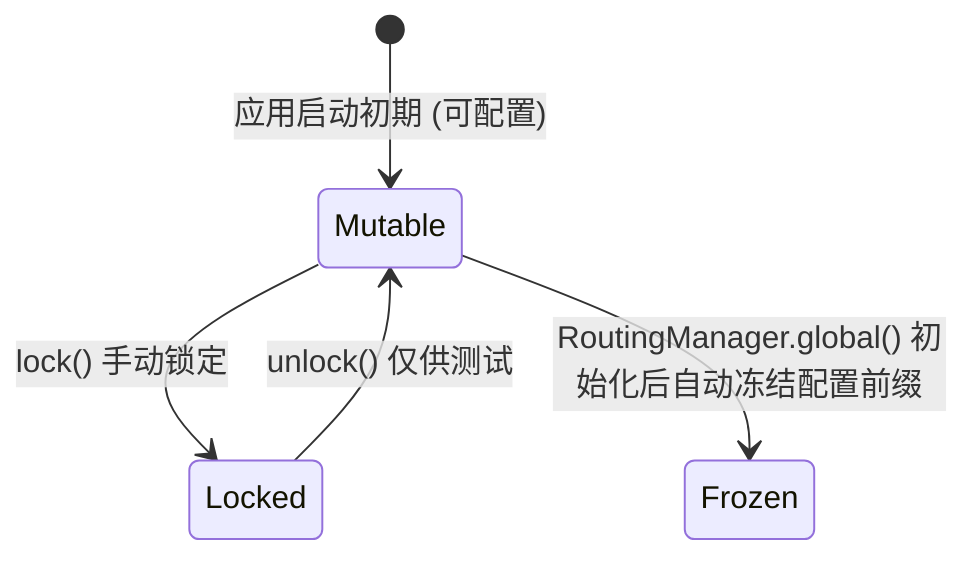
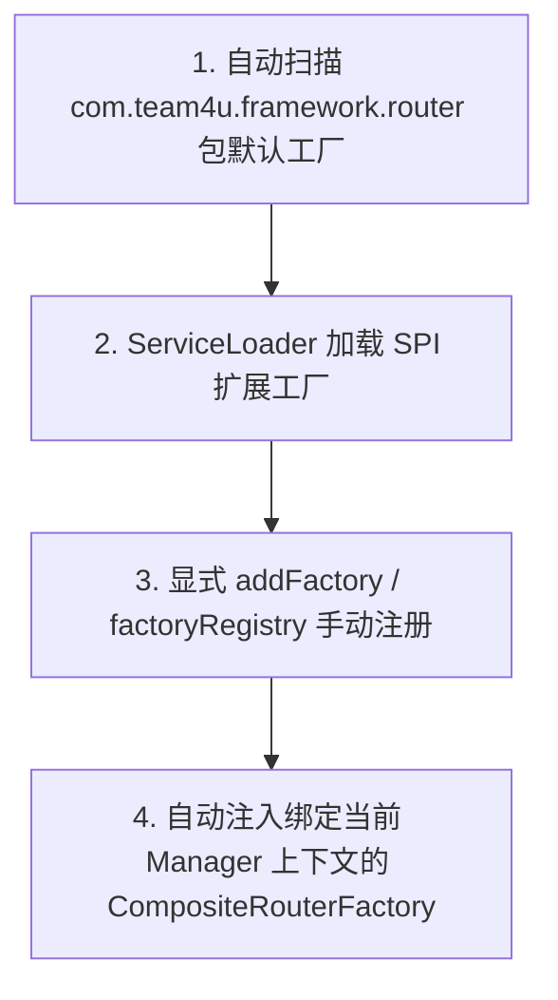

# SPI 扩展与高级配置

`team4u-router` 具备极强的插件化与可扩展能力。通过 SPI（Service Provider Interface）机制与引导配置类，开发者可以自由扩展自定义路由器工厂、替换规则配置解析器、管理配置生命周期以及实现多租户隔离。

---

## 扩展自定义路由器 (RouterFactory SPI)

当内置的 `map`、`expression`、`weight`、`composite` 无法满足特定算法场景（如一致性哈希分片、地理位置距离计算分发、机器学习在线预测路由）时，可通过实现 `RouterFactory` 接入自定义路由器。

### 步骤 1：编写自定义路由器类

继承 `AbstractRouter`，实现核心匹配逻辑：

```java
package com.mycompany.router;

import com.team4u.framework.router.api.model.RoutePolicy;
import com.team4u.framework.router.api.model.RouteResult;
import com.team4u.framework.router.core.AbstractRouter;

public class ShardingRouter extends AbstractRouter {

    private final int shardCount;

    public ShardingRouter(RoutePolicy policy) {
        super(policy);
        this.shardCount = policy.getExtProperty("shardCount", Integer.class, 16);
    }

    @Override
    @SuppressWarnings("unchecked")
    public <T> RouteResult<T> route(Object request) {
        if (request == null) {
            return fallback();
        }

        // 计算分片索引
        int hash = Math.abs(request.hashCode()) % shardCount;
        String targetDs = "datasource_" + hash;
        
        return RouteResult.ruleMatch((T) targetDs, "shard_" + hash);
    }
}
```

### 步骤 2：实现 RouterFactory 接口

```java
package com.mycompany.router;

import com.team4u.framework.router.api.Router;
import com.team4u.framework.router.api.model.RoutePolicy;
import com.team4u.framework.router.spi.RouterFactory;

public class ShardingRouterFactory implements RouterFactory {

    @Override
    public String key() {
        return "sharding"; // 对应配置中的 "type": "sharding"
    }

    @Override
    public Router create(RoutePolicy policy) {
        return new ShardingRouter(policy);
    }
}
```

### 步骤 3：注册工厂

#### 方式 A：Java SPI 自动发现（推荐）
在 `META-INF/services/com.team4u.framework.router.spi.RouterFactory` 文件中添加实现类全限定名：
```text
com.mycompany.router.ShardingRouterFactory
```

#### 方式 B：通过 RouterBootstrap 全局注册
```java
RouterBootstrap.global().addFactory(new ShardingRouterFactory());
```

#### 方式 C：通过 RoutingManager.Builder 局部注册
```java
RoutingManager manager = RoutingManager.builder()
        .addFactory(new ShardingRouterFactory())
        .build();
```

---

## 自定义配置解析器 (RoutePolicyParser SPI)

默认情况下，`team4u-router` 使用 `DefaultRoutePolicyParser`（基于 `JsonUtil`）解析 JSON 格式的路由配置。如果你的系统统一采用 YAML、Properties 或自定义 DSL 配置，可实现 `RoutePolicyParser` 接口：

```java
package com.mycompany.router;

import com.team4u.framework.router.api.model.RoutePolicy;
import com.team4u.framework.router.spi.RoutePolicyParser;
import org.yaml.snakeyaml.Yaml;

public class YamlRoutePolicyParser implements RoutePolicyParser {

    private final Yaml yaml = new Yaml();

    @Override
    public RoutePolicy parse(String input) {
        if (input == null || input.trim().isEmpty()) {
            return null;
        }
        return yaml.loadAs(input, RoutePolicy.class);
    }
}
```

### 注册与发现优先级
解析器查找遵循三级优先级机制：
1. **最高优先级**：`RoutingManager.builder().configParser(customParser)` 显式传入。
2. **次高优先级**：通过 SPI `META-INF/services/com.team4u.framework.router.spi.RoutePolicyParser` 自动发现。
3. **默认兜底**：使用框架内置的 `DefaultRoutePolicyParser`。

---

## 全局引导与配置生命周期 (`RouterBootstrap`)

为了保证多线程与生产环境下的确定性与安全性，`RouterBootstrap` 提供了状态机锁机制：



### 锁定与冻结机制

- **`lock()`（全局锁定）**：
  锁定后，所有通过 `RouterBootstrap.global().addFactory(...)` 与 `addInterceptor(...)` 注册新组件的操作都会抛出 `RouteConfigException.registryLocked()`。建议在 Spring Context 启动完成的事件监听中调用。
- **`freezeConfig()`（配置冻结）**：
  一旦 `RoutingManager.global()` 首次被初始化，全局配置前缀 `configPrefix` 将自动被永久冻结。后续尝试修改 `configPrefix` 会抛出异常，防止运行时由于配置前缀不一致引发路由丢失。

```java
// 在 Spring Boot 启动完成监听器中锁定
@Component
public class RouterLifecycleListener implements ApplicationListener<ApplicationReadyEvent> {
    @Override
    public void onApplicationEvent(ApplicationReadyEvent event) {
        RouterBootstrap.global().lock();
    }
}
```

---

## 路由管理器工厂加载优先级

`RoutingManager.Builder` 在构建 `factoryRegistry` 时采用分层合并策略（优先级由低到高）：



1. **内置默认工厂**：包含 `MapRouterFactory`、`ExpressionRouterFactory`、`WeightRouterFactory`。
2. **SPI 扩展工厂**：覆盖或补充第三方扩展。
3. **手动指定工厂**：最高优先级，覆盖同名的已有工厂。
4. **复合工厂隔离**：每个 `RoutingManager` 实例构建时都会创建绑定自身上下文的 `CompositeRouterFactory`，防止组合路由在多实例环境下跨上下文错乱。
