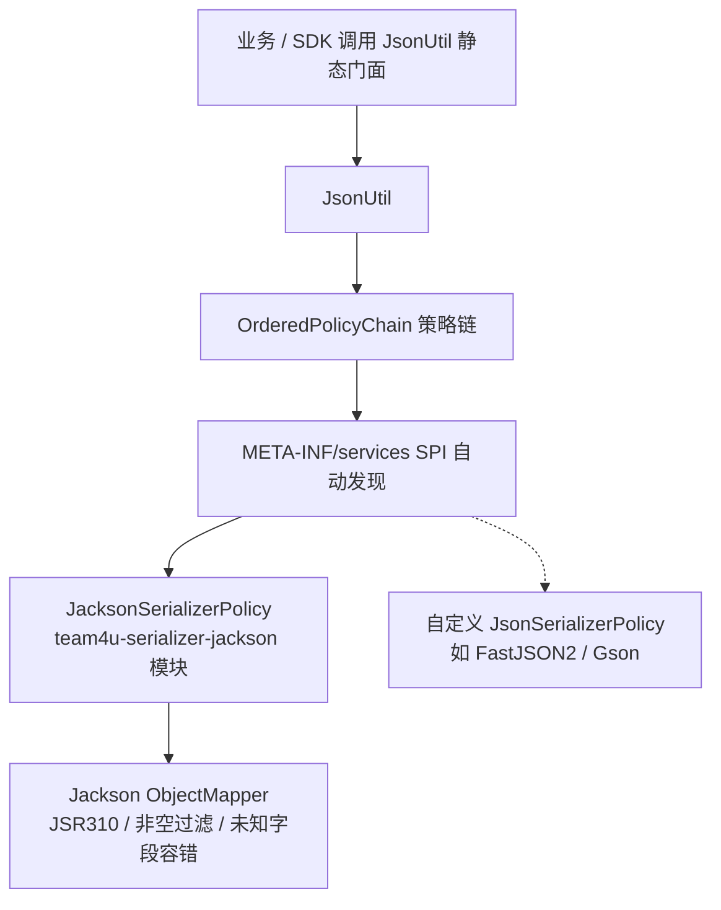

# 序列化组件 (team4u-serializer)

# 背景

在微服务与分布式系统中，数据的序列化与反序列化是网络传输、数据持久化与跨进程通信的基础。然而在实际架构设计中，常常遇到以下痛点：

- **底层序列化库强耦合**：业务代码或底层 SDK 内部若直接硬编码使用 FastJSON、Jackson 或 Gson 的原生静态类（如 `JSON.toJSONString`、`new ObjectMapper()`），一旦宿主工程版本冲突或存在安全漏洞，很难完成平滑替换。
- **复杂嵌套泛型类型擦除**：对于 `List<Map<String, User>>` 或多层嵌套结构，手动处理 `JavaType`、`TypeToken` 或反射类型容易出现冗余样板代码和类型转换异常。
- **配置容错与空值处理标准不一**：各序列化库对 `null` 值过滤、Java 8 日期时间（`LocalDateTime`）支持以及未知字段容错的处理行为各不相同。

`team4u-serializer` 提供了**接口策略驱动（Strategy Pattern）**与**统一静态门面 (`JsonUtil`)**，实现了底层序列化引擎的无感替换与复杂泛型的高性能反序列化。

---

# 设计

## 设计理念



## 核心概念

| 概念 | 类/接口路径 | 说明 |
| :--- | :--- | :--- |
| `JsonUtil` | `com.team4u.framework.serializer.json.JsonUtil` | 统一操作门面，提供 `toJsonStr`、`toBean`、`toList`、`parseObj` 等静态方法 |
| `JsonSerializerPolicy` | `com.team4u.framework.serializer.json.JsonSerializerPolicy` | 序列化策略 SPI 接口，继承 `ContextPolicy<Void>` 与 `KeyedPolicy<String>` |
| `JacksonSerializerPolicy` | `com.team4u.framework.serializer.json.jackson.JacksonSerializerPolicy` | 基于 Jackson 实现的高性能默认策略（优先级 `HIGH`） |
| `TypeReference<T>` | `com.team4u.framework.base.util.TypeReference` | 复杂泛型标记抽象类，用于在运行期保留完整的泛型元数据 |

---

## 模块结构

| 模块 ArtifactId | 说明 | 核心依赖 |
| :--- | :--- | :--- |
| **`team4u-serializer-json`** | 统一门面与 SPI 策略接口定义（`JsonUtil`, `JsonSerializerPolicy`） | `team4u-base`, `team4u-policy` |
| **`team4u-serializer-jackson`** | 基于 Jackson 实现的官方序列化驱动 | `team4u-serializer-json`, `jackson-databind`, `jackson-datatype-jsr310` |

---

## 组件位置与包结构

```text
team4u-serializer
├── team4u-serializer-json
│   └── src/main/java/com/team4u/framework/serializer/json
│       ├── JsonSerializerPolicy.java        # 策略 SPI 契约接口
│       └── JsonUtil.java                    # 统一操作门面工具类
└── team4u-serializer-jackson
    └── src/main/java/com/team4u/framework/serializer/json/jackson
        └── JacksonSerializerPolicy.java     # Jackson 驱动实现
```

---

## 文档导航

- [快速开始](quick-start.md)：依赖引入、基础序列化与泛型反序列化
- [统一门面与泛型解析 (JsonUtil)](serializer-facade.md)：`JsonUtil` 核心 API 清单、`TypeReference` 与错误容忍
- [Jackson 驱动与性能优化](serializer-jackson.md)：Jackson 配置细节与 JSR310 时间支持
- [SPI 扩展与引擎替换](serializer-spi.md)：自定义 FastJSON / Gson 策略与动态注册
- [实战案例](serializer-sample.md)：通用 SDK 序列化解耦与复杂泛型报文解析实战
