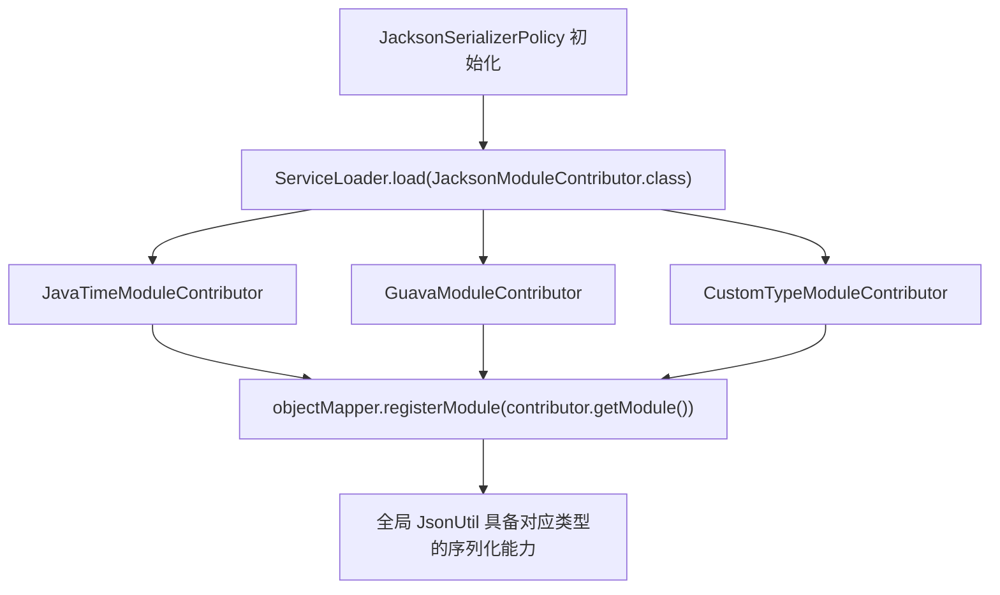

# 自定义 JacksonModuleContributor SPI

在微服务与领域驱动设计中，Java 8 时间类型（`java.time.Instant` / `LocalDateTime`）、Joda-Time、Google Guava 集合或业务自定义值对象（如货币、脱敏类型）往往需要向 Jackson 注册专用的序列化模块（`Module`）。

`team4u-serializer-json-jackson` 提供了 **`JacksonModuleContributor` SPI 契约**，允许第三方模块通过 Java 标准 `ServiceLoader` 机制向全局 `ObjectMapper` 自动注入扩展模块，而无需侵入修改任何框架核心代码。

---

## 接口契约：`JacksonModuleContributor`

```java
package com.team4u.framework.serializer.json.jackson;

import com.fasterxml.jackson.databind.Module;

public interface JacksonModuleContributor {
    /**
     * 提供需要注册到全局 ObjectMapper 的 Jackson 模块。
     *
     * @return Jackson Module 实例
     */
    Module getModule();
}
```

---

## 扩展与注册步骤

### 1. 编写贡献者实现类

例如注册 Java 8 时间模块 `JavaTimeModule`：

```java
package com.example.serializer;

import com.fasterxml.jackson.databind.Module;
import com.fasterxml.jackson.datatype.jsr310.JavaTimeModule;
import com.team4u.framework.serializer.json.jackson.JacksonModuleContributor;

public class JavaTimeModuleContributor implements JacksonModuleContributor {

    @Override
    public Module getModule() {
        return new JavaTimeModule();
    }
}
```

### 2. 在 SPI 描述文件中声明

在 `src/main/resources/META-INF/services/com.team4u.framework.serializer.json.jackson.JacksonModuleContributor` 文件中添加实现类的全限定名：

```text
com.example.serializer.JavaTimeModuleContributor
```

---

## 自动加载与生效机制



当 `JacksonSerializerPolicy` 首次加载时，会自动通过 `ServiceLoader` 扫描 classpath 下所有的 `JacksonModuleContributor` 实现并注册到底层的单例 `ObjectMapper` 中。

---

## 关联章节与进一步阅读

- 了解 JsonUtil 门面 API：[JsonUtil 统一门面与常用操作](serializer-facade.md)
- 了解 Jackson 核心配置策略：[Jackson 序列化策略与配置](serializer-jackson.md)
- 了解序列化避坑与常见故障：[序列化避坑指南与最佳实践](serializer-diagnostics.md)
