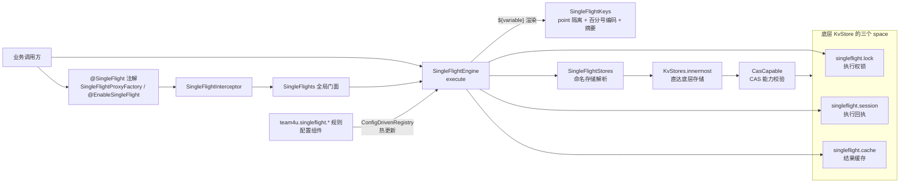

# Singleflight 组件 (team4u-singleflight)

# 背景

业务系统里经常遇到「同一件事，并发来了很多次，但只希望真正做一次」的需求：

- **缓存击穿合并**：商品详情缓存到期的瞬间，2000 个请求同时打到数据库。期望只有 1 个请求真正回源，其余 1999 个等着复用这一次的结果；
- **昂贵计算共享**：同一份报表、同一个用户的推荐列表，计算一次要 800ms。并发调用同一 key 时，后来者不必重复计算；
- **并发窗口互斥**：用户双击提交按钮，同一订单的提交动作在同一时间窗口内只允许执行一次，重复点击直接拒绝。

这些需求如果由各业务自己实现，通常会写成三种样子：

- **本地 `synchronized` / `ConcurrentHashMap`**：只在单个 JVM 内有效。服务部署了 8 个实例，每个实例还是各回源一次；
- **裸写 Redis SET/DEL**：没有租约概念——进程崩了锁就死锁了；没有接管——持锁者超时后请求只能干等；也没有身份校验——旧执行者晚到一步，会把过期结果盖在新执行者头上；
- **各处复制粘贴**：等待、超时、降级、异常路径的代码重复且容易写错，规则改一下就要发版。

`team4u-singleflight` 做一件事：**把「同 key 唯一执行者」收敛为「一条 JSON 规则 + kv 锁协调」**。业务代码只声明一个 point 和加载函数，key 怎么取、结果缓存多久、竞争者等待还是失败还是降级，全部在规则里配置、热更新生效。

> 组件解决的是**回源合并与并发互斥**，不是限流：它不统计时间窗口内的请求次数，没有配额、阈值语义。需要「每分钟最多 N 次」时请使用[限流组件](../ratelimiter/README.md)。

---

# 设计

## 设计理念

- **规则与实现分离**：业务只声明 `point`（一个字符串）和加载函数；key 模板、缓存时长、竞争策略、降级值全部在 `team4u.singleflight.{point}` 规则 JSON 中。配置中心改完即热更新（先建新再替换、失败保旧）；
- **基于 kv 锁协调**：谁先抢到锁谁执行，其余请求按策略收场。存储换成 Redis / JDBC，多个实例就自动共享同一个执行窗口——业务代码一行不改；
- **执行有「回执」**：执行者抢到锁后写一条会话记录（SessionEnvelope），状态从「执行中」流转到「成功 / 不可缓存成功 / 失败」。等待者读回执拿结果，不靠猜；
- **token 防抢跑**：每次抢锁都带唯一 token（相当于这次执行的工号）。发布结果必须通过「回执还是我的工号」的 CAS 校验——丢了锁的旧执行者即使晚一步跑完，也无法把结果盖到新执行者头上；
- **协调直连存储**：锁和会话的读写剥掉所有装饰层（`TieredStore` / `ObservedStore`），直达最内层真实存储。中间若有本地缓存，A 实例写入的新 token B 实例可能读到旧值，协调就乱了。



执行流程：

```text
execute(point, arguments, returnType, loader)
├── 规则加载：配置键 team4u.singleflight.{point}；无规则按全局 onRuleMissing 策略处理
├── 请求校验：规则 id 必须等于 point；void / 基本类型 / FALLBACK 的组合约束在此检查
├── skipWhen：命中时直接执行 loader，不抢锁、不写会话、不写结果缓存
├── key 渲染：key 模板变量为 null 或渲染为空时按 onInvalidKey 处理
├── cacheEnabled=true：先读 singleflight.cache，命中则反序列化后直接返回
├── 协调：
│   ├── tryAcquire 成功：重读会话（上一执行者可能刚完成），否则写入 PENDING(token)
│   │   ├── 执行 loader，CAS 发布终态回执
│   │   └── 可缓存成功：终态发布后写结果缓存（写失败按 onStoreFailure 处理）
│   └── tryAcquire 失败：按 contention 走 WAIT / FAIL_FAST / FALLBACK
└── WAIT：
    ├── 读到终态回执：成功反序列化结果，失败重构为 SingleFlightExecutionException
    ├── PENDING 且锁记录已消失：抢锁接管，写入新 token 的 PENDING 并重新执行
    └── 超过 waitTimeoutMillis：抛 SingleFlightTimeoutException
```

## 核心概念

| 概念 | 说明 |
| :--- | :--- |
| `SingleFlightEngine` | 协调引擎：规则编译、key 渲染、抢锁、回执发布、结果缓存都在这里完成；实现 `AutoCloseable` |
| `SingleFlightRule` | 一个 point 对应一条 JSON 规则，字段见下表 |
| `SingleFlightExecution<T>` | 一次执行请求：point、参数名到参数值的 Map、返回类型和 loader。编程式 API 的唯一入参 |
| `SingleFlightLoader<T>` / `ThrowableLoader<T>` | 加载函数。前者可抛 `Exception`；后者用于代理边界，可抛任意 `Throwable` |
| `SessionEnvelope` | 执行回执：`token + 状态 + 时间 + 结果/错误`，是跨线程、跨实例传递执行结果的数据契约 |
| `SingleFlightKeys` | 最终 key 组成：point 与业务 key 分别百分号编码后拼接，超过阈值时保留前缀并追加 SHA-256 |
| `SingleFlightStores` | 命名 `KvStore` 注册表；规则用 `store` 字段按名引用 |
| `SingleFlights` | 全局静态门面：显式 `init`，未初始化时用 `ConfigManager.global()` + `InMemoryKvStore` 懒加载 |
| `@SingleFlight` | 方法注解，只声明 `value()`（point）；代理自动携带方法泛型返回类型和参数名上下文 |
| `SingleFlightExceptionHandler` | 注解边界的组件异常转换器，只处理 `SingleFlightException`，不处理 loader 自己抛出的业务异常 |

## 规则字段

一个 point 一条规则，配置键为 `team4u.singleflight.{point}`。`enabled=false` 时直接执行 loader，完全绕过协调与缓存；配置键存在但规则不可解析时热更新失败并保留旧规则。

| 字段 | 类型 / 取值 | 必填 | 默认 | 说明 |
| :--- | :--- | :--- | :--- | :--- |
| `enabled` | boolean | 否 | `true` | 是否启用 singleflight。false 时直接执行 loader，不读锁、回执与缓存 |
| `id` | String | 是 | 无 | 必须与 point 完全一致，否则执行期抛 `SingleFlightConfigException`。加载期不能为空 |
| `store` | String | 否 | `""` | `SingleFlightStores.global()` 中的命名存储；空白用引擎默认存储。解析后直达最内层真实存储 |
| `key` | String | 否 | 无 | `${variable}` 模板，变量来自参数名 Map。不配置时业务 key 就是 point，同 point 全局共享窗口。渲染为 null/空白时按 `onInvalidKey` 处理 |
| `skipWhen` | String | 否 | 无 | Criterion 表达式，匹配参数名 Map。命中则直接执行 loader，完全绕过协调和缓存。用 `$参数名` 引用参数，例如 `$refresh == true` |
| `cacheWhen` | String | 否 | 无 | Criterion 表达式，匹配 loader 返回值。不配置默认可缓存；为 false 时发布 `SUCCESS_NOT_CACHEABLE` 且不写结果缓存 |
| `contention` | `WAIT` / `FAIL_FAST` / `FALLBACK` | 否 | `WAIT` | 锁竞争策略，见下文并发策略 |
| `fallback` | 原生 JSON | `FALLBACK` 时是 | 无 | 竞争时按返回类型反序列化。显式 `null` 表示返回 null；省略该字段与显式 `null` 不同，`FALLBACK` 省略会加载失败 |
| `errorFallback` | 原生 JSON | 否 | 无 | 组件失败兑底：FAIL_FAST 竞争、WAIT 超时、复用失败回执三类组件异常不抛出，改为按返回类型反序列化此值返回。省略不兑底（异常照抛）；显式 `null` 返回 null（仅对象类型）。不覆盖配置错误与 loader 业务异常 |
| `lockLeaseMillis` | long > 0 | 否 | `30000` | kv 锁租约。持有期间锁管理器后台续约；进程崩溃后续约停止，租约到期后可被接管 |
| `waitTimeoutMillis` | long > 0 | 否 | `10000` | WAIT 调用者等待终态或接管机会的最长时间，超时抛 `SingleFlightTimeoutException` |
| `pollIntervalMillis` | long > 0 | 否 | `100` | WAIT 轮询回执与锁的间隔 |
| `cacheEnabled` | boolean | 否 | `true` | 是否启用结果缓存。false 时仍会使用锁和回执（纯互斥模式），但 `cacheTtlMillis` 必须为 0（省略即可） |
| `cacheTtlMillis` | long | `cacheEnabled=true` 时 > 0 | `0` | 结果缓存 TTL。`cacheEnabled=true` 时必须大于 0；false 时必须为 0 |
| `uncacheableTtlMillis` | long > 0 | 否 | `5000` | 成功终态回执的 TTL。不可缓存的成功不写结果缓存，只让等待者在该窗口内读到本次结果 |
| `failureTtlMillis` | long > 0 | 否 | `5000` | 失败回执 TTL。窗口内同 key 的 WAIT 调用者收到重构的 `SingleFlightExecutionException` |
| `onInvalidKey` | `ERROR` / `PASS_THROUGH` | 否 | `ERROR` | key 渲染失败：`ERROR` 抛配置异常；`PASS_THROUGH` 直接执行 loader，不做协调 |
| `onStoreFailure` | `PASS_THROUGH` / `FAIL_CLOSED` | 否 | 随 contention | 显式指定优先。省略时 `FAIL_FAST` 默认 `FAIL_CLOSED`，`WAIT` / `FALLBACK` 默认 `PASS_THROUGH` |
| `digestThreshold` | int > 0 | 否 | `128` | 编码后完整 key 长度阈值。超过则保留最多 48 字符可读前缀并追加 `#sha256_摘要`，避免存储 key 无界变长 |

规则缺失策略是全局配置（不是规则字段），通过独立配置键设置：

```properties
# 可选 PASS_THROUGH / ERROR；默认 PASS_THROUGH（记 warn 直接执行 loader）
team4u.singleflight.on_rule_missing=ERROR
```

## 会话状态机

执行回执保存在 `singleflight.session` space，值是 JSON。`token` 是这次执行的锁持有者令牌，也是 CAS 的身份边界。

| 状态 | 写入者 | 载荷 | TTL | 后续读取 |
| :--- | :--- | :--- | :--- | :--- |
| `PENDING` | 获得锁的执行者 | `token`、`startedAtMillis` | 动态：`max(waitTimeoutMillis + max(uncacheableTtlMillis, failureTtlMillis), 1000)` | 锁仍存在则等待；锁不存在则尝试接管 |
| `SUCCESS_CACHEABLE` | loader 成功且 `cacheWhen` 通过 | `token`、`result`、`finishedAtMillis` | `uncacheableTtlMillis` | WAIT 调用者反序列化 `result`；执行者另行写 `singleflight.cache` |
| `SUCCESS_NOT_CACHEABLE` | loader 成功但 `cacheWhen` 不通过 | `token`、`result`、`finishedAtMillis` | `uncacheableTtlMillis` | WAIT 调用者可读取结果，但不写结果缓存 |
| `FAILURE` | loader 抛出 `RuntimeException` / `Error` | `token`、`error`、`finishedAtMillis` | `failureTtlMillis` | WAIT 调用者收到 `SingleFlightExecutionException`，message 来自原异常 |

终态发布使用 `compareAndSet(sessionKey, pending.toJson(), terminal)`：存储里的回执必须「还是我写的那份 PENDING」才允许写成终态。只要接管者已经写入新 token 的 PENDING，旧执行者的 CAS 必然失败。

**执行者崩溃后的接管流程**：

1. 执行者 A 获得锁，写入 `PENDING(tokenA)`，随后进程崩溃、心跳停止；
2. WAIT 调用者读到 `PENDING(tokenA)`，再检查锁记录——已随租约到期消失；
3. 调用者 `tryAcquire` 抢锁，成功后先重读回执：A 若恰好刚发布终态则直接复用结果，否则写入新的 `PENDING(tokenB)`；
4. A 若此时晚到完成，它用 `tokenA` 的 PENDING 做 CAS 会失败，盖不掉 `tokenB` 的回执；
5. 接管者执行 loader 并发布自己的终态；接管路径不写结果缓存——避免由未持有原始请求语义的线程替调用方决定长 TTL 缓存。

首次协调同样「抢锁后重读」：从进入协调到真正抢到锁之间，上一个执行者可能已完成并释放锁，此时直接复用已发布结果——这是「同 key 一个周期只执行一次」的最后一道保障。

> 本地执行 loader 的调用者收到原始业务异常；其他线程或实例只能从失败回执读取错误信息，收到的是 `SingleFlightExecutionException`（只含 message）——组件不承诺跨线程重建原异常对象。

## 并发策略

`contention` 决定「没抢到锁的请求」如何收场：

| 策略 | 行为 | 适用 |
| :--- | :--- | :--- |
| `WAIT` | 以 `pollIntervalMillis` 轮询回执与锁。终态直接返回；PENDING 且锁消失则接管；超过 `waitTimeoutMillis` 抛 `SingleFlightTimeoutException`（配重 `errorFallback` 时改为返回兑底值） | 缓存击穿合并，调用方希望拿到同一次真实结果 |
| `FAIL_FAST` | 锁竞争立即抛无栈的 `SingleFlightConflictException`（配重 `errorFallback` 时改为返回兑底值） | 并发窗口互斥、任务防重；调用方自己决定重试或报错 |
| `FALLBACK` | 锁竞争时把规则中的原生 JSON 反序列化为返回类型；显式 JSON null 只允许非基本类型返回 | 竞争时返回静态降级数据或 null |

> `cacheEnabled=true` 时缓存命中不会抢锁，因此不会进入竞争策略；只有缓存未命中且锁已被他人持有才触发 `contention`。纯互斥场景应配置 `cacheEnabled=false`。

### errorFallback 与 exceptionHandler 的优先级

`errorFallback` 在引擎层兑底，`exceptionHandler` 在代理层接异常——引擎先执行，因此：

| 场景 | errorFallback | exceptionHandler | 实际结果 |
| :--- | :--- | :--- | :--- |
| 竞争 / 超时 / 失败回执 | 已配置 | 已配置 | **errorFallback 生效**，handler 收不到这些异常 |
| 竞争 / 超时 / 失败回执 | 未配置 | 已配置 | 异常抛到代理层，**handler 生效** |
| 竞争 / 超时 / 失败回执 | 未配置 | 未配置 | 异常抛给调用方 |
| 配置错误 | 无论是否配置 | 已配置 | 异常穿透引擎（不兑底），**handler 生效** |
| loader 业务异常 | 无论是否配置 | 无论是否配置 | 都不生效，原样上抛 |

不配置 `errorFallback` 时行为与未引入该字段前完全一致，无隐藏默认值。注意：若依赖 handler 统一记录组件异常日志（监控埋点），配上 errorFallback 后竞争 / 超时类事件不再经过 handler，需改从引擎日志观察。

## 存储选型与限制

| 存储 | 互斥范围 | 说明 |
| :--- | :--- | :--- |
| `InMemoryKvStore` | 当前 JVM | 单测、单实例。跨进程调用者不会合并到同一个执行窗口 |
| `RedisKvStore` | 连接同一 Redis 的实例 | 生产常用，支持 `CasCapable`，适合跨实例回源合并 |
| `JdbcKvStore` | 连接同一数据库的实例 | 共享协调可用；高 QPS 热点 key 需评估数据库压力 |
| 其他 `KvStore` | 由存储决定 | 最内层存储必须实现 `CasCapable`，否则引擎构造或规则编译失败 |

**协调路径必须直达底层**：

- 引擎对默认存储和命名存储都调用 `KvStores.innermost`，再在最内层存储上校验 `CasCapable`；
- `TieredStore`、`ObservedStore` 等装饰层不参与锁、回执和结果缓存读写。传入 `TieredStore` **不会**得到 singleflight 结果缓存的 L1 加速；
- 目的：避免本地 L1 让锁续约、回执轮询或 CAS 读到陈旧 token；
- 引擎没有单独的「协调存储 / 结果缓存存储」字段。若业务在 singleflight 之外再套分层缓存，需自行处理负缓存和 TTL：`SUCCESS_NOT_CACHEABLE` 与 `FAILURE` 只写回执，不会给外部缓存写墓碑；外部 L1 在自身 TTL 窗口内也可能看不到其他实例的新结果。分层存储自身的边界见[分层存储](../kv/kv-tiered.md)；
- 同一规则 id 的 `store` 名不能在热更新中从 A 改为 B；新编译失败时旧规则继续服务。

**存储异常策略**：

| `onStoreFailure` | 行为 |
| :--- | :--- |
| `PASS_THROUGH` | 记 warn，跳过协调直接执行 loader。存储故障时失去合并能力，但保住业务可用性 |
| `FAIL_CLOSED` | 抛出包装了原因的 `SingleFlightConfigException`。协调阶段失败时 loader 不执行；若失败发生在 loader 成功后的结果缓存写入，loader 已经执行过 |

## 注解与类型约束

方法注解只有一个属性：

```java
public interface ProductService {
    @SingleFlight("product.detail")
    Product detail(String productId);
}
```

- 注解代理使用 `method.getGenericReturnType()`，`List<User>` 等泛型会按完整类型反序列化；
- 编译必须保留参数名（父 POM 默认开启 `-parameters`）。有参数的方法参数名不可读时，代理创建失败；
- 注解可标注在当前方法、接口方法或父类同名方法上；
- 非 Spring 环境用 `SingleFlightProxyFactory.proxy(...)`；Spring 环境用 `@EnableSingleFlight` 自动包装含注解方法的 Bean。

| 代理边界能力 | 约束 |
| :--- | :--- |
| 泛型返回 | loader 结果和 WAIT 回执结果都会 JSON 序列化/反序列化，调用方必须提供精确泛型类型；编程式用 `TypeReference` 子类，注解自动携带方法泛型 |
| 基本类型返回 | 可以返回基本类型，但显式 JSON null fallback、exceptionHandler 返回 null 都不允许 |
| `void` / `Void` 返回 | 规则必须 `cacheEnabled=false` 且 `contention=FAIL_FAST`；回执终态对 void 解码为 null |
| `Optional<T>` | 不支持，也不会做 unwrap。JSON wrapper 不能表达组件期望的直接业务结果 |
| `CompletableFuture<T>` | 不支持。组件不感知异步完成，也不会等待 future |
| JSON 序列化 | loader 结果必须能被 JSON 序列化并按返回类型反序列化；失败抛 `SingleFlightConfigException` |

`SingleFlightExceptionHandler` 只拦截 `SingleFlightException`（冲突、等待超时、重构失败、配置/存储失败），loader 原始异常永远原样抛出。handler 返回值必须能赋给方法返回类型，null 不能用于基本类型方法；handler 抛出的 checked 异常必须是目标方法声明过的异常，否则会被包装为 `IllegalStateException`。

## 最佳实践与边界

- `lockLeaseMillis` 覆盖 loader 的合理最长耗时。存活的持有者由 kv lock 心跳续约，租约不是强制杀任务；进程崩溃后租约到期才允许接管；
- `waitTimeoutMillis` 应大于 loader P99 加上发布终态的耗时；`pollIntervalMillis` 在存储压力和冲突响应速度之间取舍；
- 三个 TTL 语义不同：`cacheTtlMillis` 是结果新鲜度；`uncacheableTtlMillis` / `failureTtlMillis` 是等待者还能共享本次终态多久；
- `FAIL_FAST` 用于互斥时通常配 `cacheEnabled=false`，否则缓存命中会改变「是否进入互斥窗口」的路径；
- `FALLBACK` 的 JSON 类型必须与每个调用点返回类型一致；同一个 point 被不同返回类型调用时不要使用复杂原生 JSON。

| 边界 | 实际行为 |
| :--- | :--- |
| 执行超时 | 未实现 `executionTimeout`。loader 执行多久由业务和锁租约/心跳机制约束，WAIT 超时只影响等待者 |
| 限流 / 防刷 | 未实现。没有时间窗口计数、阈值、黑名单或配额语义 |
| 分布式强互斥 | 依赖 kv 锁的租约与 fencing，适合尽量互斥。金融扣减等场景仍需业务幂等或更强的串行化手段 |
| 结果身份 | WAIT 调用者拿到的是 JSON 反序列化结果，与执行者本地对象不是同一个实例 |
| 错误传播 | 只有本地执行者收到原始异常；等待者收到只含 message 的 `SingleFlightExecutionException` |

## 组件位置与包结构

```text
team4u-singleflight                # 单模块：存储经 kv 能力协商，无存储子模块
└── com.team4u.framework.singleflight
    ├── api                       # SingleFlights 门面、SingleFlightExecution、异常体系
    ├── config                    # SingleFlightRule 与策略枚举
    ├── core                      # SingleFlightEngine、SessionEnvelope、SingleFlightKeys
    ├── policy                    # key 渲染、Criterion 包装、fallback 转换
    ├── store                     # SingleFlightStores / NamedStore 命名存储
    ├── proxy                     # @SingleFlight 注解、拦截器、代理工厂、异常转换
    └── spring                    # @EnableSingleFlight 自动代理（可选依赖）
```

| 依赖 | 用途 | 按需引入 |
| :--- | :--- | :--- |
| `team4u-kv-core` | `KvStore`、`CasCapable`、`KvStores` 装饰链解析、内存实现 | 必需（传递引入） |
| `team4u-kv-lock` | `KvLockManager` / `KvLock` 租约、心跳、token | 必需（传递引入） |
| `team4u-config-core` | `ConfigDrivenRegistry` 规则加载与热更新 | 必需（传递引入） |
| `team4u-base` | `TextTemplate`、`TypeReference` | 必需（传递引入） |
| `team4u-policy` | 命名存储注册使用的 `KeyedPolicyRegistry` | 必需（传递引入） |
| `team4u-criterion` | `skipWhen` / `cacheWhen` 表达式 | 必需（传递引入） |
| `team4u-serializer-json` + `jackson-databind` | 规则、结果、回执 JSON | 必需（传递引入） |
| `team4u-proxy` | `@SingleFlight` 注解代理 | 使用注解时（传递引入） |
| `spring-context` | `@EnableSingleFlight` 自动代理 | Spring 环境（可选） |
| `team4u-kv-store-redis` | Redis 跨实例协调 | Redis 存储 |
| `team4u-kv-store-jdbc` | JDBC 跨实例协调 | 数据库存储 |

## 与其他组件联动

- **[键值存储组件](../kv/README.md)**：锁租约、CAS 能力、命名存储与存储后端全部由 kv 组件提供
- **[限流组件](../ratelimiter/README.md)**：时间窗口配额、突发整形与防刷应使用限流而不是 singleflight
- **[Criterion 表达式组件](../criterion/README.md)**：`skipWhen` / `cacheWhen` 的表达式语法即 Criterion DSL
- **[配置组件](../config/README.md)**：规则经 `ConfigDrivenRegistry` 加载，配置中心变更即热更新

## 文档导航

- [快速开始](quick-start.md)：依赖引入、最小示例、编程式/注解式接入、WAIT / FAIL_FAST / FALLBACK / 不可缓存结果配置
