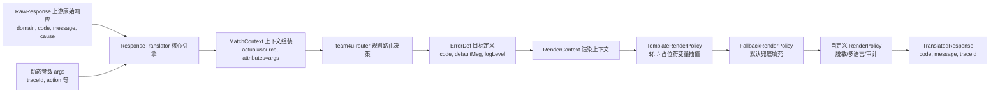

# 契约翻译组件 (team4u-translator)

# 背景

在分布式微服务与开放平台网关中，内部各微服务返回的原始响应与错误码各不相同（例如订单中心返回 `ORDER_TIMEOUT`、支付中心返回 `PAY_INSUFFICIENT_FUNDS`）。直接将内部原始异常暴露给终端用户或前端通常存在以下问题：

- **对外契约不统一**：前端需要针对不同微服务对接几十种不同的异常格式与错误码结构。
- **内部技术细节泄漏**：将诸如 `MySQLSyntaxErrorException`、`RedisConnectionRefused` 暴露给用户极具安全风险且不友好。
- **缺乏上下文变量动态替换**：对外文案需要带上用户的业务动作（如“您在 [提交订单] 时失败，请稍后重试”）。
- **多业务线无法独立定制**：不同业务线希望在沿用全局兜底错误的同时，优先定制自己专属的提示文案与状态码。

`team4u-translator` 专注于将内部系统返回的原始响应 `RawResponse`，按路由规则与渲染策略翻译成对外暴露的标准化不可变契约 `TranslatedResponse`。JSON 路由配置继承 Router 的显式 provider 要求：应用添加 `team4u-serializer-jackson` 或注册自定义 `JsonSerializerPolicy`。

---

# 设计

## 设计理念

`team4u-translator` 采用 **三段式流水线架构（上下文组装 -> 规则路由决策 -> 责任链渲染输出）**，无缝联动 `team4u-router`（负责多模式规则匹配）与 `team4u-policy`（负责渲染链管理）：



## 核心概念

| 概念 | 说明 |
| :--- | :--- |
| `ResponseTranslator` | 翻译器核心门面接口，定义 `translate(source, routerId, args)` 标准操作 |
| `DefaultResponseTranslator` | 核心引擎实现类，基于三段式流水线驱动路由与责任链渲染，支持 SPI 策略加载与自定义包路径扫描 |
| `RawResponse` | 上游系统的原始响应输入模型（包含 `domain`、`code`、`message`、`cause`） |
| `ErrorDef` | 路由命中后返回的目标静态规则定义（包含目标错误码 `code`、文案模板 `defaultMsg` 与日志级别 `logLevel`） |
| `TranslatedResponse` | 最终输出给调用方的标准化不可变契约模型（包含 `code`、`message`、`traceId`） |
| `RenderContext` | 渲染管线流转上下文，持有只读输入与可变的 `finalCode`、`finalMessage` |
| `RenderPolicy` | 渲染器 SPI 接口（继承自 `ContextPolicy<RenderContext>`），负责对文案和错误码执行增强处理 |
| `TemplateRenderPolicy` | 内置变量模板渲染器，基于 LRU 缓存解析 `${...}` 占位符，自动注入 `rawCode` 与 `rawMessage` |
| `FallbackRenderPolicy` | 内置兜底渲染器，在目标码或文案为空时使用原始数据安全回填 |

---

## 核心特性

- **路由多模式解耦**：完全复用 `team4u-router`，无缝支持精准映射 (`Map`)、表达式判定 (`Expression`) 与多级级联 (`Composite`)。
- **模板变量智能注入与容错**：文案模板不仅支持透传的 `args` 业务参数，还自动注入 `rawCode` 与 `rawMessage`；未解析的变量保留原样不报错。
- **两级安全兜底**：
  1. **路由未命中兜底**：若未命中任何路由规则，引擎默认原样返回原始 `code` 与 `message`，并保留 `traceId`。
  2. **字段空值兜底**：若路由命中的 `ErrorDef` 字段为空，由 `FallbackRenderPolicy` 自动回填原始响应值。
- **链路标识无缝透传**：自动从 `args` 中提取 `traceId`，并在各种命中/未命中分支下始终透传回包。
- **防污染安全执行顺序**：`TemplateRenderPolicy` 优先于 `FallbackRenderPolicy` 执行，防止原始异常中包含的 `${...}` 字符被意外作为模板二次渲染。
- **责任链渲染扩展**：支持基于 SPI 或包扫描扩展自定义 `RenderPolicy`（如敏感词脱敏、多语言国际化 i18n、日志动态降级）。

---

## 组件位置与包结构

```text
com.team4u.framework.translator
├── api                              # 核心门面接口 (ResponseTranslator)
├── engine                           # 翻译流转引擎实现 (DefaultResponseTranslator)
├── model                            # 领域模型 (RawResponse, ErrorDef, TranslatedResponse, RenderContext)
└── render                           # 渲染策略体系 (RenderPolicy, TemplateRenderPolicy, FallbackRenderPolicy)
```

---

## 文档导航

- [快速开始](quick-start.md)：依赖引入与基础翻译调用
- [核心模型与执行流程](translator-model.md)：RawResponse、ErrorDef、TranslatedResponse 与执行步骤详解
- [模板渲染与策略扩展](translator-render.md)：模板占位符渲染、自动注入变量与自定义 RenderPolicy 扩展
- [结合 Router 组合路由](translator-routing.md)：利用 CompositeRouter 实现业务私有规则覆盖全局基准
- [实战案例](translator-sample.md)：Spring Boot 全局异常拦截与多支付渠道统一翻译实战
