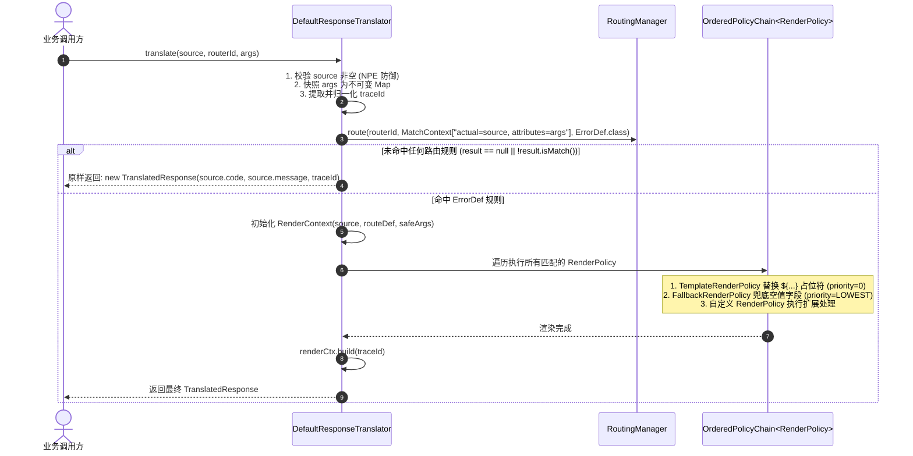

# 核心模型与执行流程

本章详细解析 `team4u-translator` 的核心模型定义、数据封装约束与单次翻译执行的底层流转。

---

## 核心数据模型

### `RawResponse` (上游原始响应)
代表上游微服务或第三方依赖返回的原始数据：

```java
public class RawResponse {
    private String domain;      // 来源领域/子系统标识（如 "ORDER_CENTER", "PAY_GATEWAY"）
    private String code;        // 原始错误码或异常类名
    private String message;     // 原始错误描述信息
    private Throwable cause;    // 可选：底层抛出的异常堆栈对象
}
```

#### 构造与工厂方法：
- **普通响应**：`RawResponse.of("ORDER", "O_1001", "库存不足")`
- **异常包装**：`RawResponse.of("SYSTEM", exception)`（自动提取异常简单类名作为 `code`，提取 `getMessage()` 作为 `message`，并保存 `cause`）
- **全参构造**：`new RawResponse(domain, code, message, cause)`

---

### `ErrorDef` (目标契约定义)
路由规则命中后从配置中心（如 JSON）反序列化得到的目标静态模板：

```java
public class ErrorDef {
    private String code;        // 暴露给外部的标准错误码 (如 "INVALID_PARAM")
    private String defaultMsg;  // 默认文案模板 (如 "操作失败：${action}，原因：${rawMessage}")
    private String logLevel;    // 动态日志级别管控 (如 "WARN", "ERROR")
}
```

---

### `TranslatedResponse` (最终统一输出)
最终输出给调用方或前端的标准化契约对象。这是一个通过 Lombok `@Value` 修饰的 **不可变对象** (Immutable)：

```java
@Value
public class TranslatedResponse {
    private final String code;        // 最终返回的目标标准错误码
    private final String message;     // 最终渲染后的提示文案
    private final String traceId;     // 链路追踪标识 (可为 null)
}
```

---

### `RenderContext` (渲染管线流转上下文)
传递给各个 `RenderPolicy` 的执行上下文，保证非共享线程安全：

| 属性 / 方法 | 类型 / 返回值 | 说明 |
| :--- | :--- | :--- |
| `source` | `RawResponse` | **只读**：原始输入对象 |
| `routeDef` | `ErrorDef` | **只读**：路由命中的静态配置定义 |
| `args` | `Map<String, Object>` | **只读**：外部透传参数的不可变安全快照 |
| `finalCode` | `String` | **可变**：当前流转中的最终错误码，允许渲染器修改覆盖 |
| `finalMessage` | `String` | **可变**：当前流转中的最终提示文案，允许渲染器修改覆盖 |
| `build(traceId)` | `TranslatedResponse` | 根据当前 `finalCode`、`finalMessage` 和 `traceId` 构造最终不可变结果 |

---

## 详细执行流转



### 核心步骤详解

1. **入参防御与安全快照**：
   - `Objects.requireNonNull(source, "source must not be null")` 快速失败。
   - `snapshotArgs(args)` 创建不可变 Map 快照，防止渲染过程中外部多线程并发修改参数。
   - 提取 `traceId`（空字符串自动归一化为 `null`）。
2. **构建上下文并路由决策**：
   - 将 `source` 作为 `MatchContext.actual`，将 `safeArgs` 作为 `MatchContext.attributes`。
   - 调用 `routingManager.route(routerId, matchCtx, ErrorDef.class)` 执行规则判定。
3. **未命中安全兜底**：
   - 未命中规则时，直接返回包含 `source.getCode()` 与 `source.getMessage()` 的响应，且**不丢失** `traceId`。
4. **渲染管线推进**：
   - 初始化 `RenderContext`（初始 `finalCode = routeDef.getCode()`，`finalMessage = routeDef.getDefaultMsg()`）。
   - 按 `priority()` 顺序执行责任链中所有 `supports(context)` 返回 `true` 的 `RenderPolicy`。
5. **构建不可变结果**：
   - 调用 `renderCtx.build(traceId)` 生成全新的不可变 `TranslatedResponse` 并返回。
