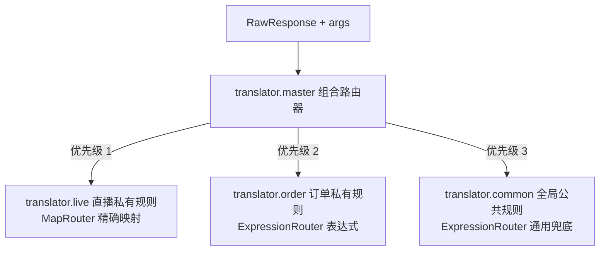

# 结合 Router 组合路由

大型分布式中台架构中，各个独立业务线（如电商、外卖、直播、聚合支付）既有专属于本业务域的错误契约与提示诉求，又需要继承中台全局的公共错误兜底（如数据库连接池打满、网关限流、网络故障）。

借助 `team4u-router` 的 `composite`（组合路由器）与 `expression`（表达式路由器），可以轻松实现**业务线私有规则优先、中台公共规则兜底**的优雅架构。

---

## 路由上下文组装机制

在翻译调用时，`DefaultResponseTranslator` 会自动将 `RawResponse` 作为主体，将动态参数 `args` 作为属性组装为 `MatchContext`：

```java
MatchContext matchCtx = MatchContext.of(source).setAttributes(safeArgs);
```

因此，在编写路由规则表达式时，可以直接使用以下属性：
- **`RawResponse` 字段**：`domain`、`code`、`message`、`cause`
- **动态参数 `args` 字段**：以 `$` 开头或普通属性形式使用（如 `$tenantId`、`$channel`）

---

## 组合路由架构设计



---

## 完整配置示例

### 1. 直播业务线私有规则 (`router.translator.live`)
```json
{
  "id": "translator.live",
  "type": "map",
  "rules": [
    {
      "condition": "ROOM_BANNED",
      "value": {
        "code": "LIVE_ROOM_FORBIDDEN",
        "defaultMsg": "该直播间因违规已被封禁"
      }
    },
    {
      "condition": "ANCHOR_OFFLINE",
      "value": {
        "code": "LIVE_NOT_STARTED",
        "defaultMsg": "主播已离开，去看看其他直播吧"
      }
    }
  ]
}
```

### 2. 订单业务线私有规则 (`router.translator.order`)
```json
{
  "id": "translator.order",
  "type": "expression",
  "rules": [
    {
      "condition": "domain == 'ORDER' && code == 'STOCK_ZERO'",
      "value": {
        "code": "ORDER_OUT_OF_STOCK",
        "defaultMsg": "您选购的商品已售罄"
      }
    },
    {
      "condition": "domain == 'ORDER' && code == 'PRICE_CHANGED'",
      "value": {
        "code": "ORDER_PRICE_EXPIRED",
        "defaultMsg": "商品价格已更新，请重新结算"
      }
    }
  ]
}
```

### 3. 中台系统公共规则 (`router.translator.common`)
```json
{
  "id": "translator.common",
  "type": "expression",
  "rules": [
    {
      "condition": "code in ['DB_TIMEOUT', 'RPC_TIMEOUT', 'GATEWAY_TIMEOUT']",
      "value": {
        "code": "SERVICE_BUSY",
        "defaultMsg": "网络开小差了[${rawCode}]，请稍后重试"
      }
    },
    {
      "condition": "code =~ '.*_RATE_LIMIT.*'",
      "value": {
        "code": "TOO_MANY_REQUESTS",
        "defaultMsg": "访问过于频繁，请稍后再试"
      }
    }
  ],
  "fallbackValue": {
    "code": "UNKNOWN_ERROR",
    "defaultMsg": "系统异常，操作【${action}】未完成，单号：${bizNo}"
  }
}
```

### 4. 组合聚合总入口 (`router.translator.master`)
```json
{
  "id": "translator.master",
  "type": "composite",
  "ext": {
    "delegates": [
      "translator.live",
      "translator.order",
      "translator.common"
    ]
  }
}
```

---

## 业务调用与执行流转

```java
// 场景 A：直播错误 -> 命中 translator.live 私有规则
TranslatedResponse respA = translator.translate(
        RawResponse.of("LIVE", "ROOM_BANNED", "房间封禁"),
        "translator.master",
        args
);
// 结果: code = LIVE_ROOM_FORBIDDEN, message = "该直播间因违规已被封禁"

// 场景 B：超时公共错误 -> 私有规则未命中，滑落至 translator.common
TranslatedResponse respB = translator.translate(
        RawResponse.of("LIVE", "DB_TIMEOUT", "数据库等待超时"),
        "translator.master",
        args
);
// 结果: code = SERVICE_BUSY, message = "网络开小差了[DB_TIMEOUT]，请稍后重试"

// 场景 C：未知异常 -> 全局 Fallback 兜底
TranslatedResponse respC = translator.translate(
        RawResponse.of("OTHER", "STRANGE_ERR", "未知堆栈"),
        "translator.master",
        Collections.singletonMap("action", "创建房间")
);
// 结果: code = UNKNOWN_ERROR, message = "系统异常，操作【创建房间】未完成，单号：null"
```
