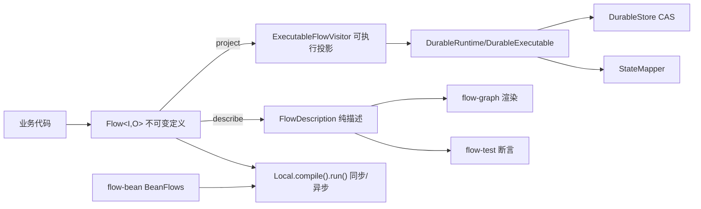

# team4u-flow 轻量化重构设计文档（2026-08-30）

> 状态：已实施。分支 `refactor/flow-lightweight-redesign`。
> 本文是最终设计记录；模块使用文档见 `docs/flow/`。

## 背景与决策

`team4u-framework` 定位是简单、克制、按需取用的 Java 8 基础架构组件库。Flow 并入后成为其中的业务步骤组合能力。设计起点有两个：

- `/root/code/team4u-flow`（成熟蓝本）：类型化 `Operation + 四态 Outcome` DSL、不可变定义、单同步内核、Local/Durable 双执行器、公开可执行投影 SPI。约 4,300 行，零第三方依赖。
- `team-kit` 旧版 Flow（与 framework 旧三态实现）：Builder 简洁、节点可读、可渲染、有轨迹，但三态 `SUCCEEDED/STOPPED/FAILED` 无法表达 Rejected 与 Skipped，持久化只保存共享 Context 的完成记录，无法可靠表达分支选择、失败阶段与副作用提交边界。

最终决策：**以成熟蓝本的 DSL 与行为模型为基线，破坏性迁移到 Java 8 / `com.team4u.framework.flow`**。不保留旧三态 Builder、旧 `Flow.Projection`、旧 snapshot 格式。framework 旧实现仅贡献恢复正确性经验（全局 cursor、ensure 顺序、终态 CAS、`load()` 副作用、branch key 碰撞等 11 个已修复缺陷的教训）。

## 核心设计

### 1 一个定义，两种执行器

`Flow<I, O>` 是唯一不可变业务定义，不可执行。两条投影路径：

- `flow.describe(flowId)` → `FlowDescription`（纯描述：NodeDescription 树 + BindingDescriptor，无 callback）。Graph/Test 消费。
- `flow.project(resolver, ExecutableFlowVisitor<R>)` → 可执行合同（解析后的 target 实例、project/merge、selector、join、ResumePoint、Policy、configuration）。Durable 消费。

### 2 业务结果与执行生命周期分层

- **Outcome<T>（业务四态，闭集）**：`Accepted(唯一携值)` / `Rejected(Reason)` / `Skipped(Reason)` / `Failed(Failure)`。
  - `then` 仅 Accepted 推进；Rejected 明确终止候选传播；Skipped 可被 `firstApplicable` 消费继续尝试；Failed 触发 `recoverWith`（输入包为 `Recovery<I>`）与 retry。
- **FlowResult<O>（Local 生命周期）**：`Completed(outcome)` / `Suspended(suspension)` / `Cancelled(executionId)`。
- **DurableResult<O>（Durable 生命周期）**：`Completed` / `Suspended(awaitingPoint)` / `Active(wakeAt)` / `Cancelled`，与快照 lifecycle `ACTIVE/SUSPENDED/COMPLETED/CANCELLED` 对应。
- Java 8 闭集：package-private 构造器抽象基类，外部无法扩展；运行时未知分支抛 `IllegalStateException`。

### 3 DSL 与节点

密封运行时节点八种：INVOKE、SEQUENCE、ROUTE、FALLBACK、PARALLEL、AWAIT、CONTROL（POLICY/PERSISTENT_POLICY/RETRY/TIMEOUT）、COMPLETE。

主要 API：`Flow.step(op/class/class+qualifier)`、`.then`、`.use`、`.scope(name,flow)`、`.named(label)`、`Flow.route(selector).caseOf/otherwise/withoutOtherwise`、`Flow.firstApplicable`、`.recoverWith(Flow<Recovery<I,O>,O>)`、`.await(ResumePoint<R>) → Flow<I,Resumed<O,R>>`、`.policy/.persistentPolicy`、`.retry(Retry)`、`.timeout(Duration)`、`Flow.<I>parallel(Branch...).join(JoinStrategy)`（内置 allAccepted/firstAccepted/quorum/homogeneousCollect）、`Flow.accepted/rejected/skipped/failed/identity`。

扩展点只有：Operation、Policy、PersistentPolicy、JoinStrategy、OperationResolver（+Durable 的 StateMapper/DurableStore）。运行时节点不可扩展。

### 4 执行模型

- 一个同步内核（SerialMachine / DurableMachine）推进单帧栈；异步入口与并行分支用 caller-owned executor（默认 commonPool），框架绝不创建/关闭线程池。
- true wait-all：取消/超时返回前等待已启动分支物理退出；忽略中断的业务代码会延迟返回（合同明确，不承诺严格耗时上界）。
- 非 ForkJoin worker 遇嵌套 parallel 或分支内 timeout 在编译期 fail-fast（`requiresCompensatingWorker`）。
- 取消：协作式 `Cancellation` 父子级联 + 线程中断绑定；async 命令无显式 executor 明确拒绝（ASYNC_EXECUTOR_MISSING）。

### 5 Durable 持久化协议

- 身份唯一边界：人工 `(flowId, flowVersion)`。不计算结构 hash、不承诺 path 跨版本稳定、不迁移旧 snapshot；格式不匹配直接 FORMAT_MISMATCH。
- 快照只含框架元数据 + `StoredValue` 编码槽；槽角色 `input` / `node:<path>` / `key:<path>` / `policy:<path>` / `resume:<name>`。绝不持久化 callback、Operation、Policy、JoinStrategy。
- Store SPI：side-effect-free `load` + `compareAndSet(executionId, expectedRevision, update)`（-1=create）。每个稳定节点边界 revision+1 CAS 提交；冲突 REVISION_CONFLICT。
- at-least-once：崩溃在 checkpoint 前允许当前 invoke 重放；`invocationId = flowId:flowVersion:executionId:path` 恢复不变，用于外部幂等。
- resume 两段 CAS：信号先编码落库（ACTIVE+pendingResume），再驱动 continuation 消费一次；同点同值幂等、不同值 RESUME_SIGNAL_CONFLICT。
- PersistentPolicy 的 key/state/attempt/绝对 wake（WaitUntil/RetryAt）跨恢复持久化；等待落 ACTIVE+wakeAt 不占线程，由 recover 继续。
- phase=0 结构帧是合法快照栈顶（初始快照或父帧压入后立即提交的检查点），恢复由 enterXxx 正常进入——此为审查发现并修复的高危恢复缺陷。
- Parallel 分支按声明顺序串行驱动（合同化简化，javadoc 声明 + 测试锁定）；分支结果槽按 token 持久化，恢复只跑未完成分支。
- checkpoint 事件走独立 `DurableObserver`，不进 Core `FlowObserver.Type`。

### 6 模块边界

| 模块 | 生产依赖 | 职责 |
|---|---|---|
| team4u-flow | 仅 JDK | DSL、四态、Local 执行、双投影 SPI |
| team4u-flow-durable | 仅 team4u-flow | 可恢复执行器、快照、CAS、StateMapper |
| team4u-flow-graph | 仅 team4u-flow | Mermaid/Text 渲染（只消费 FlowDescription） |
| team4u-flow-bean | team4u-flow + team4u-bean | BeanOperationResolver、BeanFlows 门面；容器代理原样调用 |
| team4u-flow-test | team4u-flow + team4u-flow-durable | OperationStub/PolicyStub/TraceCollector/FlowAssertions/Local+DurableFixture/ParallelBarrier |

单向依赖；Core 无 Durable 协议；外部包边界测试证明 Durable 无需反射/split-package/package-private 即可取得全部执行合同。

## Graph 渲染合同

- 六通道：四个业务 Outcome 终端 + SUSPENDED/CANCELLED 终端；sequence 仅 ACCEPTED 推进；fallback 只连配置的 trigger；route no-match → SKIPPED。
- parallel：业务四态经 branch-done → wait-all → JOIN；CANCELLED/SUSPENDED 出口进独立 cancel/suspended 节点，**绝不汇入 join**（审查修复：取消链可达 join 的高危缺陷）。
- route key 渲染只对精确 final 类型（String/wrapper/BigInteger/BigDecimal/Enum/Class）取值；其余（含子类、lambda）输出 `<opaque>`——不执行用户 `toString()`、不泄漏 `$$Lambda/0x...` 类名。
- 配置摘要只读 final 配置类字段：Retry → `maxAttempts=<n>,backoff=<s>s<n>ns`；Duration → `timeout=<s>s<n>ns`。
- Exits 为不可变 rope（结构共享、O(depth) 存储），显式栈遍历；5000 层嵌套 control 线性渲染。

## Bean 绑定合同

- 实例、class、class+qualifier 三种绑定在编译期一次性解析；resolver 返回的代理对象即 invocation target（Spring JDK/CGLIB 代理原样调用，advice 执行，不解包）。
- qualifier 解析：name lookup 后 `contract.isInstance` 校验，失败给稳定错误。

## 验证

- 模块测试：core 65 / bean 7 / durable 114 / graph 20 / test 11 = **217 通过**（`-Dmaven.compiler.release=8`）。
- 全 reactor `mvn clean test` BUILD SUCCESS（54 模块）。
- consumer IT（flow-core）：新 DSL 四态/route/fallback/parallel/await/resume/retry/timeout/cancel/describe 全部通过，运行时依赖树仅 team4u-flow。
- Java 8 classfile：五模块抽样 `javap` major version **52**。
- 独立缺陷审查：旧基线 11 缺陷、Graph 3 高 1 低、Durable 1 高 2 中 5 低，全部修复并有回归测试锁定。

## 明确不做的

- 不为旧三态 API、旧 Builder、旧 snapshot 提供兼容层。
- 不做结构 hash、跨版本 path 稳定、snapshot 自动迁移。
- 不创建/关闭线程池；不内置调度器。
- 不承诺忽略中断代码的严格取消耗时上界。
- Core 不预埋 Durable 状态字段（无 CoreDurableBridge 复活）。
