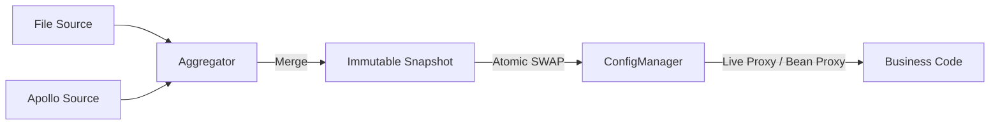

# 配置核心模块

[](https://openjdk.java.net/)
[](https://opensource.org/licenses/MIT)

## 目录
- [简介](#简介)
- [快速入门](#快速入门)
- [核心特性](#核心特性)
- [典型场景](#典型场景)
- [SPI 扩展](#spi-扩展)
- [架构与原理](#架构与原理)

---

## 简介

team4u-config-core 是一个轻量级、高性能、类型安全的 Java 配置管理框架。它通过“快照 (Snapshot) 驱动”的设计理念，解决了分布式系统在配置管理上的核心痛点：多源冲突、热更新抖动以及配置类型的非直观映射。

它不是简单的 Properties 或 Map 封装，而是将配置视为一个不断演进的数据流。通过这一层抽象，业务方可以透明地接入各种配置中心（Apollo, Nacos, Git, File 等），并享受强类型代理和原子化热更新带来的可靠性。

### 核心优势
* **透明热更新**：支持 Pinned（快照）/ Live（实时）双模代理，业务无感升级，彻底告别重启。
* **类型安全代理**：只需定义**普通 Java Bean**，一行代码自动生成代理并绑定配置，支持智能松散绑定。
* **高性能实现**：底层基于字节码增强技术，确保配置访问性能接近原生调用。
* **多源聚合**：内置优先级机制，支持环境变量、系统属性、远程配置的多级叠加与覆盖。
* **智能默认值**：原生支持 Java Bean 字段初始值作为兜底默认值，无缝集成。

---

## 快速入门

### 引入依赖

```xml
<dependency>
    <groupId>com.team4u</groupId>
    <artifactId>team4u-config-core</artifactId>
    <version>1.0.0-SNAPSHOT</version>
</dependency>
```

> [!NOTE]
> 本项目核心逻辑依赖于 [Hutool](https://hutool.cn/) (5.x)，引入时请确保项目中包含相关依赖。

### 准备配置源

在 src/main/resources 下创建 config.properties：
```properties
# 基础配置
server.name=team4u-demo
server.port=8080
server.tags=web,api,v1

# 复杂对象绑定示例
server.connect-timeout=5000
server.max-threads=200
# 嵌套对象绑定
server.db.url=jdbc:mysql://localhost:3306/test
server.db.username=root

# 占位符引用
server.description=${server.name} is running on port ${server.port}
```

### 获取 ConfigManager 实例

ConfigManager 是所有操作的入口。你可以使用内置的标准单例，也可以通过 Builder 进行深度定制。

```java
// 标准实例（推荐）：自动扫描当前包并加载所有通过 SPI 发现的 ConfigSource 和 ConfigWatcher
ConfigManager manager = ConfigManager.standard();

// 自定义实例：使用 Builder 进行高级配置
ConfigManager customManager = ConfigManager.builder()
    .scanSources("com.mycompany.config.sources")
    .scanWatchers("com.mycompany.config.watchers")
    .addSource(new MyCustomConfigSource())
    .build();
```

---

## 核心特性

### 强类型配置代理 (Live Mode)

框架会自动为配置类创建“实时代理”。当配置源发生变更时，代理对象的方法返回值会自动更新。

系统会自动实例化 Bean 对象，并将**代码初始值**作为最底层的默认值。
注解（如 `@ConfigKey`）既可以标注在 **Getter 方法**上，也可以直接标注在 **Field 字段**上。

```java
@ConfigPrefix("server")
public class ServerConfig {
    // 自动映射到 server.host，配置缺失时保持 "localhost"
    private String host = "localhost";
    
    // 映射到 server.port
    private int port = 8080;

    @ConfigKey("admin-user")
    private String user;

    public String getHost() { return host; }
    public int getPort() { return port; }
    public String getUser() { return user; }
}
```

> [!IMPORTANT]
> **值覆盖优先级**：
> **外部配置项** (最高) > **代码初始值** (最低)

#### 代理双模式对比

| 特性     | Live Mode (默认)       | Pinned Mode (通过 pin 获取)      |
| :------- | :--------------------- | :------------------------------- |
| 数据源   | 始终读取全局最新的快照 | 始终读取锚定时那一刻的快照       |
| 热更新   | 实时生效               | 实例保持旧值                     |
| 一致性   | 弱一致                 | 强一致（生命周期内绝对不变）     |
| 适用场景 | 绝大多数业务、实时开关 | 批处理、事务性计算、长连接初始化 |

### 声明式注解 (Annotations)

#### @ConfigPrefix
用于定义统一的配置前缀。
```java
@ConfigPrefix("server")
public class AppConfig { ... }
```

#### @ConfigKey
显式指定配置键，支持绝对路径（以点号开头）。
```java
@ConfigKey("max-threads") // 标注在方法或字段均可
int threads();

@ConfigKey(".global.version") // 忽略前缀，匹配全局配置项
String version();
```

#### @ConfigRequired
标记为必填项。若配置中心缺失该项，且对应的 Bean 字段初始值也为 `null`，则抛出 `ConfigMissingException`。
该注解可标注在 **Getter 方法**或 **Field 字段**上。

### 智能松散绑定 (Relaxed Binding)

系统会按以下顺序尝试匹配：
- server.maxThreads (驼峰)
- server.max-threads (中划线)
- server.max_threads (下划线)
- server.max.threads (点分隔)

### 占位符解析 (Placeholder)
支持 `${key:defaultValue}` 语法，具备深度嵌套解析、循环依赖检测和高性能实现。

---

## 典型场景

### 场景：高性能一致性快照 (Pinned Mode)

```java
public void process() {
    // 在入口处锁定当前版本（Pinning）
    AppConfig safeConfig = SnapshotAware.pin(config); 

    // 后续所有逻辑基于该 safeConfig 执行，确保配置的一致性
    if (safeConfig.isEnabled()) {
         int val = safeConfig.getVal(); 
    }
}
```

---

## 架构与原理

### 核心执行流程

1. **探测 (Watch)**：`ConfigWatcher` 发现原始配置变更。
2. **重载 (Reload)**：`SnapshotAggregator` 并发读取所有 `ConfigSource` 并按优先级合并为 `ConfigSnapshot`。
3. **生效 (Commit)**：原子化替换 `ConfigManager` 中的快照引用。
4. **代理拦截 (Proxy)**：
    - 底层基于字节码增强技术创建代理。
    - 方法调用被拦截后，优先从最新快照中通过 `key` 解析值。
    - 若快照中不存在，则通过 `invocation.proceed()` 调用真实 Bean 方法获取字段初始值。
    - **L2 Cache**：基于快照版本号的二级结果缓存，确保高频访问下性能接近原生调用。

### 状态流转图


