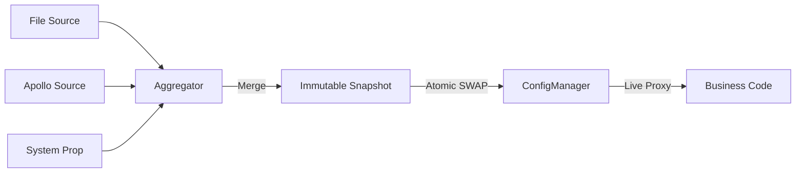

[返回总目录](../README.md)

# 配置核心模块

[](https://openjdk.java.net/)
[](https://opensource.org/licenses/MIT)

## 目录

- [简介](#简介)
- [快速入门](#快速入门)
- [核心特性](#核心特性)
- [典型场景](#典型场景)
- [SPI 扩展](#spi-扩展)
- [架构与原理](#架构与原理)

---

## 简介

team4u-config-core 是一个轻量级、高性能、类型安全的 Java 配置管理框架。它通过“快照 (Snapshot)
驱动”的设计理念，解决了分布式系统在配置管理上的核心痛点：多源冲突、热更新抖动以及配置类型的非直观映射。

它不是简单的 Properties 或 Map 封装，而是将配置视为一个不断演进的数据流。通过这一层抽象，业务方可以透明地接入各种配置中心（Apollo,
Nacos, Git, File 等），并享受强类型代理和原子化热更新带来的可靠性。

### 核心优势

* 透明热更新：支持 Pinned（快照）/ Live（实时）双模代理，业务无感升级，彻底告别重启。
* 类型安全代理：支持接口与普通 Java Bean，一行代码自动绑定配置到对象，支持智能松散绑定。
* 字段默认值：支持使用 Java Bean 字段的初始值作为配置缺失时的兜底默认值。
* 多源聚合：内置优先级机制，支持环境变量、系统属性、远程配置的多级叠加与覆盖。
* 不可变快照：核心对象基于不可变设计，确保在一次业务处理周期内配置逻辑一致。
* 零依赖/微依赖：核心模块极度精简，除 Hutool 及基础组件外无冗余依赖。

---

## 快速入门

### 引入依赖

```xml

<dependency>
    <groupId>com.team4u</groupId>
    <artifactId>team4u-config-core</artifactId>
    <version>1.0.0-SNAPSHOT</version>
</dependency>
```

> [!NOTE]
> 本项目核心逻辑依赖于 [Hutool](https://hutool.cn/) (5.x)，引入时请确保项目中包含相关依赖。

### 准备配置源

在 src/main/resources 下创建 config.properties：

```properties
# 基础配置
server.name=team4u-demo
server.port=8080
server.tags=web,api,v1
# 复杂对象绑定示例
server.connect-timeout=5000
server.max-threads=200
# 嵌套对象绑定
server.db.url=jdbc:mysql://localhost:3306/test
server.db.username=root
# 占位符引用
server.description=${server.name} is running on port ${server.port}
```

### 获取 ConfigManager 实例

ConfigManager 是所有操作的入口。你可以使用内置的标准单例，也可以通过 Builder 进行深度定制。

#### 1. 标准单例（推荐）

自动通过 SPI 发现并聚合配置。你也可以在调用 `global()` 之前，通过全局注册表手动预填组件：

```java
// 手动向全局注册表注入一个配置源
ConfigSourceRegistry.global().

register(new MyCustomConfigSource());

// 获取标准单例，它会自动包含上面手动注册的源以及 SPI 加载的源
ConfigManager manager = ConfigManager.global();
```

#### 2. 自定义实例

使用 Builder 构建完全隔离的配置环境：

```java
ConfigManager customManager = ConfigManager.builder()
        .scanSources("com.mycompany.config.sources")   // 扫描包自动注册
        .addSource(new MyCustomConfigSource())         // 手动添加实例
        .build();
```

#### 3. 状态重置

在单元测试或隔离沙箱中，你可以清理全局状态：

```java
// 重置 ConfigManager 单例
ConfigManager.resetGlobal();

// 清空全局注册表中的所有组件
ConfigSourceRegistry.

global().

unregisterAll();
ConfigWatcherRegistry.

global().

unregisterAll();
```

### 基础用法：获取键值

```java
// 获取精准配置，返回 Optional 避免空指针
String dbUrl = manager.getString("server.db.url").orElse("jdbc:mysql://localhost:3306/default");
```

### 进阶用法：强类型对象代理

这是最推荐的使用方式。你只需定义一个普通的 Java Bean（**必须包含无参构造函数**），框架会自动将配置绑定到对象属性上。*
*最强大的特性是：它会自动将字段的初始值作为配置缺失时的默认值。**

```java
public class AppConfig {
    private String name;
    private int port = 8080; // 字段初始值即为默认值
    private DbConfig db;

    // Getter (必须提供，用于代理拦截)
    public String getName() {
        return name;
    }

    public int getPort() {
        return port;
    }

    public DbConfig getDb() {
        return db;
    }
}

public class DbConfig {
    private String url;
    private final String username = "root";

    public String getUrl() {
        return url;
    }

    public String getUsername() {
        return username;
    }
}

// 方式 A：手动指定前缀
AppConfig config = manager.createProxy("server", AppConfig.class);

// 方式 B：使用 @ConfigPrefix 注解
AppConfig config2 = manager.createProxy(AppConfig.class);

System.out.

println(config.getDb().

getUsername()); // 若配置中无 server.db.username，则输出 "root"
```

#### 代理双模式：Live vs Pinned

通过 createProxy 创建的实例默认即为 Live Mode（实时模式）。理解这两种模式的区别对于构建高可靠系统至关重要：

| 特性   | Live Mode (默认)     | Pinned Mode (通过 pin 获取) |
|:-----|:-------------------|:------------------------|
| 数据源  | 始终读取全局最新的快照        | 始终读取锚定时那一刻的快照           |
| 热更新  | 实时生效，无需重启或重新获取     | 全局更新后，该实例仍保持旧值          |
| 一致性  | 弱一致：同一个方法多次调用可能值不同 | 强一致：生命周期内值绝对不变          |
| 适用场景 | 绝大多数业务、实时监控、开关逻辑   | 批处理、事务性计算、长连接初始化        |

---

---

## 核心特性

### 声明式注解 (Annotations)

#### @ConfigPrefix

用于在类级别定义统一的前缀。支持多级叠加：

```java

@ConfigPrefix("db")
public class DbConfig { ...
}

// 最终生效前缀为 "prod.app.db"
DbConfig config = manager.createProxy("prod.app", DbConfig.class);
```

#### @ConfigKey

用于明确指定配置 Key。支持**绝对路径**（以点号开头）：

```java
public class AppConfig {
    @ConfigKey("max-threads")      // 相对路径：匹配 server.max-threads
    private int threads;

    @ConfigKey(".global.version") // 绝对路径：忽略前缀，直接匹配 global.version
    private String version;

    public int getThreads() {
        return threads;
    }

    public String getVersion() {
        return version;
    }
}
```

#### @ConfigRequired & @ConfigDefault

- `@ConfigRequired`: 标记为必填。若配置缺失**且字段无初始值**时抛出 `ConfigMissingException`。
- `@ConfigDefault`: 提供字符串形式的默认值（支持占位符）。

---

### 占位符解析 (Placeholder)

支持 `${key:defaultValue}` 语法，具备以下特性：

- **深度嵌套支持**：
    - 键嵌套：`${db.${env}.host}`，动态决定查找的键。
    - 默认值嵌套：`${server.port:${global.port:8080}}`。
- **高性能与安全**：
    - 零临时对象：优化匹配算法，避免大量 `substring` 导致的内存压力。
    - 循环依赖检测：自动拦截并识别 `${a} -> ${b} -> ${a}` 的无限递归。
    - 递归深度限制：默认最大支持 20 层嵌套。

---

### 内置或官方扩展配置源

| 来源类型                   | 说明                | 文档链接                                              |
|:-----------------------|:------------------|:--------------------------------------------------|
| **System Properties**  | JVM 参数 (-D)       | [查看详情](#built-in-sources)                         |
| **System Environment** | 操作系统环境变量          | [查看详情](#built-in-sources)                         |
| **Properties File**    | 本地 .properties 文件 | [查看详情](#built-in-sources)                         |
| **Relational DB**      | 关系型数据库 (MySQL/H2) | [team4u-config-db](../team4u-config-db/README.md) |

#### SystemEnvConfigSource (系统属性与环境变量)

自动聚合 JVM 系统属性 (`-D`) 和操作系统环境变量。

- **自动归一化**：环境变量通常为大写下划线（如 `APP_PORT`），框架会自动生成对应的点分小写键（如 `app.port`），实现业务层感知透明。
- **优先级**：JVM 系统属性 > 环境变量。

#### PropertiesConfigSource

支持从 `java.util.Properties` 实例或类路径（Classpath）资源文件加载静态配置。

---

### 自定义属性转换 (Custom Converters)

#### 使用内置通用转换器

框架内置了 `JsonPropertyConverter`，可自动处理复杂 POJO 对象的反序列化：

```java
public class AppConfig {
    @ConfigConverter(JsonPropertyConverter.class)
    private User admin; // 自动解析配置中的 JSON 字符串
}
```

#### 注册与发现

转换器支持以下三种加载方式，均会注册到 `PropertyConverterRegistry.global()` 实例中：

1. **SPI 机制**：在 `META-INF/services/com.team4u.framework.config.core.convert.PropertyConverter` 中定义类路径。
2. **包扫描**：框架初始化时会自动扫描 `com.team4u.framework.config.core.convert` 包。
3. **手动注册（推荐）**：直接通过全局注册表注册，无需通过 Builder 重新构建。

```java
// 在应用启动时手动注入一个特定转换器
PropertyConverterRegistry.global().

register(new MyCustomConverter());
```

---

### 智能松散绑定 (Relaxed Binding)

框架对键名执行归一化匹配（忽略大小写及 `.`, `-`, `_` 分隔符）。
当你访问属性 `maxDbConnections` 时，以下配置均可匹配：

- `server.maxDbConnections` (驼峰)
- `server.max-db-connections` (中划线)
- `server.max_db_connections` (下划线)
- `server.max.db.connections` (点分隔)

---

### 热加载与变更监听

当 `ConfigWatcher` 探测到源数据变更时，`ConfigManager` 会执行原子快照替换。

* **防抖处理**：默认内置 500ms 防抖窗口，合并瞬时高频变更。
* **监听语义**：通过 `addChangeListener` 注册的回调中，`oldValue == null` 表示新增，`newValue == null` 表示删除。

```java
manager.addChangeListener("server.*",(key, oldVal, newVal) ->{
        if(newVal ==null){
        System.out.

println("Config deleted: "+key);
    }else{
            System.out.

println("Config changed: "+key +" from "+oldVal+" to "+newVal);
    }
            });
```

### 多源优先级聚合

你可以同时组合多个配置源，优先级高的源将覆盖优先级低的源：

```java
ConfigManager manager = ConfigManager.builder()
        .addSource(new GitConfigSource())   // 外部配置，优先级高
        .addSource(new LocalConfigSource()) // 本地兜底，优先级低
        .build();
```

---

## 单元测试支持

框架内置了 `InMemoryConfigSource`，允许在单元测试中通过代码动态注入配置，无需依赖外部文件。它同时实现了 `ConfigWatcher`
接口，支持实时刷新。

### 1. 使用标准单例测试

通过全局注册表，你可以直接向 `ConfigManager.global()` 注入数据：

```java

@BeforeEach
public void setup() {
    // 注入内存配置源
    ConfigSourceRegistry.global().register(new InMemoryConfigSource("test", 1));
}

@AfterEach
public void cleanup() {
    // 清理全局状态，确保测试隔离
    ConfigManager.resetGlobal();
    ConfigSourceRegistry.global().unregisterAll();
}
```

### 2. 使用 Builder 构建隔离环境

推荐在复杂的集成测试中使用 Builder，以获得完全隔离的配置空间：

```java
InMemoryConfigSource memorySource = new InMemoryConfigSource("test-memory", 1);
ConfigManager manager = ConfigManager.builder()
        .addSource(memorySource)
        .addWatcher(memorySource) // 作为监听器注册
        .build();

// 注入配置并自动刷新
memorySource.

putAndRefresh("server.name","unit-test-app");
```

---

## 可靠性与故障排查

### 启动阻断 (Fail-Fast)

在 ConfigManager 初始化时，会执行 initialLoad()。如果任何关键配置源加载失败，系统将抛出异常并阻断应用启动，防止应用在配置不完整的状态下运行。

### 热更容错与原子性

热更新过程是原子性的。如果新快照在聚合或加载过程中发生异常，HotReloadManager 会捕获异常并记录错误日志，同时保留旧快照生效，确保系统运行的连续性。

### 配置溯源 (Traceability)

当多个配置源存在同名键时，可以通过快照获取配置的原始来源，解决“配置究竟从哪来”的疑问：

```java
manager.currentSnapshot().

getEntry("server.name").

ifPresent(entry ->{
        System.out.

println("Value: "+entry.getValue());
        System.out.

println("From source: "+entry.getSourceName()); // 例如 "File:config.properties"
        });
```

---

## 典型场景

### 场景：高性能一致性快照 (Pinned Mode)

在某些对一致性要求极高的场景（如长耗时的批处理任务或涉及多步逻辑的订单处理），你可能不希望处理过程中配置发生跳变。

#### 为什么要用锚定 (Pinning)？

* 防止“撕裂读取”：如果一段逻辑中多次读取不同的配置项（如 discount 和
  threshold），而此时后台正好发生了配置重载，可能会导致一半逻辑使用了旧配置，另一半使用了新配置，从而产生业务逻辑错误。
* 性能优化：Pinned 代理绑定了固定的快照，且内部共享解析后的元数据静态缓存。这使得 Pinned 代理的创建非常轻量，且由于不需要每次调用都去竞争全局
  Snapshot 引用，能更好地承载极高并发的读取请求。

#### 最佳实践：一次锚定，多次复用

为了既保证逻辑一致性，又发挥代理的高性能，应遵循 “一次 Pin，多次使用” 的原则。通常建议在业务请求的入口（如 Request Filter 或
Service 入口处）进行锚定，并将其绑定到请求上下文或方法作用域中。

##### ❌ 错误用法（反模式）

不要在每个微小的操作中重复锚定，这虽然正确性没问题，但会产生不必要的对象分配。

```java
public void process() {
    // 【严重不推荐】
    // 每次调用都 pin，虽然对象创建很轻量，但会导致逻辑颗粒度过碎
    if (SnapshotAware.pin(config).isEnabled()) {
        // ...
        int val = SnapshotAware.pin(config).getVal();
    }
}
```

##### ✅ 正确用法（推荐）

在业务逻辑的开始处锚定一次，后续所有子逻辑复用该实例。

```java
public void process() {
    // 1. 在当前作用域开始时，生成一个固定视角的配置对象
    AppConfig safeConfig = SnapshotAware.pin(config);

    // 2. 后续所有逻辑都使用这个 safeConfig
    //    由于元数据已全局静态缓存，此处的开销极低
    if (safeConfig.isEnabled()) {
        // ... 
        // 这里拿到的 val 和上面的 isEnabled 保证是同一个版本快照，且读取性能极高
        int val = safeConfig.getVal();
    }
}
```

### 场景：基于接口的配置驱动编程

通过 createProxy，你可以将配置完全视为一个普通的 Java 服务，极大地增强了代码的可测试性和自描述性。

---

## SPI 扩展

框架高度可扩展，通过实现以下 SPI 接口并配合 ServiceLoader 或 Builder 手动注册。

| 扩展接口              | 功能说明                                    | 核心路径                           |
|-------------------|-----------------------------------------|--------------------------------|
| ConfigSource      | 数据源：决定配置从哪加载（如从 Redis、MySQL 或 Http 加载）。 | spi/ConfigSource.java          |
| ConfigWatcher     | 监听器：决定如何发现配置变更（如监听文件系统通知、定时拉取等）。        | spi/ConfigWatcher.java         |
| ConfigBinder      | 绑定器：决定如何将 String 数据映射到 Complex Object。  | spi/ConfigBinder.java          |
| PropertyConverter | 转换器：SPI 方式注册全局转换逻辑（可选）。                 | convert/PropertyConverter.java |

### 实现自定义配置源

- Tombstone 机制：
  `ConfigSource` 定义了 `TOMBSTONE_VALUE` (null)。当一个源返回此值时，表示它显式“删除”或“屏蔽”了低优先级源中的同名配置，防止旧值污染。

- 实现接口：

```java
public class MyConfigSource implements ConfigSource {
    @Override
    public String name() {
        return "my-source";
    }

    @Override
    public int priority() {
        return 100;
    }

    @Override
    public Map<String, ConfigEntry> load() {
        // 从外部系统加载配置并包装成 ConfigEntry
        return new HashMap<>();
    }
}
```

- 注册服务：
  在 `src/main/resources/META-INF/services/com.team4u.framework.config.core.spi.ConfigSource` 文件中添加类全路径：

```text
com.yourpackage.MyConfigSource
```

---

## 架构与原理

### 核心执行流程

team4u-config-core 的运行机制可以简化为以下闭环：

- 探测 (Watch)：ConfigWatcher 发现原始配置发生变更。
- 重载 (Reload)：触发信号，SnapshotAggregator 并发读取所有 ConfigSource。
- 聚合 (Aggregate)：根据 OrderedPolicy 优先级将多个 Map 压扁（Flatten）合并为唯一的 ConfigSnapshot。
- 生效 (Commit)：原子化替换 ConfigManager 中的 currentSnapshot 引用。
- 分发 (Notify)：触发所有通过 addChangeListener 注册的业务回调。

### 状态流转图


