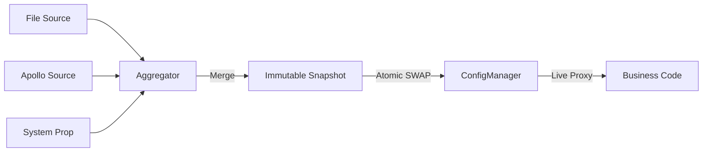

# 配置核心模块

[](https://openjdk.java.net/)
[](https://opensource.org/licenses/MIT)

## 目录
- [简介](#简介)
- [快速入门](#快速入门)
- [核心特性](#核心特性)
- [典型场景](#典型场景)
- [SPI 扩展](#spi-扩展)
- [架构与原理](#架构与原理)

---

## 简介

team4u-config-core 是一个轻量级、高性能、类型安全的 Java 配置管理框架。它通过“快照 (Snapshot) 驱动”的设计理念，解决了分布式系统在配置管理上的核心痛点：多源冲突、热更新抖动以及配置类型的非直观映射。

它不是简单的 Properties 或 Map 封装，而是将配置视为一个不断演进的数据流。通过这一层抽象，业务方可以透明地接入各种配置中心（Apollo, Nacos, Git, File 等），并享受强类型代理和原子化热更新带来的可靠性。

### 核心优势
* 透明热更新：支持 Pinned（快照）/ Live（实时）双模代理，业务无感升级，彻底告别重启。
* 类型安全代理：只需定义接口，一行代码自动绑定配置到 Java 对象，支持智能松散绑定。
* 多源聚合：内置优先级机制，支持环境变量、系统属性、远程配置的多级叠加与覆盖。
* 不可变快照：核心对象基于不可变设计，确保在一次业务处理周期内配置逻辑一致。
* 零依赖/微依赖：核心模块极度精简，方便集成到任何 Java 环境。

---

## 快速入门

### 引入依赖

```xml
<dependency>
    <groupId>com.team4u</groupId>
    <artifactId>team4u-config-core</artifactId>
    <version>1.0.0-SNAPSHOT</version>
</dependency>
```

> [!NOTE]
> 本项目核心逻辑依赖于 [Hutool](https://hutool.cn/) (5.x)，引入时请确保项目中包含相关依赖。

### 准备配置源

在 src/main/resources 下创建 config.properties：
```properties
# 基础配置
app.name=team4u-demo
app.port=8080
app.tags=web,api,v1

# 复杂对象绑定示例
server.connect-timeout=5000
server.max-threads=200
# 嵌套对象绑定
server.db.url=jdbc:mysql://localhost:3306/test
server.db.username=root

# 占位符引用
app.description=${app.name} is running on port ${app.port}
```

### 获取 ConfigManager 实例

ConfigManager 是所有操作的入口。你可以使用内置的标准单例，也可以通过 Builder 进行深度定制。

```java
// 标准实例（推荐）：自动通过 SPI 加载所有可用的 ConfigSource 和 ConfigWatcher
ConfigManager manager = ConfigManager.standard();

// 自定义实例：使用 Builder 进行高级配置
ConfigManager customManager = ConfigManager.builder()
    .scanSources("com.mycompany.config.sources")   // 扫描包自动注册 Source
    .scanWatchers("com.mycompany.config.watchers") // 扫描包自动注册 Watcher
    .addSource(new MyCustomConfigSource())         // 手动添加
    .build();
```

### 基础用法：获取键值

```java
// 获取精准配置，返回 Optional 避免空指针
String dbUrl = manager.getString("db.url").orElse("jdbc:mysql://localhost:3306/default");
```

### 进阶用法：强类型接口代理

这是最推荐的使用方式，无需再手动 getString，直接操作业务接口。

```java
public interface AppConfig {
    String getName();
    int getPort();
    List<String> getTags();
    
    // 支持嵌套结构绑定：自动将 server.db.xxx 映射为 DbConfig 对象
    DbConfig getDb();
}

public interface DbConfig {
    String getUrl();
    String getUsername();
}

// 创建动态代理 (Live Mode：配置变动时，值随之同步变化)
// 前缀可以带 "." 也可以不带，如 "server" 或 "server." 效果一致
AppConfig config = manager.createProxy("server", AppConfig.class);

System.out.println(config.getName());        // 内部自动查找 server.name
System.out.println(config.getDb().getUrl()); // 访问嵌套对象
```

#### 代理双模式：Live vs Pinned

通过 createProxy 创建的实例默认即为 Live Mode（实时模式）。理解这两种模式的区别对于构建高可靠系统至关重要：

| 特性         | Live Mode (默认)                     | Pinned Mode (通过 pin 获取)      |
| :----------- | :----------------------------------- | :------------------------------- |
| 数据源   | 始终读取全局最新的快照               | 始终读取锚定时那一刻的快照       |
| 热更新   | 实时生效，无需重启或重新获取         | 全局更新后，该实例仍保持旧值     |
| 一致性   | 弱一致：同一个方法多次调用可能值不同 | 强一致：生命周期内值绝对不变     |
| 适用场景 | 绝大多数业务、实时监控、开关逻辑     | 批处理、事务性计算、长连接初始化 |

---

## 核心特性

### 智能松散绑定 (Relaxed Binding)

框架对配置键采用“尽力而为”的模糊匹配算法。无论是通过 ConfigManager.createProxy 生成的接口代理，还是基于 Bean 的绑定，都支持多种风格的自动转换。

#### 接口代理匹配规则
当你调用接口方法 maxDbConnections() 时，系统会按照以下顺序尝试在配置源中查找匹配项：
- app.maxDbConnections (原始驼峰)
- app.max-db-connections (中划线，推荐)
- app.max_db_connections (下划线)
- app.max.db.connections (点分隔)

> [!NOTE]
> 对于 boolean 类型的 Getter 方法（如 isDevMode()），系统会自动去除 is 前缀后再进行上述匹配逻辑（即查找 app.dev-mode 等）。

#### 绑定对比示例
| 配置键 (Config Key) | 映射关系示例      | 适用风格   |
| :------------------ | :---------------- | :--------- |
| app.max-threads   | getMaxThreads() | Kebab Case |
| app.max_threads   | getMaxThreads() | Snake Case |
| app.max.threads   | getMaxThreads() | Dot Case   |
| app.maxThreads    | getMaxThreads() | Camel Case |

### 占位符解析 (Placeholder)
支持 ${key:defaultValue} 语法：
- 基本引用：${app.name}。
- 默认值：${db.port:3306}，当键不存在时使用默认值。
- 嵌套引用：jdbc:mysql://${db.host}:${db.port}/db。
- 循环依赖检测：系统会自动检测并防止 ${a} -> ${b} -> ${a} 的死循环。

### 热加载与变更监听
当 ConfigWatcher 探测到源数据变更时，ConfigManager 会触发重载。

* 防抖处理：内置 500ms 的防抖窗口，合并高频变更信号，避免配置抖动对系统造成冲击。
* 监听语义：通过 addChangeListener 注册的回调中，oldValue 和 newValue 的 null 值具有明确含义：
    - 新增：oldValue == null, newValue != null
    - 修改：两者均不为 null 且不相等
    - 删除：oldValue != null, newValue == null（代表配置被移除或被高优先级源标记为删除）

```java
manager.addChangeListener("app.*", (key, oldVal, newVal) -> {
    if (newVal == null) {
        System.out.println("Config deleted: " + key);
    } else {
        System.out.println("Config changed: " + key + " from " + oldVal + " to " + newVal);
    }
});
```

### 多源优先级聚合
你可以同时组合多个配置源，优先级高的源将覆盖优先级低的源：
```java
ConfigManager manager = ConfigManager.builder()
    .addSource(new GitConfigSource())   // 外部配置，优先级高
    .addSource(new LocalConfigSource()) // 本地兜底，优先级低
    .build();
```

---

## 单元测试支持

框架内置了 InMemoryConfigSource，允许在单元测试中通过代码动态注入配置，无需依赖外部文件。

```java
// 构建包含内存源的 Manager
InMemoryConfigSource memorySource = new InMemoryConfigSource("test-memory", 1);
ConfigManager manager = ConfigManager.builder()
    .addSource(memorySource)
    .build();

// 注入配置并自动刷新
memorySource.putAndRefresh("app.name", "unit-test-app");

// 验证行为
AppConfig config = manager.createProxy("app", AppConfig.class);
assertEquals("unit-test-app", config.getName());
```

---

## 可靠性与故障排查

### 启动阻断 (Fail-Fast)
在 ConfigManager 初始化时，会执行 initialLoad()。如果任何关键配置源加载失败，系统将抛出异常并阻断应用启动，防止应用在配置不完整的状态下运行。

### 热更容错与原子性
热更新过程是原子性的。如果新快照在聚合或加载过程中发生异常，HotReloadManager 会捕获异常并记录错误日志，同时保留旧快照生效，确保系统运行的连续性。

### 配置溯源 (Traceability)
当多个配置源存在同名键时，可以通过快照获取配置的原始来源，解决“配置究竟从哪来”的疑问：
```java
manager.currentSnapshot().getEntry("app.name").ifPresent(entry -> {
    System.out.println("Value: " + entry.getValue());
    System.out.println("From source: " + entry.getSourceName()); // 例如 "File:config.properties"
});
```

---

## 典型场景

### 场景：高性能一致性快照 (Pinned Mode)

在某些对一致性要求极高的场景（如长耗时的批处理任务或涉及多步逻辑 of 订单处理），你可能不希望处理过程中配置发生跳变。

为什么要用锚定 (Pinning)？
* 防止“撕裂读取” (Torn Reads)：如果一段逻辑中多次读取不同的配置项（如 discount 和 threshold），而此时后台正好发生了配置重载，可能会导致一半逻辑使用了旧配置，另一半使用了新配置，从而产生业务逻辑错误。
* 性能优化：Pinned 代理绑定了固定的快照，避免了每次方法调用时都去查询全局最新引用的开销。

```java
// 方式 A：直接从管理器获取当前时刻的静态快照
ConfigSnapshot snapshot = manager.currentSnapshot();
String value = snapshot.get("key").orElse(null);

// 方式 B：将已有的 Live 代理“锚定”为 Pinned 代理（推荐）
// 锚定后产生的新对象将永远固定在调用 pin 时刻的状态，不再随全局更新。
AppConfig pinnedConfig = SnapshotAware.pin(config);
```

### 场景：基于接口的配置驱动编程
通过 createProxy，你可以将配置完全视为一个普通的 Java 服务，极大地增强了代码的可测试性和自描述性。

---

## SPI 扩展

框架高度可扩展，通过实现以下 SPI 接口并配合 ServiceLoader 或 Builder 手动注册。

| 扩展接口        | 功能说明                                                             | 核心路径                 |
| --------------- | -------------------------------------------------------------------- | ------------------------ |
| ConfigSource  | 数据源：决定配置从哪加载（如从 Redis、MySQL 或 Http 加载）。     | spi/ConfigSource.java  |
| ConfigWatcher | 监听器：决定如何发现配置变更（如监听文件系统通知、定时拉取等）。 | spi/ConfigWatcher.java |
| ConfigBinder  | 绑定器：决定如何将 String 数据映射到 Complex Object。            | spi/ConfigBinder.java  |

### 实现自定义配置源

- 实现接口：
```java
public class MyConfigSource implements ConfigSource {
    @Override
    public String name() { return "my-source"; }

    @Override
    public int priority() { return 100; }

    @Override
    public Map<String, ConfigEntry> load() {
        // 从外部系统加载配置并包装成 ConfigEntry
        return new HashMap<>();
    }
}
```

- 注册服务：
在 src/main/resources/META-INF/services/com.team4u.config.core.spi.ConfigSource 文件中添加类全路径：
```text
com.yourpackage.MyConfigSource
```

---

## 架构与原理

### 核心执行流程

team4u-config-core 的运行机制可以简化为以下闭环：

- 探测 (Watch)：ConfigWatcher 发现原始配置发生变更。
- 重载 (Reload)：触发信号，SnapshotAggregator 并发读取所有 ConfigSource。
- 聚合 (Aggregate)：根据 OrderedPolicy 优先级将多个 Map 压扁（Flatten）合并为唯一的 ConfigSnapshot。
- 生效 (Commit)：原子化替换 ConfigManager 中的 currentSnapshot 引用。
- 分发 (Notify)：触发所有通过 addChangeListener 注册的业务回调。

### 状态流转图


