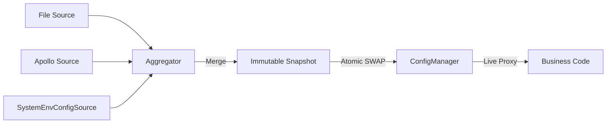

# 配置核心模块

[](https://openjdk.java.net/)
[](https://opensource.org/licenses/MIT)

## 目录
- [简介](#简介)
- [快速入门](#快速入门)
- [核心特性](#核心特性)
- [典型场景](#典型场景)
- [SPI 扩展](#spi-扩展)
- [架构与原理](#架构与原理)

---

## 简介

team4u-config-core 是一个轻量级、高性能、类型安全的 Java 配置管理框架。它通过“快照 (Snapshot) 驱动”的设计理念，解决了分布式系统在配置管理上的核心痛点：多源冲突、热更新抖动以及配置类型的非直观映射。

它不是简单的 Properties 或 Map 封装，而是将配置视为一个不断演进的数据流。通过这一层抽象，业务方可以透明地接入各种配置中心（Apollo, Nacos, Git, File 等），并享受强类型代理和原子化热更新带来的可靠性。

### 核心优势
* 透明热更新：支持 Pinned（快照）/ Live（实时）双模代理，业务无感升级，彻底告别重启。
* 类型安全代理：只需定义接口，一行代码自动绑定配置到 Java 对象，支持智能松散绑定。
* 多源聚合：内置优先级机制，支持环境变量、系统属性、远程配置的多级叠加与覆盖。
* 不可变快照：核心对象基于不可变设计，确保在一次业务处理周期内配置逻辑一致。
* 零依赖/微依赖：核心模块极度精简，方便集成到任何 Java 环境。

---

## 快速入门

### 引入依赖

```xml
<dependency>
    <groupId>com.team4u</groupId>
    <artifactId>team4u-config-core</artifactId>
    <version>1.0.0-SNAPSHOT</version>
</dependency>
```

> [!NOTE]
> 本项目核心逻辑依赖于 [Hutool](https://hutool.cn/) (5.x)，引入时请确保项目中包含相关依赖。

### 准备配置源

在 src/main/resources 下创建 config.properties：
```properties
# 基础配置
server.name=team4u-demo
server.port=8080
server.tags=web,api,v1

# 复杂对象绑定示例
server.connect-timeout=5000
server.max-threads=200
# 嵌套对象绑定
server.db.url=jdbc:mysql://localhost:3306/test
server.db.username=root

# 占位符引用
server.description=${server.name} is running on port ${server.port}
```

### 获取 ConfigManager 实例

ConfigManager 是所有操作的入口。你可以使用内置的标准单例，也可以通过 Builder 进行深度定制。

```java
// 标准实例（推荐）：自动扫描当前包并加载所有通过 SPI 发现的 ConfigSource 和 ConfigWatcher
ConfigManager manager = ConfigManager.standard();

// 自定义实例：使用 Builder 进行高级配置
// Builder 在初始化时也会默认触发自动扫描和 SPI 加载
ConfigManager customManager = ConfigManager.builder()
    .scanSources("com.mycompany.config.sources")   // 额外的包扫描：手动扫描包自动注册 Source
    .scanWatchers("com.mycompany.config.watchers") // 额外的包扫描：手动扫描包自动注册 Watcher
    .addSource(new MyCustomConfigSource())         // 手动添加实例
    .build();
```

### 基础用法：获取键值

```java
// 获取精准配置，返回 Optional 避免空指针
String dbUrl = manager.getString("server.db.url").orElse("jdbc:mysql://localhost:3306/default");
```

### 进阶用法：强类型接口代理

这是最推荐的使用方式，无需再手动 getString，直接操作业务接口。

```java
public interface AppConfig {
    String getName();
    int getPort();
    List<String> getTags();
    
    // 支持嵌套结构绑定：自动将 server.db.xxx 映射为 DbConfig 对象
    DbConfig getDb();
}

public interface DbConfig {
    String getUrl();
    String getUsername();
}

// 方式 A：手动指定前缀
AppConfig config = manager.createProxy("server", AppConfig.class);

// 方式 B：使用 @ConfigPrefix 注解（推荐，见下文“声明式注解”章节）
AppConfig config2 = manager.createProxy(AppConfig.class);

System.out.println(config.getName());        // 内部自动查找 server.name
System.out.println(config.getDb().getUrl()); // 访问嵌套对象
```

#### 代理双模式：Live vs Pinned

通过 createProxy 创建的实例默认即为 Live Mode（实时模式）。理解这两种模式的区别对于构建高可靠系统至关重要：

| 特性         | Live Mode (默认)                     | Pinned Mode (通过 pin 获取)      |
| :----------- | :----------------------------------- | :------------------------------- |
| 数据源   | 始终读取全局最新的快照               | 始终读取锚定时那一刻的快照       |
| 热更新   | 实时生效，无需重启或重新获取         | 全局更新后，该实例仍保持旧值     |
| 一致性   | 弱一致：同一个方法多次调用可能值不同 | 强一致：生命周期内值绝对不变     |
| 适用场景 | 绝大多数业务、实时监控、开关逻辑     | 批处理、事务性计算、长连接初始化 |

---

---

## 核心特性

### 声明式注解 (Annotations)

除了基本的松散绑定，框架提供了一系列注解来增强接口的可维护性和鲁棒性。

#### @ConfigPrefix
用于在接口类级别定义统一的配置前缀，简化代理创建过程。
```java
@ConfigPrefix("server")
public interface AppConfig {
    String getName();
}

// 此时无需在代码中硬编码 "server" 前缀
AppConfig config = manager.createProxy(AppConfig.class);
```

> [!TIP]
> 前缀合并规则：如果你在代码中显式指定了前缀，它将与注解中的前缀进行叠加合并。例如，如果接口标记了 `@ConfigPrefix("db")`，而调用时使用了 `manager.createProxy("prod", DbConfig.class)`，最终生效的完整前缀将是 `prod.db`。

#### @ConfigKey
用于明确指定该方法对应的配置 Key，跳过自动推断逻辑。支持绝对路径（以点号开头）和相对路径。
```java
public interface AppConfig {
    @ConfigKey("max-threads") // 显式匹配 server.max-threads
    int threads();
    
    @ConfigKey(".global.version") // 绝对路径，忽略 server 前缀，匹配 global.version
    String version();
}
```

#### @ConfigDefault & @ConfigRequired
用于处理缺失值：
- `@ConfigDefault`: 提供兜底值（支持占位符和自动类型转换）。
- `@ConfigRequired`: 标记为必填，若缺失且无默认值则抛出 `ConfigMissingException`。

```java
public interface AppConfig {
    @ConfigDefault("8080")
    int getPort();

    @ConfigRequired
    String getSecretKey();
}
```

### 自定义属性转换 (Custom Converters)

当内置的绑定逻辑无法满足复杂类型（如：加密数据解密、特定格式解析）时，可以使用 `@ConfigConverter` 指定自定义转换器。

#### 使用内置通用转换器
框架内置了基于 Hutool JSON 的通用转换器 `JsonPropertyConverter`，可直接用于任何 POJO 类型：

```java
public interface AppConfig {
    // 自动将 JSON 字符串转换为 User 对象
    @ConfigConverter(JsonPropertyConverter.class)
    User getUser();
}
```

#### 实现自定义转换器
如果需要特殊的转换逻辑（如解密），可以实现 `PropertyConverter` 接口：

```java
/
 * 解密转换器示例
 */
public class MyDecryptConverter implements PropertyConverter<String> {
    @Override
    public String convert(String source, Class<String> targetType) {
        // source 为原始配置值，targetType 为方法返回类型
        return SecureUtil.aes(KEY).decryptStr(source);
    }
}
```

#### 注册自定义转换器

你通过以下方式提供的自定义转换器将在所有 `ConfigManager` 实例中生效：

方式 A：通过 Builder 手动注册（推荐用于特定实例）
```java
ConfigManager manager = ConfigManager.builder()
    .addConverter(new MyDecryptConverter()) // 手动添加实例
    .build();
```

方式 B：自动发现（推荐用于全局通用转换器）
框架在初始化 `Builder` 时，会自动通过以下两种机制加载转换器：
1. SPI 机制：在 `META-INF/services/com.team4u.framework.config.core.convert.PropertyConverter` 文件中添加实现类的全路径。
2. 包扫描：自动扫描 `com.team4u.framework.config.core.convert` 包及其子包下的所有非抽象 `PropertyConverter` 实现类。

方式 C：手动指定包扫描
```java
ConfigManager manager = ConfigManager.builder()
    .scanConverters("com.mycompany.config.converters") // 手动扫描指定包
    .build();
```

> [!TIP]
> 优先级说明：手动通过 `addConverter` 注册的转换器优先级高于自动加载的转换器。如果同一个目标类型存在多个转换器，系统将采用最后注册的一个。

### 智能松散绑定 (Relaxed Binding)

框架对配置键采用“尽力而为”的模糊匹配算法。无论是通过 ConfigManager.createProxy 生成的接口代理，还是基于 Bean 的绑定，都支持多种风格的自动转换。

#### 接口代理匹配规则
当你调用接口方法 maxDbConnections() 时，系统会按照以下顺序尝试在配置源中查找匹配项：
- server.maxDbConnections (原始驼峰)
- server.max-db-connections (中划线，推荐)
- server.max_db_connections (下划线)
- server.max.db.connections (点分隔)

> [!NOTE]
> 对于 boolean 类型的 Getter 方法（如 isDevMode()），系统会自动去除 is 前缀后再进行上述匹配逻辑（即查找 server.dev-mode 等）。

#### 绑定对比示例
| 配置键 (Config Key) | 映射关系示例      | 适用风格   |
| :------------------ | :---------------- | :--------- |
| server.max-threads   | getMaxThreads() | Kebab Case |
| server.max_threads   | getMaxThreads() | Snake Case |
| server.max.threads   | getMaxThreads() | Dot Case   |
| server.maxThreads    | getMaxThreads() | Camel Case |

### 占位符解析 (Placeholder)
支持 `${key:defaultValue}` 语法，具备以下特性：
- 深度嵌套支持：
    - 键嵌套：`${db.${env}.host}`，根据 `env` 的值动态决定查找的键。
    - 值嵌套：解析出的值若包含占位符，将自动递归解析。
    - 默认值嵌套：`${server.port:${global.port:8080}}`，支持在默认值中嵌套其他占位符。
- 高性能实现：
    - 零临时对象：优化了匹配算法，在解析过程中避免了大量 `substring` 导致的临时字符串对象分配。
    - 集合复用：在批量解析配置快照时复用依赖追踪集合，显著降低高频调用下的内存压力。
- 循环依赖检测：系统会自动检测并防止 `${a} -> ${b} -> ${a}` 的死循环，并抛出清晰的异常信息。
- 优雅降级：对于无法解析且未提供默认值的占位符，系统将保持原样输出，确保不会因部分配置缺失导致整体解析失败。

### 热加载与变更监听
当 ConfigWatcher 探测到源数据变更时，ConfigManager 会触发重载。

* 防抖处理：内置 500ms 的防抖窗口，合并高频变更信号，避免配置抖动对系统造成冲击。
* 监听语义：通过 addChangeListener 注册的回调中，oldValue 和 newValue 的 null 值具有明确含义：
    - 新增：oldValue == null, newValue != null
    - 修改：两者均不为 null 且不相等
    - 删除：oldValue != null, newValue == null（代表配置被移除或被高优先级源标记为删除）

```java
manager.addChangeListener("server.*", (key, oldVal, newVal) -> {
    if (newVal == null) {
        System.out.println("Config deleted: " + key);
    } else {
        System.out.println("Config changed: " + key + " from " + oldVal + " to " + newVal);
    }
});
```

### 多源优先级聚合
你可以同时组合多个配置源，优先级高的源将覆盖优先级低的源：
```java
ConfigManager manager = ConfigManager.builder()
    .addSource(new SystemEnvConfigSource(10)) // 系统属性/环境变量，作为最高层覆盖（如 -Dapp.debug=true）
    .addSource(new GitConfigSource(20))       // 远程配置，中层
    .addSource(new LocalConfigSource(30))     // 本地兜底，优先级最低
    .build();
```

> [!TIP]
> 数值越小优先级越高。`SystemEnvConfigSource` 通常应分配最高优先级，以确保运维人员可以通过系统属性（`-Dkey=value`）随时热覆盖任意配置项。

---

## 单元测试支持

框架内置了 InMemoryConfigSource，允许在单元测试中通过代码动态注入配置，无需依赖外部文件。

```java
// 构建包含内存源的 Manager
InMemoryConfigSource memorySource = new InMemoryConfigSource("test-memory", 1);
ConfigManager manager = ConfigManager.builder()
    .addSource(memorySource)
    .addWatcher(memorySource) // 确保刷新信号能被监听到
    .build();

// 注入配置并自动刷新
memorySource.putAndRefresh("server.name", "unit-test-app");

// 验证行为
AppConfig config = manager.createProxy("server", AppConfig.class);
assertEquals("unit-test-app", config.getName());
```

---

## 可靠性与故障排查

### 启动阻断 (Fail-Fast)
在 ConfigManager 初始化时，会执行 initialLoad()。如果任何关键配置源加载失败，系统将抛出异常并阻断应用启动，防止应用在配置不完整的状态下运行。

### 热更容错与原子性
热更新过程是原子性的。如果新快照在聚合或加载过程中发生异常，HotReloadManager 会捕获异常并记录错误日志，同时保留旧快照生效，确保系统运行的连续性。

### 配置溯源 (Traceability)
当多个配置源存在同名键时，可以通过快照获取配置的原始来源，解决“配置究竟从哪来”的疑问：
```java
manager.currentSnapshot().getEntry("server.name").ifPresent(entry -> {
    System.out.println("Value: " + entry.getValue());
    System.out.println("From source: " + entry.getSourceName()); // 例如 "File:config.properties"
});
```

---

## 典型场景

### 场景：高性能一致性快照 (Pinned Mode)

在某些对一致性要求极高的场景（如长耗时的批处理任务或涉及多步逻辑的订单处理），你可能不希望处理过程中配置发生跳变。

#### 为什么要用锚定 (Pinning)？
*   防止“撕裂读取”：如果一段逻辑中多次读取不同的配置项（如 discount 和 threshold），而此时后台正好发生了配置重载，可能会导致一半逻辑使用了旧配置，另一半使用了新配置，从而产生业务逻辑错误。
*   性能优化：Pinned 代理绑定了固定的快照，且内部共享解析后的元数据静态缓存。这使得 Pinned 代理的创建非常轻量，且由于不需要每次调用都去竞争全局 Snapshot 引用，能更好地承载极高并发的读取请求。

#### 最佳实践：一次锚定，多次复用
为了既保证逻辑一致性，又发挥代理的高性能，应遵循 “一次 Pin，多次使用” 的原则。通常建议在业务请求的入口（如 Request Filter 或 Service 入口处）进行锚定，并将其绑定到请求上下文或方法作用域中。

##### ❌ 错误用法（反模式）
不要在每个微小的操作中重复锚定，这虽然正确性没问题，但会产生不必要的对象分配。
```java
public void process() {
    // 【严重不推荐】
    // 每次调用都 pin，虽然对象创建很轻量，但会导致逻辑颗粒度过碎
    if (SnapshotAware.pin(config).isEnabled()) {
         // ...
         int val = SnapshotAware.pin(config).getVal();
    }
}
```

##### ✅ 正确用法（推荐）
在业务逻辑的开始处锚定一次，后续所有子逻辑复用该实例。
```java
public void process() {
    // 1. 在当前作用域开始时，生成一个固定视角的配置对象
    AppConfig safeConfig = SnapshotAware.pin(config); 

    // 2. 后续所有逻辑都使用这个 safeConfig
    //    由于元数据已全局静态缓存，此处的开销极低
    if (safeConfig.isEnabled()) {
         // ... 
         // 这里拿到的 val 和上面的 isEnabled 保证是同一个版本快照，且读取性能极高
         int val = safeConfig.getVal(); 
    }
}
```

### 场景：基于接口的配置驱动编程
通过 createProxy，你可以将配置完全视为一个普通的 Java 服务，极大地增强了代码的可测试性和自描述性。

---

## SPI 扩展

框架高度可扩展，通过实现以下 SPI 接口并配合 ServiceLoader 或 Builder 手动注册。

| 扩展接口           | 功能说明                                                             | 核心路径                       |
| ------------------ | -------------------------------------------------------------------- | ------------------------------ |
| ConfigSource       | 数据源：决定配置从哪加载（如从 Redis、MySQL 或 Http 加载）。         | spi/ConfigSource.java          |
| ConfigWatcher      | 监听器：决定如何发现配置变更（如监听文件系统通知、定时拉取等）。     | spi/ConfigWatcher.java         |
| ConfigBinder       | 绑定器：决定如何将 String 数据映射到 Complex Object。                | spi/ConfigBinder.java          |
| PropertyConverter  | 转换器：SPI 方式注册全局转换逻辑（可选）。                           | convert/PropertyConverter.java |

### 内置配置源

框架开箱即用地提供了以下几种配置源实现：

| 类名 | 说明 | 典型场景 |
| --- | --- | --- |
| `InMemoryConfigSource` | 基于内存的配置源，支持动态写入并自动触发热更新 | 单元测试、运行时动态覆盖 |
| `PropertiesConfigSource` | 基于 `java.util.Properties` 的静态配置源 | 加载本地 .properties 文件 |
| `SystemEnvConfigSource` | 合并 JVM 系统属性与操作系统环境变量 | 运维覆盖、容器化环境注入 |

#### SystemEnvConfigSource 使用说明

`SystemEnvConfigSource` 会同时读取两类系统级数据，并按以下优先级合并：
1. **JVM 系统属性**（通过 `-Dkey=value` 传入）——优先级更高，会覆盖同名环境变量
2. **操作系统环境变量**（`System.getenv()`）

**键名规范化**：对于 `MY_APP_PORT` 这类全大写下划线风格的环境变量，系统会同时以 `MY_APP_PORT` 和规范化的 `my.app.port` 两种键名写入，以确保接口代理的松散绑定能正常匹配。

**实时感知**：每次调用 `load()` 都会重新读取当前系统状态，可感知运行期通过 `System.setProperty` 进行的动态修改。

```java
// 直接将系统属性与环境变量注册为最高优先级配置源
ConfigManager manager = ConfigManager.builder()
    .addSource(new SystemEnvConfigSource(10))  // 使用默认名称 "SystemEnv"
    .addSource(appFileSource)                  // 应用配置文件，优先级次之
    .build();

// 此后可通过 -Dserver.port=9090 在启动时覆盖文件中的配置
```

---

### 实现自定义配置源

- Tombstone 机制：
  `ConfigSource` 定义了 `TOMBSTONE_VALUE` (null)。当一个源返回此值时，表示它显式“删除”或“屏蔽”了低优先级源中的同名配置，防止旧值污染。

- 实现接口：
```java
public class MyConfigSource implements ConfigSource {
    @Override
    public String name() { return "my-source"; }

    @Override
    public int priority() { return 100; }

    @Override
    public Map<String, ConfigEntry> load() {
        // 从外部系统加载配置并包装成 ConfigEntry
        return new HashMap<>();
    }
}
```

- 注册服务：
在 `src/main/resources/META-INF/services/com.team4u.framework.config.core.spi.ConfigSource` 文件中添加类全路径：
```text
com.yourpackage.MyConfigSource
```

---

## 架构与原理

### 核心执行流程

team4u-config-core 的运行机制可以简化为以下闭环：

- 探测 (Watch)：ConfigWatcher 发现原始配置发生变更。
- 重载 (Reload)：触发信号，SnapshotAggregator 并发读取所有 ConfigSource。
- 聚合 (Aggregate)：根据 OrderedPolicy 优先级将多个 Map 压扁（Flatten）合并为唯一的 ConfigSnapshot。
- 生效 (Commit)：原子化替换 ConfigManager 中的 currentSnapshot 引用。
- 分发 (Notify)：触发所有通过 addChangeListener 注册的业务回调。

### 状态流转图


