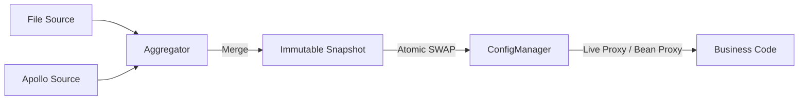

# 配置核心模块

[](https://openjdk.java.net/)
[](https://opensource.org/licenses/MIT)

## 目录
- [简介](#简介)
- [快速入门](#快速入门)
- [核心特性](#核心特性)
- [典型场景](#典型场景)
- [SPI 扩展](#spi-扩展)
- [架构与原理](#架构与原理)

---

## 简介

team4u-config-core 是一个轻量级、高性能、类型安全的 Java 配置管理框架。它通过“快照 (Snapshot) 驱动”的设计理念，解决了分布式系统在配置管理上的核心痛点：多源冲突、热更新抖动以及配置类型的非直观映射。

它不是简单的 Properties 或 Map 封装，而是将配置视为一个不断演进的数据流。通过这一层抽象，业务方可以透明地接入各种配置中心（Apollo, Nacos, Git, File 等），并享受强类型代理和原子化热更新带来的可靠性。

### 核心优势
* **透明热更新**：支持 Pinned（快照）/ Live（实时）双模代理，业务无感升级，彻底告别重启。
* **类型安全代理**：只需定义**接口或普通 Java Bean**，一行代码自动生成代理并绑定配置，支持智能松散绑定。
* **高性能实现**：底层基于 ByteBuddy 字节码增强技术，确保配置访问性能接近原生调用。
* **多源聚合**：内置优先级机制，支持环境变量、系统属性、远程配置的多级叠加与覆盖。
* **不可变快照**：核心对象基于不可变设计，确保在一次业务处理周期内配置逻辑一致。

---

## 快速入门

### 引入依赖

```xml
<dependency>
    <groupId>com.team4u</groupId>
    <artifactId>team4u-config-core</artifactId>
    <version>1.0.0-SNAPSHOT</version>
</dependency>
```

> [!NOTE]
> 本项目核心逻辑依赖于 [Hutool](https://hutool.cn/) (5.x)，引入时请确保项目中包含相关依赖。

### 准备配置源

在 src/main/resources 下创建 config.properties：
```properties
# 基础配置
server.name=team4u-demo
server.port=8080
server.tags=web,api,v1

# 复杂对象绑定示例
server.connect-timeout=5000
server.max-threads=200
# 嵌套对象绑定
server.db.url=jdbc:mysql://localhost:3306/test
server.db.username=root

# 占位符引用
server.description=${server.name} is running on port ${server.port}
```

### 获取 ConfigManager 实例

ConfigManager 是所有操作的入口。你可以使用内置的标准单例，也可以通过 Builder 进行深度定制。

```java
// 标准实例（推荐）：自动扫描当前包并加载所有通过 SPI 发现的 ConfigSource 和 ConfigWatcher
ConfigManager manager = ConfigManager.standard();

// 自定义实例：使用 Builder 进行高级配置
// Builder 在初始化时也会默认触发自动扫描和 SPI 加载
ConfigManager customManager = ConfigManager.builder()
    .scanSources("com.mycompany.config.sources")   // 额外的包扫描：手动扫描包自动注册 Source
    .scanWatchers("com.mycompany.config.watchers") // 额外的包扫描：手动扫描包自动注册 Watcher
    .addSource(new MyCustomConfigSource())         // 手动添加实例
    .build();
```

### 基础用法：获取键值

```java
// 获取精准配置，返回 Optional 避免空指针
String dbUrl = manager.getString("server.db.url").orElse("jdbc:mysql://localhost:3306/default");
```

### 进阶用法：强类型配置代理 (接口与 Bean)

这是最推荐的使用方式。框架会自动为你的配置类（接口或 Bean）创建“实时代理”，使其具备热更新能力。

#### 方式 A：基于接口 (Interface)
只需定义 Getter 规范的接口：
```java
public interface AppConfig {
    String getName();
    int getPort();
    DbConfig getDb(); // 支持嵌套
}

// 创建实时代理
AppConfig config = manager.createProxy("server", AppConfig.class);
```

#### 方式 B：基于普通类 (Java Bean)
无需接口，直接代理普通 POJO。底层会拦截 Getter 方法以支持热更新：
```java
public class ServerBean {
    private String name;
    private int port;
    // 标准 Getter/Setter ...
}

// 同样支持 Live Mode（实时感知配置变更）
ServerBean config = manager.createProxy("server", ServerBean.class);
```

> [!TIP]
> **声明式注解支持**：你可以配合 `@ConfigPrefix("server")` 注解使用 `manager.createProxy(AppConfig.class)`。

#### 代理双模式：Live vs Pinned

理解这两种模式的区别对于构建高可靠系统至关重要：

| 特性         | Live Mode (默认)                     | Pinned Mode (通过 pin 获取)      |
| :----------- | :----------------------------------- | :------------------------------- |
| 数据源       | 始终读取全局最新的快照               | 始终读取锚定时那一刻的快照       |
| 热更新       | 实时生效，无需重启或重新获取         | 全局更新后，该实例仍保持旧值     |
| 一致性       | 弱一致：同一个方法多次调用可能值不同 | 强一致：生命周期内值绝对不变     |
| 适用场景     | 绝大多数业务、实时监控、开关逻辑     | 批处理、事务性计算、长连接初始化 |

---

## 核心特性

### 声明式注解 (Annotations)

除了基本的松散绑定，框架提供了一系列注解来增强代理的可维护性和鲁棒性。

#### @ConfigPrefix
用于定义统一的配置前缀，简化代理创建过程。
```java
@ConfigPrefix("server")
public interface AppConfig {
    String getName();
}

// 无需硬编码前缀
AppConfig config = manager.createProxy(AppConfig.class);
```

#### @ConfigKey
显式指定配置键，跳过自动推断逻辑。支持绝对路径（以点号开头）。
```java
public interface AppConfig {
    @ConfigKey("max-threads") // 匹配 server.max-threads
    int threads();
    
    @ConfigKey(".global.version") // 忽略前缀，匹配全局 key
    String version();
}
```

#### @ConfigDefault & @ConfigRequired
用于处理缺失值：
- `@ConfigDefault`: 提供兜底值（支持类型转换）。
- `@ConfigRequired`: 标记为必填，缺失则抛出 `ConfigMissingException`。

### 自定义属性转换 (Custom Converters)

可以使用 `@ConfigConverter` 指定自定义转换逻辑（如解密、复杂对象解析）。

```java
public interface AppConfig {
    // 自动将 JSON 字符串转换为 User 对象
    @ConfigConverter(JsonPropertyConverter.class)
    User getUser();
}
```

### 智能松散绑定 (Relaxed Binding)

框架对配置键采用模糊匹配算法。当你调用 `getMaxThreads()` 时，系统会尝试匹配：
- server.maxThreads (驼峰)
- server.max-threads (中划线)
- server.max_threads (下划线)
- server.max.threads (点分隔)

### 占位符解析 (Placeholder)
支持 `${key:defaultValue}` 语法，具备深度嵌套、循环依赖检测和高性能解析（零临时对象分配）等特性。

### 热加载与变更监听
内置 500ms 的防抖窗口，合并高频变更。通过 `addChangeListener` 可精准感知配置的增删改。

---

## 典型场景

### 场景：高性能一致性快照 (Pinned Mode)

在长耗时的批处理任务或涉及多步逻辑的订单处理中，应避免处理过程中配置发生跳变。

#### 最佳实践：一次锚定，多次复用
```java
public void process() {
    // 1. 在入口处生成一个固定视角的配置对象（Pinning）
    AppConfig safeConfig = SnapshotAware.pin(config); 

    // 2. 后续所有逻辑都使用这个 safeConfig
    if (safeConfig.isEnabled()) {
         // 这里的逻辑保证版本一致，且读取性能极高
         int val = safeConfig.getVal(); 
    }
}
```

---

## SPI 扩展

框架高度可扩展，支持自定义以下组件：

| 扩展接口           | 功能说明                                                             |
| ------------------ | -------------------------------------------------------------------- |
| ConfigSource       | 数据源：决定配置从哪加载（如 Redis、Apollo、Http）。                 |
| ConfigWatcher      | 监听器：决定如何发现配置变更（如文件钩子、定时拉取）。               |
| ConfigBinder       | 绑定器：决定如何将数据映射到 Bean（仅用于非代理的单次绑定）。        |
| PropertyConverter  | 转换器：SPI 方式注册全局转换逻辑。                                   |

---

## 架构与原理

### 核心执行流程

1. **探测 (Watch)**：`ConfigWatcher` 发现原始配置发生变更。
2. **重载 (Reload)**：触发信号，`SnapshotAggregator` 并发读取所有 `ConfigSource`。
3. **聚合 (Aggregate)**：根据优先级将多个 Map 压扁合并为唯一的 `ConfigSnapshot`。
4. **生效 (Commit)**：原子化替换 `ConfigManager` 中的 `currentSnapshot` 引用。
5. **代理拦截 (Proxy)**：代理对象（ByteBuddy/JDK）拦截调用，通过最新的快照实时计算并返回结果，同时利用版本化二级缓存（L2 Cache）确保高性能。

### 状态流转图


