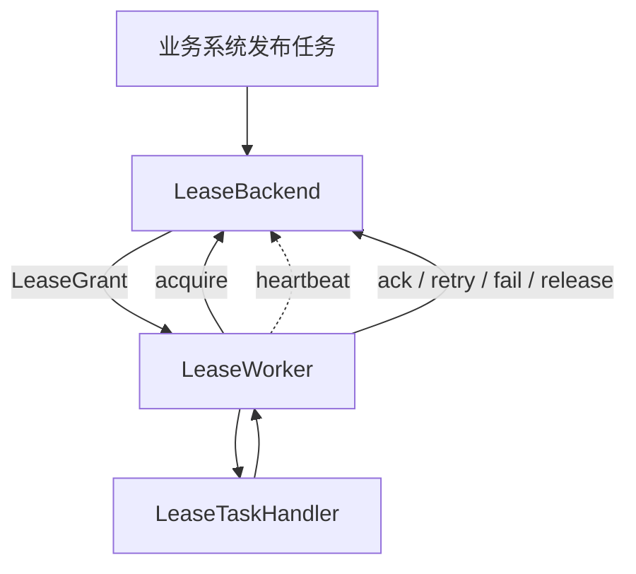

# team4u-lease

一个基于 Lease（租约）协议 的分布式任务调度框架，用来解决多节点环境下的 任务唯一消费、长耗时执行、失败重试、租约续约与故障自愈
问题。

适用于这类场景：

- 异步回调
- 报表生成
- 批处理任务
- 营销消息投递
- 延迟任务 / 重试任务
- 需要在集群中“同一时刻只允许一个节点执行”的后台作业

## 为什么需要它

在分布式系统里，后台任务调度通常会遇到这些问题：

### 1. 普通定时任务无法天然支持集群互斥

像 `@Scheduled` 这类本地调度方式，在多节点部署下很容易出现同一任务被多个实例同时执行的问题。

### 2. MQ 不一定适合长耗时任务

消息队列擅长分发，但对于“执行时间远大于消费超时时间”的任务，可能出现重复投递、并行执行和状态失真。

### 3. 数据库锁方案重、脆、恢复差

基于悲观锁或长事务的实现，在高并发或异常宕机场景下，容易引发锁等待、死锁或脏状态残留。

## 核心思路

`team4u-lease` 的核心不是“推送任务给 Worker”，而是：

> Worker 主动拉取任务，并通过租约竞争获得某个任务在一段时间内的独占执行权。

只要租约仍然有效，其他节点就不能接手这个任务；  
如果当前节点挂掉且租约未续期，任务会在租约到期后重新变为可抢占，从而实现自动恢复。

## 核心机制

### 1. Acquire：抢占任务并获得租约

Worker 周期性向后端发起 `acquire` 请求。

当某个任务满足以下任一条件时，就有机会被当前 Worker 抢到：

- 任务状态为 `SCHEDULED`，且已经到达可见时间
- 任务状态为 `LEASED`，但原租约已经过期

抢占成功后，Worker 会获得一份 `LeaseHandle`，其中包含：

- `taskId`
- `workerId`
- `leaseToken`

后续的 `ack / retry / fail / heartbeat / release` 都必须带上这份句柄，避免错误节点篡改任务状态。

### 2. Heartbeat：长任务通过心跳续约

对于执行时间较长的任务，Worker 可以定时发送 `heartbeat` 来延长租约有效期。

这意味着：

- 长任务不需要一次性设置特别大的锁时间
- 只要 Worker 还活着，就能持续保有任务执行权
- 如果 Worker 异常退出，心跳停止，租约会自然过期

### 3. Ack / Retry / Fail：形成完整生命周期闭环

处理器执行结束后，Worker 会根据结果回写状态：

- `ack`：任务执行成功，标记为 `SUCCEEDED`
- `retry`：任务执行失败但允许重试，回到 `SCHEDULED`，并设置下一次可见时间
- `fail`：任务终止，标记为 `DEAD`
- `release`：主动释放租约但不计失败次数，稍后重新入队

## 任务状态

框架当前定义了 4 个核心状态：

- `SCHEDULED`：已入队，等待被消费
- `LEASED`：已被某个 Worker 持有租约，正在处理
- `SUCCEEDED`：执行成功，终态
- `DEAD`：执行失败且不再重试，终态

## 项目结构

当前项目采用多模块结构：

- `team4u-lease-core`  
  核心抽象、Worker、租约协议、重试退避策略等

- `team4u-lease-memory`  
  基于内存的后端实现，适合单测、示例和本地演示

- `team4u-lease-jdbc`  
  基于 JDBC 的后端实现，可接数据库使用

- `team4u-lease-test`  
  后端实现的通用契约测试

## 核心抽象

### `LeaseBackend`

统一后端接口，组合了以下能力：

- 任务生产：`LeaseProducer`
- 运行时租约操作：`LeaseRuntimeClient`
- 管理能力：`LeaseAdminService`
- 查询能力：`LeaseQueryService`

这意味着你可以基于内存、JDBC 或其他存储实现同一套调度模型。

### `LeaseWorker`

负责：

- 拉取任务
- 获取租约
- 路由到对应的 `LeaseTaskHandler`
- 启动心跳续约
- 根据执行结果回写状态

它是整个框架的执行引擎。

### `LeaseTaskHandler`

业务处理器接口：

```java
public interface LeaseTaskHandler {
    void handle(LeaseExecutionContext context) throws Exception;
}
````

你只需要关注业务逻辑，不需要自己处理抢锁、续约、重试写回这些细节。

### `LeaseWorkerPolicy`

用于配置 Worker 的运行策略，例如：

* `workerId`
* `leaseMillis`
* `pollWaitMillis`
* `maxFailures`
* `backoff`
* `heartbeatEnabled`
* `heartbeatIntervalMillis`
* `missingHandlerStrategy`

### `Backoff`

失败重试的退避策略接口，内置支持：

* 固定延迟 `fixed`
* 线性递增 `increment`
* 指数退避 `exponential`
* 带抖动的指数退避 `exponentialJitter`

## 快速开始

## 1. 引入依赖

```xml

<dependency>
    <groupId>com.team4u</groupId>
    <artifactId>team4u-lease-core</artifactId>
    <version>1.0.0-SNAPSHOT</version>
</dependency>

<dependency>
<groupId>com.team4u</groupId>
<artifactId>team4u-lease-memory</artifactId>
<version>1.0.0-SNAPSHOT</version>
</dependency>
```

## 2. 定义任务处理器

```java
import com.team4u.framework.lease.LeaseExecutionContext;
import com.team4u.framework.lease.LeaseTaskHandler;
import com.team4u.framework.lease.NonRetryableLeaseException;

public class PushNotificationHandler implements LeaseTaskHandler {

    @Override
    public void handle(LeaseExecutionContext context) throws Exception {
        System.out.println("收到任务: " + context.getPayload());

        // 模拟耗时处理
        Thread.sleep(3000);

        // 对于不可恢复错误，直接抛出不可重试异常
        if ("invalid-payload".equals(context.getPayload())) {
            throw new NonRetryableLeaseException("Payload 不合法");
        }

        System.out.println("处理完成");
    }
}
```

## 3. 注册处理器并启动 Worker

```java
import com.team4u.framework.lease.DefaultLeaseTaskHandlerRegistry;
import com.team4u.framework.lease.LeasePublishRequest;
import com.team4u.framework.lease.LeaseWorker;
import com.team4u.framework.lease.LeaseWorkerPolicy;
import com.team4u.framework.lease.memory.InMemoryLeaseBackend;

public class LeaseDemoApp {

    static void main(String[] args) throws Exception {
        InMemoryLeaseBackend backend = new InMemoryLeaseBackend();

        DefaultLeaseTaskHandlerRegistry registry = new DefaultLeaseTaskHandlerRegistry();
        registry.register("push-queue", "sms-task", new PushNotificationHandler());

        LeaseWorkerPolicy policy = LeaseWorkerPolicy.builder()
                .workerId("worker-node-1")
                .leaseMillis(30_000L)
                .pollWaitMillis(1_000L)
                .maxFailures(5)
                .heartbeatEnabled(true)
                .build();

        LeaseWorker worker = new LeaseWorker(backend, registry, policy);
        worker.start("notification-worker");

        backend.publish(LeasePublishRequest.builder()
                .queue("push-queue")
                .taskType("sms-task")
                .payload("{\"phone\":\"13800138000\",\"content\":\"验证码：1234\"}")
                .delayMillis(1000L)
                .build());

        Thread.sleep(10_000L);
        worker.shutdown();
    }
}
```

## 执行流程



## 重试与失败策略

默认情况下，业务处理抛出的普通异常会进入重试流程：

* `failureCount + 1`
* 按 `Backoff` 计算下一次重试时间
* 重新变为 `SCHEDULED`

当满足以下条件之一时，任务会进入 `DEAD`：

* 抛出 `NonRetryableLeaseException`
* 已达到 `maxFailures`

## Missing Handler 策略

当 Worker 抢到任务后，如果本地没有匹配的处理器，框架支持两种策略：

### `FAIL_FAST`（默认）

直接将任务标记为失败终态。

适合“任务类型必须严格可识别”的场景。

### `RETRY_LATER`

释放任务并延迟重新入队，不增加失败次数。

适合滚动发布、处理器尚未全量部署完成等场景。

## 管理能力

后端还提供基础运维操作：

* `reschedule(taskId, delayMillis)`：重新调度未终态任务
* `cancel(taskId)`：取消任务
* `requeueDead(taskId, delayMillis)`：将死信任务重新放回调度队列

## 查询能力

框架支持查询：

* 单任务详情：`get(taskId)`
* 按条件分页查询：`list(LeaseQueryRequest)`

可按以下条件过滤：

* `queue`
* `taskType`
* `status`
* `workerId`

## 适合什么场景

推荐用于：

* 需要集群互斥消费的任务
* 执行时间不稳定、可能较长的任务
* 需要失败重试和退避控制的任务
* 希望具备“节点宕机自动接管”能力的调度系统

不推荐直接用于：

* 极高吞吐、纯消息广播类场景
* 对实时延迟要求极低、必须毫秒级推送的场景
* 已经由成熟 MQ 消费模型完美覆盖的简单短任务

## 最佳实践

### 保证业务幂等

租约过期、节点宕机或网络抖动时，任务可能被再次执行。
业务侧必须能接受“至少一次执行”。

### 合理设置 `leaseMillis`

* 太短：任务可能尚未执行完就丢失租约
* 太长：故障恢复会变慢

通常建议：

* 平稳短任务：设置略大于平均耗时
* 波动较大的长任务：开启心跳续约

### 谨慎设计 Payload

建议 Payload 只携带必要信息，例如业务 ID，而不是完整大对象。

### 区分可重试与不可重试异常

* 可恢复错误：抛普通异常，交给框架重试
* 不可恢复错误：抛 `NonRetryableLeaseException`

## 已有实现

当前仓库内已提供：

* `InMemoryLeaseBackend`
* `JdbcLeaseBackend`

如果你希望接入 Redis、MySQL 专用实现、PostgreSQL 或其他存储系统，也可以基于 `LeaseBackend` 抽象继续扩展。

