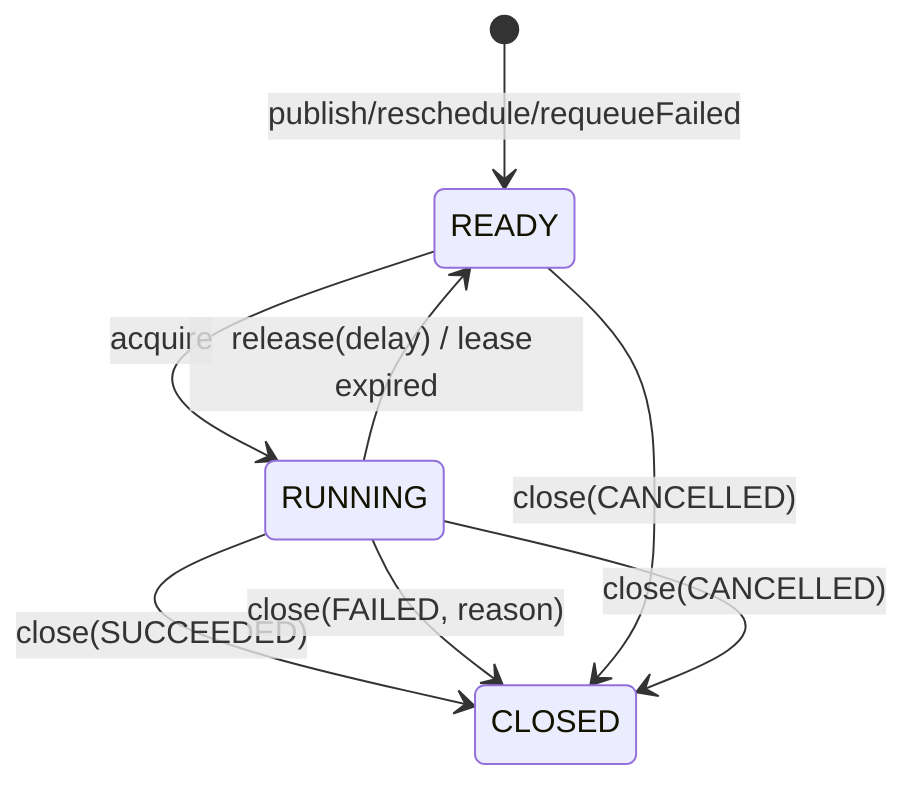

# team4u-lease

## 为什么需要它

在分布式系统中，经常会遇到这样一类“长任务”或“排他性任务”：

- 排他性执行：同一个任务在任意时刻只能由一个节点处理。
- 可靠性保证：长任务需要续约，如果执行节点中途宕机或失联，任务应能自动被其他节点接管。
- 状态可见性：任务需要保留执行状态、结果、失败原因以及业务上下文，方便查询与人工运维。
- 低成本集成：不想为了这些基础需求引入复杂的 MQ 平台或重量级工作流引擎。

`team4u-lease` 通过可抢占的任务记录加可过期的独占租约，为这类场景提供了一个轻量且稳妥的解决方案。


## 核心概念

### 什么是租约 (Lease)

当 Worker 成功获取一个任务时，并不是永久占有，而是获得了一段有过期时间的独占执行权。

这段权限即为 Lease，包含：
- `taskId`：任务标识
- `workerId`：执行节点标识
- `leaseToken`：租约令牌，用于版本校验

后续的所有写回操作（心跳、完成、失败、释放）都必须带上这个凭证。如果租约过期或令牌不匹配，写回操作将被拒绝。

这种机制保证了：
1. 并发控制：同一时刻只有一个合法持有者能更新任务状态。
2. 异常接管：Worker 故障后，任务会在租约过期后自动重新变得可抢占。

### 队列与任务类型

- Queue (队列)：决定任务会被哪一类 Worker 节点订阅和拉取，是调度边界。
- TaskType (类型)：决定同一个队列内由哪个具体的本地 `Handler` 处理，是路由标识。

简单来说：Queue 解决“谁能拿到任务”，TaskType 解决“拿到后怎么处理”。


## 快速开始

### 1. 选择后端实现

本项目采用分层设计：

- `team4u-lease-core`：核心接口、模型、Worker 运行逻辑
- `team4u-lease-memory`：内存版实现，适合单机开发、测试
- `team4u-lease-jdbc`：基于 JDBC 的持久化实现，适合生产环境
- `team4u-lease-test`：测试支持与契约测试

开发调试阶段可以先使用内存版；生产环境建议使用 JDBC 版。

### 2. 引入依赖

如需使用内存版：

```xml
<dependency>
  <groupId>io.github.jayblue98</groupId>
  <artifactId>team4u-lease-memory</artifactId>
  <version>${version}</version>
</dependency>
```

如需使用 JDBC 版：

```xml
<dependency>
  <groupId>io.github.jayblue98</groupId>
  <artifactId>team4u-lease-jdbc</artifactId>
  <version>${version}</version>
</dependency>
```

### 3. 初始化存储

- 内存版无需额外初始化。
- JDBC 版需要先创建 `lease_task` 表，初始化脚本见：
  - `team4u-lease-jdbc/src/main/resources/schema/lease_task_mysql.sql`
- 如果需要按业务键做幂等建档，请确保 schema 已包含 `business_key` 列以及 `(queue_name, business_key)` 唯一约束。

### 4. 创建 Producer 并发布任务

```java
LeaseProducer producer = ...;

producer.publish(
    LeasePublishRequest.builder()
        .queue("demo")
        .taskType("demo")
        .payload("hello")
        .delayMillis(0L)
        .build()
);
```

如需“相同业务请求只建档一次”，可以改用 `publishIfAbsent(...)`：

```java
LeasePublishResult result = producer.publishIfAbsent(
    LeasePublishRequest.builder()
        .queue("demo")
        .taskType("demo")
        .payload("hello")
        .businessKey("demo|order-1001")
        .delayMillis(0L)
        .build()
);
```

### 5. 创建 Worker 处理任务

```java
DefaultLeaseTaskHandlerRegistry registry = new DefaultLeaseTaskHandlerRegistry();
registry.register("demo", "demo", context -> {
    System.out.println(context.getPayload());
});

LeaseWorker worker = new LeaseWorker(
    runtimeClient,
    registry,
    LeaseWorkerPolicy.builder().workerId("worker-1").build()
);

worker.start();
```

### 6. 停止 Worker

```java
worker.shutdown();
```

`shutdown()` 会触发优雅停机，默认最多等待一个 `leaseMillis` 周期；如需显式控制等待时长，请使用 `shutdownGracefully(timeoutMillis)`。
对于长任务，建议启用心跳续租机制，避免任务执行过程中租约过期。


## 模块说明

### `team4u-lease-core`

核心模块，定义统一的任务模型、租约语义、查询/管理接口以及 Worker 执行框架。  
无论选择哪种存储实现，业务侧主要依赖的抽象接口都来自该模块。

### `team4u-lease-memory`

内存版实现，适合：
- 本地开发
- 单元测试
- 示例演示

特点：
- 接入简单，无需数据库
- 进程重启后数据丢失
- 不适合生产环境

### `team4u-lease-jdbc`

基于 JDBC 的持久化实现，适合生产环境。  
任务、租约状态、失败次数、下次可见时间等信息持久化存储于数据库中。

特点：
- 支持多实例竞争与接管
- 进程重启后任务状态可恢复
- 适合与业务系统一起部署

### `team4u-lease-test`

提供测试支持与契约测试基类，用于验证不同后端实现是否满足统一行为约束。  
如需扩展新的存储后端，建议复用该模块中的测试基线进行校验。


## 核心模型

### 生命周期状态：`LeaseTaskState`

任务通过三个维度表达其当前处境：

| 状态      | 说明                                                   |
| --------- | ------------------------------------------------------ |
| `READY`   | 待命状态，可供 Worker 获取执行（包含延迟生效的任务）。 |
| `RUNNING` | 已被某个 Worker 成功抢占，正在执行中。                 |
| `CLOSED`  | 终局状态，任务已结束，不再自动流转。                   |

### 结束结果：`LeaseTaskOutcome`

当状态为 `CLOSED` 时，通过 `Outcome` 表达最终结局：
- `SUCCEEDED`：执行成功。
- `FAILED`：执行失败。
- `CANCELLED`：人工或系统取消。

### 失败原因：`LeaseTaskFailureReason`

当 outcome 为 `FAILED` 时，记录具体的失败诱因：
- `HANDLER_EXCEPTION`：业务处理器抛出异常。
- `RETRY_EXHAUSTED`：外部定义的重试预算已耗尽。
- `ABORTED_BY_POLICY`：被执行策略拦截。
- `MISSING_HANDLER`：本地未注册对应的处理器。
- `MANUAL_FAIL`：人工手动标记失败。


## 状态流转




## 执行保证与语义

### 执行语义说明

本框架基于“租约（lease）”而非“独占锁”来驱动任务执行。
系统提供的是至少一次（at-least-once）执行语义，而不是严格的 exactly-once。

这意味着：
- Worker 成功抢占任务后开始处理。
- 如果 Worker 在租约有效期内完成并提交终态，则任务完成。
- 如果 Worker 在处理过程中崩溃、失联、长时间未续租，租约到期后任务可能被其他 Worker 再次接管执行。

因此，业务处理逻辑应当具备幂等性。

### 核心操作细节

- 获取与抢占 (Acquire)：Worker 只能从 `READY` 状态或租约已过期的 `RUNNING` 状态中抢占任务。抢占成功后，任务进入 `RUNNING`，且 `deliveryCount` 自增。
- 释放 (Release)：主动交还执行权，任务回到 `READY` 状态，不增加 `failureCount`。常用于 Worker 优雅停机或本地资源不足时。
- 心跳续约 (Heartbeat)：刷新租约过期时间为 `now + leaseMillis`。业务代码可通过 `LeaseExecutionContext.requestHeartbeat()` 手动触发立即续约。
- 普通 `LeaseTaskHandler` 只处理业务逻辑；成功返回后由 `LeaseWorker` 默认执行 `close(SUCCEEDED)`。
- 如需在 handler 内显式 `close(...)` 或 `release(...)`，请实现 `LeaseLifecycleAwareTaskHandler`，并通过 `LeaseLifecycleExecutionContext` 的受控方法写回生命周期。

### 失败与重试语义

框架关注的是“租约驱动执行”和“状态流转”，业务方需要根据场景选择合适的失败处理方式：

- `close(SUCCEEDED)`：任务处理成功，进入终态。
- `close(FAILED)`：任务处理失败，进入失败终态。该任务不会自动再次执行，除非后续手动重新入队。
- `release(delay)`：主动释放租约并设置任务在未来某个时间点重新可见。这是一种“延期重试”的手段。若同时携带 `payload` 或非空 `attributes`，会一并写回；空 `attributes` 不会清空原值。

### 缺失处理器策略 (MissingHandlerStrategy)

当 Worker 抢占到某个任务后，如果本地未注册该 `taskType` 对应的处理器：
- `FAIL_FAST`：直接将任务按失败处理。适用于配置错误需要尽快暴露的场景。
- `RETRY_LATER`：释放任务，在稍后重新进入可竞争状态。适用于灰度发布或多集群异步升级场景，延迟由 `missingHandlerRetryDelayMillis` 控制。


## 接口分层与使用建议

为降低耦合度，框架将能力划分为不同角色接口。

### `LeaseProducer` (任务发布)
业务系统通常通过该接口将待处理任务投递到租约队列中。
- 创建延迟任务、异步处理任务、未来某时刻执行的任务。
- 如果需要提交幂等，可传入 `businessKey` 并使用 `publishIfAbsent(...)`。

### `LeaseRuntimeClient` (运行时处理)
Worker 执行过程中调用的底层 API。通常只有 Worker 执行链路会直接依赖。
- 获取任务、维护心跳、完成/释放/标记失败。
- `close(...)` / `release(...)` / `heartbeat(...)` 应返回非空 `LeaseRuntimeResult`；框架只把 `APPLIED` 视为成功。

### `LeaseQueryService` (查询服务)
用于查询任务状态与任务详情。
- 适合：控制台查询、问题排查、运维巡检、统计分析。
- 除 `get(taskId)` 外，也支持 `getByBusinessKey(queue, businessKey)`。

### `LeaseAdminService` (管理服务)
用于管理任务。
- 典型能力：修改任务、重排调度时间、重新入队失败任务。
- 适合：控制面、运营后台、人工干预工具。

### 管理操作示例

```java
// 查询任务分页
LeaseTaskPage tasks = queryService.list(
    LeaseQueryRequest.builder()
        .outcome(LeaseTaskOutcome.FAILED)
        .taskType("demo")
        .build()
);

// 通过业务键查询
Optional<LeaseTaskRecord> task = queryService.getByBusinessKey("demo", "demo|order-1001");

// 延后 5 分钟重新进入可领取状态
adminService.reschedule(taskId, 300_000L);

// 重新入队失败任务
adminService.requeueFailed(taskId, 0L);

// 更新任务内容
adminService.update(
    LeaseUpdateRequest.builder()
        .taskId(taskId)
        .payload(newPayload)
        .build()
);

// attributes 为 patch-only：省略或传空 map 都表示保持原值

// 原子更新任务内容并重新调度
adminService.updateAndReschedule(
    LeaseUpdateRequest.builder()
        .taskId(taskId)
        .payload(newPayload)
        .build(),
    300_000L
);
```


## Worker 参数与配置建议

### `LeaseWorkerPolicy` 配置表

| 参数                      | 说明             | 默认值            | 校验规则               |
| ------------------------- | ---------------- | ----------------- | ---------------------- |
| `workerId`                | 唯一身份标识     | 随机 UUID         | 不能为空               |
| `leaseMillis`             | 租赁（锁定）时长 | 30,000 ms         | > 0                    |
| `pollWaitMillis`          | 轮询阻塞等待时长 | 1,000 ms          | >= 0                   |
| `heartbeatEnabled`        | 是否开启自动心跳 | `true`            | -                      |
| `heartbeatIntervalMillis` | 心跳间隔         | `leaseMillis / 3` | > 0 且 < `leaseMillis` |
| `missingHandlerStrategy`  | 缺失处理器策略   | `FAIL_FAST`       | -                      |

### 关键配置建议

- `leaseMillis`：应大于任务正常处理耗时，不宜过短以免频繁超时，不宜过长以免故障接管不及时。
- `heartbeatIntervalMillis`：必须小于 `leaseMillis`，建议设置为 1/3 ~ 1/2。长耗时任务务必开启心跳。
- `workerId`：建议在同一运行实例内稳定唯一，具备可观测性。
- 单个 `LeaseWorker` 当前是串行消费模型：一次只执行一个任务；需要并发处理时应启动多个 Worker 实例。

### 常见校验失败

- `leaseMillis <= 0`：租约时长必须大于 0。
- `heartbeatIntervalMillis >= leaseMillis`：心跳间隔必须小于租约时长。
- `subscriptions` 为空：Worker 至少需要订阅一种任务类型。
- `taskId / workerId / handle` 为空：任务流转的重要标识不能为空。


## 后端实现

### JDBC 后端 (JdbcLeaseBackend)

推荐用于需要持久化、多实例部署的生产环境。
- 数据库初始化：使用前需要创建 `lease_task` 表。脚本位置：`team4u-lease-jdbc/src/main/resources/schema/lease_task_mysql.sql`。
- 抢占逻辑：采用乐观抢占模型原子竞争。
- 等待行为：`acquire()` 当前使用短轮询等待，不是数据库原生阻塞获取，更适合轻量任务场景。
- 幂等建档：支持 `businessKey`、`publishIfAbsent(...)` 和 `getByBusinessKey(...)`。
- `update(...)` / `close(...)` / `release(...)` 中的 `attributes` 为 patch-only 语义，当前版本不支持显式清空全部 attributes。
- 并发控制：JDBC 实现使用独立 `version` 列做乐观锁，`updated_at` 只保留审计时间语义。
- 索引建议：`acquire` 已按 `READY/visible_at` 与过期 `RUNNING/lease_expires_at` 分成两组索引。
- 升级已有库：除索引调整外，还需要为 `lease_task` 补充 `version BIGINT NOT NULL DEFAULT 0`。
- 说明：当前实现按 MySQL schema 与 SQL 语义维护；如需迁移到其他数据库，请先自行完成方言与并发语义验证。

### 内存后端 (InMemoryLeaseBackend)

基于 `ConcurrentHashMap` 与 `DelayQueue` 实现。
- 特点：速度极快，进程重启即消失。
- 行为：同样支持 `businessKey`、`publishIfAbsent(...)` 和 `getByBusinessKey(...)`，适合本地模拟幂等建档语义。
- 场景：单元测试、本地演示、简单单机应用。


## 构建与测试

项目包含核心行为测试、Worker 行为测试、各后端实现的契约测试等。

### 执行测试
```bash
mvn test
```

### 测试说明
- 内存版实现适合快速验证核心行为。
- `team4u-lease-test` 模块提供契约测试基线。如需扩展新的存储实现，建议先通过统一契约测试，确保行为与核心模型一致。


## 完整示例与生命周期管理

```java
// 1. 初始化后端 (内存版)
LeaseBackend backend = new InMemoryLeaseBackend();

// 2. 注册任务处理器
DefaultLeaseTaskHandlerRegistry registry = new DefaultLeaseTaskHandlerRegistry();
registry.register("order", "pay", context -> {
    System.out.println("Processing payment for: " + context.getPayload());
    // 业务预计较长，手动触发一次续约
    context.requestHeartbeat();
});

// 3. 配置并启动 Worker
LeaseWorker worker = new LeaseWorker(backend, registry, LeaseWorkerPolicy.builder()
        .workerId("worker-01")
        .leaseMillis(60_000L).build());
worker.start("lease-worker-main");

// 4. 发布任务
backend.publish(LeasePublishRequest.builder()
        .queue("order").taskType("pay").payload("{\"orderId\": 1001}").build());

// 5. 优雅停机
// shutdown() 默认最多等待一个 leaseMillis 周期
worker.shutdown();

// shutdownGracefully 会按显式超时等待当前正在执行的任务结束，停止新任务拉取并关闭心跳线程
worker.shutdownGracefully(5000); 
```


## 适用与局限

| 推荐场景                               | 不太适合                                   |
| -------------------------------------- | ------------------------------------------ |
| 中小规模异步任务执行                   | 每秒数万次的超大规模消息吞吐               |
| 需要强单节点执行语义                   | 需要 Topic 广播、Consumer Group 等 MQ 特性 |
| 需要高可见性与人工干预                 | 复杂的 DAG 编排与大型工作流                |
| 现有数据库架构，希望低成本引入任务系统 | 纯内存毫秒级超高性能场景                   |


## FAQ / 注意事项

- 任务执行时间很长怎么办？  
  建议启用心跳续租机制，并确保 `heartbeatIntervalMillis < leaseMillis`。
- 为什么同一个任务可能被执行两次？  
  系统提供至少一次执行语义。当 Worker 崩溃或续租失败时，租约到期后任务可能被再次接管。
- 内存版可以用于生产吗？  
  不建议。内存版重启数据丢失，且不适合多实例协同。
- 任务失败后如何再次执行？  
  可以调用 `release(delay)` 稍后重试，或者任务进入失败态后通过 `requeueFailed` 重新入队。
- 业务处理器需要幂等吗？  
  需要。由于不是 exactly-once 语义，业务侧应自行保证幂等性。
- `businessKey` 适合做什么？  
  适合做建档幂等键，例如订单号、请求号、业务流水号。它保证的是“不要重复创建任务”，不保证执行期 exactly-once。
