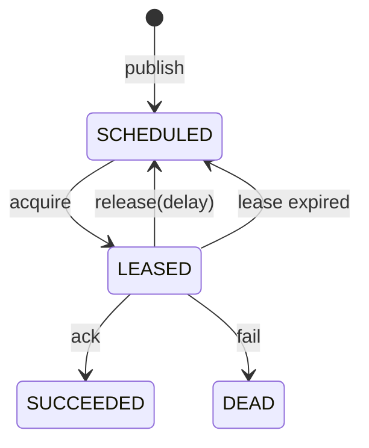

# team4u-lease

## 为什么需要这个框架

在很多业务系统里，我们都会遇到这样一类任务：

* 需要异步执行，但不一定值得单独引入完整 MQ 平台
* 任务执行时间可能较长，执行中途实例还可能重启、超时、宕机
* 同一个任务在任意时刻只能被一个节点处理
* 失败后希望支持重试、退避、死信、人工干预
* 希望保留任务状态，便于运维排查和补偿

如果直接用线程池、数据库轮询或简单定时任务，通常会很快碰到几个问题：

### 重复执行问题

多个实例同时扫描到同一条任务记录，如果没有可靠的抢占机制，就可能发生重复消费。

### 长任务失控问题

任务执行时间超过预期时，系统很难判断：

* 它到底还在执行
* 还是执行节点已经挂了
* 是否应该重新交给别的节点处理

### 失败恢复问题

简单的“失败就再跑一次”很容易失控：

* 没有统一退避策略
* 没有最大失败次数
* 没有死信状态
* 没有人工重放入口

### 运维不可见问题

很多异步框架只关心“跑起来”，但线上真正需要的是：

* 这个任务现在是什么状态？
* 被哪个 worker 抢走了？
* 为什么失败？
* 能不能改时间、取消、重放？

## 这个框架解决问题的方式

`team4u-lease` 的核心思路很简单：

> 把每个任务都当成一条可被抢占的记录，并用“租约”表示某个 worker 在一段时间内对它拥有独占执行权。

它不是传统消息队列，也不是重量级工作流系统，而是一个聚焦于“任务记录 + 抢占执行 + 状态流转”的轻量运行时。

### 什么是 Lease

当 worker 成功拿到一个任务时，它并不是永久拥有这个任务，而只是拿到一段有过期时间的独占权限。

这段权限就是 Lease，它由三部分构成：

* `taskId`
* `workerId`
* `leaseToken`

以及一个过期时间：

* `leaseExpiresAtMillis`

后续对任务的所有写回操作（成功、失败、续约、释放），都必须带着这个 lease 凭证。

如果：

* worker 不是原持有者
* token 不匹配
* 租约已经过期

那么这次写回就会被拒绝。

这套机制解决了两个问题：

1. 同一时刻只允许一个 worker 合法写回该任务
2. worker 异常退出后，任务会在租约过期后重新变得可抢占

### queue 和 taskType 的职责区别

- `queue`：决定任务会被哪一类 Worker 订阅和拉取，是调度边界
- `taskType`：决定同一个 queue 内由哪个本地处理器处理，是路由键

可以把它理解成：

- queue 解决“谁来拿到任务”
- taskType 解决“拿到以后谁来处理”

## 框架能做什么

基于当前代码，它已经具备以下能力：

### 任务发布

支持发布立即执行或延迟执行任务，并附带：

* `queue`
* `taskType`
* `payload`
* `priority`
* `attributes`

### 任务抢占

Worker 按订阅的 `queue` 抢占可执行任务。

支持：

* 阻塞等待一段时间
* 只返回当前可见任务
* 租约过期任务重新进入候选集

### 任务处理与结果回写

任务处理完成后，可以回写：

* `ack`：成功完成
* `fail`：标记为最终失败
* `release`：主动让出执行权
* `heartbeat`：续约

### 重试与退避

当前代码中已经具备：

* 不可重试异常快速失败
* `MissingHandlerStrategy.RETRY_LATER` 下释放回队列
* 通过 `requeueDead` 做人工重放

当前代码中尚未内置：

* `LeaseWorker` 自动重试
* Backoff 退避策略
* `retry` 运行时接口

### 心跳续约

对于长时间运行任务：

* Worker 可按策略自动心跳
* 业务代码也可以主动请求一次立即心跳

### 运营管理与人工干预

支持：

* 按条件分页查询任务
* 查询单个任务详情
* 修改任务类型 / payload / priority / attributes
* 调整下次执行时间
* 取消任务
* 强制标记任务失败
* 将死信任务重新放回队列

### 多种后端

目前已有两种实现：

* `InMemoryLeaseBackend`
* `JdbcLeaseBackend`

## 项目结构

### `team4u-lease-core`

核心抽象与默认 Worker 实现，包含：

* 发布接口：`LeaseProducer`
* 运行时接口：`LeaseRuntimeClient`
* 管理接口：`LeaseAdminService`
* 查询接口：`LeaseQueryService`
* 集成接口：`LeaseBackend`
* Worker：`LeaseWorker`
* Worker 配置：`LeaseWorkerPolicy`
* 处理器注册表：`LeaseTaskHandlerRegistry`
* 默认注册表：`DefaultLeaseTaskHandlerRegistry`
* 各类请求/响应/记录模型
* 状态枚举与异常类型

### `team4u-lease-memory`

内存版实现 `InMemoryLeaseBackend`。

适合：

* 本地开发
* 自动化测试
* 单进程演示或轻量场景

特点：

* 数据只保存在 JVM 内存中
* 使用 `ConcurrentHashMap + DelayQueue`
* 进程重启后任务数据丢失

### `team4u-lease-jdbc`

JDBC 持久化实现 `JdbcLeaseBackend`。

适合：

* 多实例部署
* 持久化任务
* 运维查询与补偿

特点：

* 任务存储在 `lease_task` 表中
* 用 SQL 选候选任务 + 条件更新实现抢占
* 提供数据库方言扩展点

### `team4u-lease-test`

后端契约测试模块，定义两类后端必须满足的统一行为。

## 5 分钟跑通一个任务

下面用内存版后端说明最基本的接入方式，通过 4 步完成闭环。

### 1. 引入后端

```java
LeaseBackend backend = new InMemoryLeaseBackend();
```

### 2. 写 Handler 并注册

```java
DefaultLeaseTaskHandlerRegistry registry = new DefaultLeaseTaskHandlerRegistry();

registry.

register("default","pay",context ->{
        System.out.

println("process payload="+context.getPayload());
        // 正常返回即为 SUCCEEDED
        });
```

### 3. 创建并启动 Worker

```java
LeaseWorker worker = new LeaseWorker(
        backend,
        registry,
        LeaseWorkerPolicy.builder()
                .workerId("worker-a")
                .leaseMillis(30_000L)
                .build()
);

worker.

start("lease-worker-main");
```

### 4. 发布任务并观察

```java
backend.publish(
        LeasePublishRequest.builder()
                .

queue("default")
                .

taskType("pay")
                .

payload("{\"orderId\":123}")
                .

build()
);
```

**预期结果：**

- handler 正常返回：任务进入 `SUCCEEDED`
- handler 抛出异常：任务进入 `DEAD`

## 任务执行模型

理解这个框架，最关键的是理解一条任务从发布到结束的流转过程。

### 发布后是什么状态

任务被发布后会进入：

* `SCHEDULED`

如果设置了 `delayMillis`，它不会立刻可见，而是等到：

* `visibleAtMillis <= now`

才会被抢占。

### 抢到任务后发生什么

Worker 抢到任务后，后端会把任务改成：

* `LEASED`

同时写入：

* `workerId`
* `leaseToken`
* `leaseExpiresAtMillis`
* `deliveryCount + 1`

此时别的 worker 不能再合法写这个任务，除非租约过期。

### 执行成功

Worker 正常执行完成后：

* 调用 `ack`
* 状态变成 `SUCCEEDED`
* 清空 `workerId / leaseToken / leaseExpiresAtMillis`
* 清空 `lastError`

### 执行失败

如果处理器抛出普通异常，当前 `LeaseWorker` 会直接调用 `fail`：

* 状态变为 `DEAD`
* `failureCount + 1`
* 记录 `lastError`

### 租约过期处理逻辑

如果 worker 没有在租约期内完成处理，也没有成功续约，那么租约到期后，该任务会再次变得可抢占。

处理行为说明：

* 租约自然过期不会增加 `failureCount`
* 但下次重新被抢到时，`deliveryCount` 会继续增加

系统将“超时失联”视为一次未完成投递，而不是一次明确失败。

## 核心概念与数据模型

### `LeasePublishRequest`

用于发布任务，字段包括：

* `queue`：必填
* `taskType`：必填
* `payload`：业务载荷
* `delayMillis`：延迟执行时间
* `priority`：优先级，默认 0
* `attributes`：扩展属性

当前实现中：

* `queue/taskType` 为空会抛 `IllegalArgumentException`
* `delayMillis < 0` 按 0 处理
* `attributes` 对外暴露为不可变 Map

### `LeaseAcquireRequest`

用于 Worker 抢占任务，字段包括：

* `workerId`
* `leaseMillis`
* `waitTimeoutMillis`
* `subscriptions`

其中：

* `leaseMillis` 必须大于 0
* `subscriptions` 不能为空
* 每个订阅都必须有合法 `queue`

### `LeaseSubscription`

当前实现只有一个字段：

* `queue`

说明当前订阅能力是按队列维度建模的，不支持在后端层面对 `taskType` 做订阅过滤。

### `LeaseGrant`

表示一次成功抢占后的任务快照，包含：

* `LeaseHandle handle`
* `taskId`
* `queue`
* `taskType`
* `payload`
* `deliveryCount`
* `failureCount`
* `attributes`
* `createdAtMillis`
* `visibleAtMillis`
* `leaseExpiresAtMillis`

### `LeaseHandle`

运行时写回凭证：

* `taskId`
* `workerId`
* `leaseToken`

后端会基于它校验：

* 任务是否存在
* 是否仍是 `LEASED`
* 是否仍由当前 worker 持有
* token 是否一致
* 租约是否还未过期

### `LeaseUpdateRequest`

用于运维态更新任务内容，字段包括：

* `taskId`：必填
* `taskType`：可选，非 `null` 时更新
* `payload`：可选，非 `null` 时更新
* `priority`：可选，非 `null` 时更新
* `attributes`：可选，非 `null` 时整体覆盖

管理行为说明：

* `taskId` 不存在时返回 `TASK_NOT_FOUND`
* 未提供任何可更新字段时，不建议调用 `update`
* `attributes` 是整包覆盖，不是 merge

### `LeaseExecutionContext`

这是处理器真正拿到的执行上下文，包括：

* 任务基础信息
* 投递与失败次数
* attributes
* 任务时间信息
* `requestHeartbeat()`
* `getRuntimeClient()`
* `getHandle()`

`requestHeartbeat()` 的意义是：

> 当业务代码知道后面还有一段耗时逻辑时，可以主动触发一次立即续约，而不必等定时心跳。

`getRuntimeClient()` 与 `getHandle()` 的意义是：

> 为高级场景暴露底层租约写回能力，例如自定义执行编排、显式续约或把租约句柄传给外层组件。

对于普通 handler：

* 优先使用 `requestHeartbeat()`
* 不建议在正常返回前自行调用 `ack/release/fail`，因为 `LeaseWorker` 仍会在 handler 返回后自动 `ack`

## Worker 是怎么工作的

`LeaseWorker` 是一个带心跳和失败处理能力的默认执行器。

### 主循环

它的大致流程是：

* 从注册表拿到所有订阅队列
* 调用 `runtimeClient.acquire(...)` 抢一个任务
* 通过 `queue + taskType` 在本地注册表中找处理器
* 执行业务处理逻辑
* 根据结果调用 `ack/fail/release`
* 持续循环直到关闭

### 自动 Ack

如果处理器正常返回，没有抛异常，Worker 会自动调用：

* `ack(handle)`

所以业务处理器本身一般不需要直接操作后端。

### 异常与失败处理

#### 异常

如果处理器抛出 `Exception`：

* Worker 直接调用 `fail`
* 任务进入 `DEAD`
* `failureCount + 1`

### 缺失处理器的处理策略

缺失处理器的行为可由 `MissingHandlerStrategy` 控制：

- `FAIL_FAST`：本地没有对应 handler 时直接按失败处理，任务进入 `DEAD`。
- `RETRY_LATER`：先释放回队列，等待具备处理能力的 Worker 接手，且不增加 `failureCount`。

这个对异构 worker 部署场景非常有用。

### 心跳机制

如果 `heartbeatEnabled=true`，Worker 会为当前任务启动一个定时心跳任务：

* 固定间隔调用 `heartbeat(handle, leaseMillis)`

注意这里的语义是：

* 续约时会把新的过期时间设置为 `now + leaseMillis`
* 不是在原过期时间基础上叠加

如果心跳失败，Worker 只会记录日志，不会立刻终止业务逻辑。

### 优雅关闭

`shutdown()` / `shutdownGracefully()` 的行为不是立即中断，而是：

* 先停止新任务拉取
* 等当前处理中的任务结束
* 再关闭心跳线程

测试中已验证：

* 有 in-flight 任务时，关闭会等待任务结束
* `shutdown` 后 Worker 不能再次 `start`

## Worker 配置说明

`LeaseWorkerPolicy` 控制 Worker 的运行行为。

主要参数：

* `workerId`
* `leaseMillis`
* `pollWaitMillis`
* `heartbeatEnabled`
* `heartbeatIntervalMillis`
* `missingHandlerStrategy`

### WorkerPolicy 默认行为

- 不显式传入 `LeaseWorkerPolicy` 时，Worker 会使用默认配置
- `workerId` 默认自动生成，格式为 `lease-worker-<uuid>`
- `leaseMillis` 默认 `30000`
- `pollWaitMillis` 默认 `1000`
- `heartbeatEnabled` 默认 `true`
- `heartbeatIntervalMillis` 默认取 `leaseMillis / 3`
- `heartbeatIntervalMillis` 必须小于 `leaseMillis`

## 状态流转语义

当前状态枚举只有四种：

* `SCHEDULED`
* `LEASED`
* `SUCCEEDED`
* `DEAD`

## 状态流转



### `fail` 与 `release` 的区别

这两个动作都发生在任务已被租约持有时，但语义完全不同：

- `fail`：表示这次处理失败，任务进入 `DEAD`，会增加失败次数并记录 `lastError`
- `release`：表示这次不想继续持有执行权（如本地忙、缺少处理器），但不视为失败

### `cancel` 的行为逻辑

在逻辑设计上，`cancel` 并不是删除任务，而是：

* 将状态改成 `DEAD`
* `lastError = "cancelled"`

因此被取消的任务仍保留在系统记录中，并可被查询。

### `ack` 会清空历史错误

如果任务之前因为失败后又被重新放回执行过，那么成功结束时：

* `lastError` 会被清空

这个语义很重要，因为它表示查询结果中的 `lastError` 反映的是当前任务最近一次仍然有效的失败信息。

## 管理操作语义

| 操作            | 作用              | 典型场景                                    | 可能结果                                                       |
|---------------|-----------------|-----------------------------------------|------------------------------------------------------------|
| `update`      | 修改任务内容          | 修正 taskType、payload、priority、attributes | APPLIED / TASK_NOT_FOUND                                   |
| `reschedule`  | 改下次可见时间         | 延后执行、人工改期                               | APPLIED / TASK_NOT_FOUND / TERMINAL / ACTIVE_LEASE_PRESENT |
| `cancel`      | 终止任务            | 人工取消、作废任务                               | APPLIED / TASK_NOT_FOUND / TERMINAL / ACTIVE_LEASE_PRESENT |
| `fail`        | 强制标记任务失败        | 人工终止异常任务、补录失败原因                         | APPLIED / TASK_NOT_FOUND                                   |
| `requeueDead` | 把 DEAD 任务重新放回队列 | 修复环境后重跑                                 | APPLIED / TASK_NOT_FOUND / TERMINAL                        |

## JDBC 后端接入

1. 执行 `team4u-lease-jdbc/src/main/resources/schema/lease_task_mysql.sql`
2. 创建 `JdbcLeaseBackend`
3. 根据数据库选择方言
4. 生产环境建议保留以下索引：
    - `idx_lease_task_acquire`
    - `idx_lease_task_worker`
    - `idx_lease_task_type`

说明：

- 当前默认构造函数使用 `MySqlLeaseDbDialect`
- 也可以显式传入 `PostgresLeaseDbDialect` 或自定义 `LeaseDbDialect`
- 建议先用 H2 / MySQL 模式验证，再接入正式数据库

## 两种后端的实现方式

## InMemoryLeaseBackend

这是一个纯内存实现，内部核心结构是：

* `ConcurrentMap<String, StoredTask> records`
* `ConcurrentMap<QueueKey, DelayQueue<AvailabilityRef>> queueStates`

### 租约抢占判定机制

对于每个 queue，系统会维护一个 `DelayQueue`，其中记录任务下一次可用时间。

* `SCHEDULED` 任务按 `visibleAtMillis` 进入队列
* `LEASED` 任务按 `leaseExpiresAtMillis` 进入队列

Worker 抢任务时的流程：

* 遍历已订阅的 queue
* 检查该 queue 的延迟队列头部是否已到期
* 到期后尝试抢占任务
* 抢占成功则写入新的租约信息

### 适用场景

推荐用于：

* 单测
* 本地 demo
* 不需要持久化的轻量场景

不适合：

* 多 JVM 进程共享任务
* 进程退出后仍需保留任务

## JdbcLeaseBackend

JDBC 版将任务保存在数据库表 `lease_task` 中。

### 表结构

当前 schema 包含字段：

* `task_id`
* `queue_name`
* `task_type`
* `payload`
* `status`
* `priority`
* `delivery_count`
* `failure_count`
* `worker_id`
* `lease_token`
* `lease_expires_at`
* `visible_at`
* `created_at`
* `updated_at`
* `last_error`
* `attributes_json`

并建有索引：

* 抢占索引：`(queue_name, status, visible_at, lease_expires_at, priority, created_at)`
* worker 索引：`(worker_id, status)`
* 类型索引：`(queue_name, task_type, status)`

### 任务抢占实现原理

JDBC 版不是直接 `SELECT FOR UPDATE` 一把锁死，而是两步：

#### 第一步：找候选任务

先按下面规则选出可抢占候选：

* `status = SCHEDULED and visible_at <= now`
* 或 `status = LEASED and lease_expires_at <= now`

并按下面顺序排序：

* `priority DESC`
* `created_at ASC`
* `task_id ASC`

说明：

* 优先级高的先拿
* 同优先级下，先创建的先拿

#### 第二步：条件更新尝试抢占

再执行一次带条件的 `UPDATE`：

* 把状态改成 `LEASED`
* 写入 `worker_id`
* 写入 `lease_token`
* 写入新的 `lease_expires_at`
* `delivery_count + 1`

并要求旧状态仍然满足“可抢占”条件。

如果更新行数是 1，说明抢占成功；否则说明已经被别的节点抢走。

这本质上是一个基于数据库条件更新的乐观抢占模型。

### 为什么这样设计

这样做的好处是：

* 不需要长事务持锁
* 能兼容大多数关系型数据库
* 多实例并发抢占时，靠更新条件保证只有一个实例成功

### 数据库方言

当前提供：

* `MySqlLeaseDbDialect`
* `PostgresLeaseDbDialect`

其中 PostgreSQL 方言目前逻辑上与 MySQL 方言一致，主要用于保留扩展点。

## 使用建议

### 什么时候适合用它

推荐用于：

* 中小规模异步任务执行
* 需要任务可见性、可查询、可干预
* 需要“单任务独占执行”语义
* 需要比普通线程池更稳妥的失败恢复
* 已有数据库，希望低成本落地持久化任务系统

### 限制与不适用场景

不太适合：

* 超大规模消息吞吐场景
* 需要 topic / consumer group / 广播 / 分区等 MQ 语义
* 需要复杂 DAG 编排、分支、汇聚的工作流系统
* 需要海量延迟任务的专用时间轮能力

### queue 的设计建议

因为调度维度是 `queue`，建议：

* 用 queue 划分消费能力边界
* 用 `taskType` 划分同一消费域内的业务类型

例如：

* `queue=mail`, `taskType=send`
* `queue=order`, `taskType=pay`
* `queue=order`, `taskType=close`

### 如何选择重试策略

* 明显不可恢复的业务错误：抛 `Exception`
* 可恢复但当前不想终态失败的情况：自行调用 `release`
* 已经进入 `DEAD` 但确认可以再跑：使用 `requeueDead`

## 边界说明与注意事项

以下是系统在特定边界场景下的具体行为逻辑：

### 订阅粒度

后端抢占时并不知道 Worker 是否真的能处理某个 `taskType`。

因此：

* 同一 queue 下如果 taskType 很多，Worker 需要自行注册完整处理器
* 否则会触发缺失处理器策略

### `cancel` 是逻辑取消，不是删除

被取消任务仍然保留在系统中，状态为 `DEAD`，便于审计和排查。

### `requeueDead` 行为说明

“重放”机制会复用原任务记录，并保留历史失败次数。

### `update` / `fail` 接口特性

这两个接口和 `reschedule` / `cancel` 的约束不同：

* 不要求任务当前没有活跃租约
* 不要求任务当前不是终态
* 接口更面向管理平台或人工补偿脚本

在使用这些接口前，需自行评估对执行中任务状态的影响。

### 心跳续约是重设过期时间

当前 `heartbeat(handle, extendMillis)` 会把过期时间设置为：

* `now + extendMillis`

Worker 默认传的是 `leaseMillis`，所以行为相当于“从当前时刻续一个完整租期”。

### 当前没有内建自动重试策略

这意味着：

* 普通异常不会自动回到 `SCHEDULED`
* 当前 `LeaseWorker` 不会根据失败次数做重试判断
* 如果业务需要延迟再试，需要显式 `release` 或后续人工 `requeueDead`

### JDBC 版错误信息只保存摘要字符串

`lastError` 当前保存的是 `Throwable.toString()`，而不是完整堆栈。

这意味着：

* 查询接口适合看错误摘要
* 若要完整排障，仍需结合业务日志

## 一个完整示例

```java
LeaseBackend backend = new JdbcLeaseBackend(dataSource);
DefaultLeaseTaskHandlerRegistry registry = new DefaultLeaseTaskHandlerRegistry();

registry.

register("order","pay",context ->{
String payload = context.getPayload();

// 业务预计较长，先主动续一次约
    context.

requestHeartbeat();

    try{
            // do business
            }catch(
IllegalArgumentException ex){
        // 明确不可恢复，直接失败
        throw ex;
    }
            });

LeaseWorker worker = new LeaseWorker(
        backend,
        registry,
        LeaseWorkerPolicy.builder()
                .workerId("order-worker-1")
                .leaseMillis(30_000L)
                .pollWaitMillis(1_000L)
                .heartbeatEnabled(true)
                .heartbeatIntervalMillis(10_000L)
                .missingHandlerStrategy(MissingHandlerStrategy.RETRY_LATER)
                .build()
);

worker.

start("order-worker-thread");

String taskId = backend.publish(
        LeasePublishRequest.builder()
                .queue("order")
                .taskType("pay")
                .payload("{\"orderId\":123}")
                .priority(10)
                .attribute("traceId", "T-1001")
                .build()
);

LeaseTaskRecord record = backend.get(taskId).orElse(null);
```
