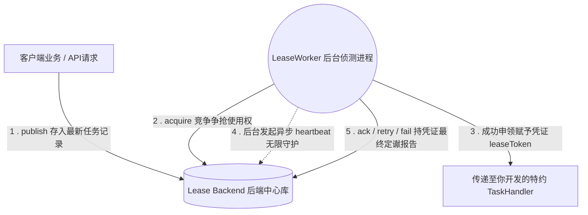

# [返回总目录](../README.md)

# team4u-lease：分布式任务与租约调度框架

[](https://openjdk.org/)
[](https://opensource.org/licenses/MIT)

## 📖 前因后果（背景与动机）

在微服务和分布式系统中，我们经常需要处理异步流程式任务或后置处理（如生成报表、批量发送营销邮件、异步回调通知等）。传统的做法通常存在以下痛点：

1. 简单定时任务框架不佳：比如普通的 `@Scheduled` 或者是 Spring
   定时任务，很难在集群多个节点之间做安全的分发。如果同一时间多个节点执行同一任务，必然造成并发重复消费带来的数据错乱（惊群效应）。
2. 常规消息队列（MQ）重投递失控：虽然 MQ 擅长消息分发，但是对于长耗时任务支持性不佳。基于“超时未 ACK 就重发”的特性，若一个报表任务需要运行
   5 分钟，而 MQ 超时设为 1 分钟，那么在任务结束前，MQ 已经将此任务强行派发给其余 4 个节点处理，最终系统发生“雪崩”。
3. 数据库悲观锁性能差且易死锁：使用 `SELECT ... FOR UPDATE` 在高并发场景下容易把数据库线程池打满；当应用非正常关闭时（如
   OOM、杀进程），事务如果没有回滚，相关的任务记录将永久性锁死变为“死数据”。

为了优雅且彻底地解决长周期与高并发任务下的这些坑，`team4u-lease`
借鉴了分布式系统（如选主、文件访问排他）内的“租约（Lease）协议”，提供了一种安全、轻量、高灵活性且具备自愈能力的任务调度框架。它通过“排他租约竞争 +
心跳自保守护”的模型，完美兼顾了分布式任务的高可用调度与单任务执行的唯一性。

---

## 💡 背后的核心原理

整个 `team4u-lease` 的工作流，建立在“拉取模型（Polling Pull）”与“防篡改租约（Lease Protocol）”两大基石上：

### 1. 任务拉取与所有权竞争（防多点并跑）

框架核心驱动是 `LeaseWorker`，这是一个常驻内存的轮询线程。不同节点上的 `LeaseWorker` 会主动定时并发向后端 `LeaseBackend`
尝试“揽客（`acquire`）”。

- 当 Worker 成功抢夺到一个可用任务时，也会同时获取一个带有期限的租约（LeaseToken 等准入凭证）。
- 这份租约代表：在限定的时间（`leaseMillis`）内，该任务专属当前节点，并加上了一把带有版本记录的“排他乐观锁”，其他任何请求都不可争抢该任务。

### 2. 心跳守护机制（解决长耗时与中途断电场景）

- 超长执行保护：普通锁往往是一次性赋予锁定时间，这不够灵活。我们的 Worker 在获取租约后，会异步开启一条心跳监控守护线程（Heartbeat
  Guardian）。在业务代码忙于执行长耗时任务时，该守护线程会默默并持续地向 Backend 发送心跳指令请求延长自己执行该任务的截止时间。
- 异常宕机自愈：如果执行该任务的节点遭遇物理断网或意外宕机，该守护线程就随同主进程死亡，后端不再收到续命请求，这把任务防乱入的“租约锁”一旦随时间耗尽，其他存活的计算节点就能够检测到锁已释放，进而顺畅接手重试（实现自适应调度）。

### 3. 可靠的生命周期闭环体系

在业务处理器执行完代码后，Worker 会持之前核发给它的 `LeaseToken` 去向 Backend 做最后防篡改的汇报验证：

- 处理成功：调用 `ack`，将任务标记为 `SUCCEEDED`。
- 遇非致命错：框架捕获到业务抛出可重试异常时，会主动发配 `retry` 投递延迟计划，配合内部的“退避系统（Backoff
  Delay）”计算出的下回可见时间放入下一次调度延时队列。
- 彻底抛弃：如重试到达上限（`maxAttempts`），将该项标记为 `DEAD` 结束生命。

---

## 🚀 快速上手 (Quick Start)

只需几步代码配置，即可构建您的分布式调度 Worker，下方的演示为单机模拟完整生命周期：

### 1. 引入 Maven 依赖

```xml

<dependency>
    <groupId>com.team4u</groupId>
    <artifactId>team4u-lease</artifactId>
    <version>1.0.0-SNAPSHOT</version>
</dependency>
```

### 2. 定义核心业务处理器 Handler

实现 `LeaseTaskHandler`，不需要关心重试或抢锁等底层，只聚焦纯净的业务：

```java
import com.team4u.framework.lease.LeaseTaskHandler;

public class PushNotificationHandler implements LeaseTaskHandler {
    @Override
    public String key() {
        return "push-app-task";
    }

    @Override
    public void handle(String payload) throws Exception {
        // payload 为发布者丢进来的简单载荷（如 JSON）
        System.out.println("【业务处理】拉取到通知推送任务，参数: " + payload);

        // 模拟执行一个复杂、耗时较长的网络操作
        Thread.sleep(5000);

        // 如果这里直接通过 throw new RuntimeException("发生超时网络波动"); 
        // 框架会自动捕获，根据策略并暂存错误供下一次时间槽再进行安全的投递重试

        System.out.println("【业务处理】推送成功。通知 LeaseWorker 去自动 Ack ");
    }
}
```

### 3. 配置运行策略并启动 Worker

接下来进行轻便的注册，演示用内置安全内存 `InMemoryLeaseBackend` 进行调度处理：

```java
import com.team4u.framework.lease.DefaultLeaseTaskHandlerRegistry;
import com.team4u.framework.lease.LeaseWorker;
import com.team4u.framework.lease.LeaseWorkerPolicy;
import com.team4u.framework.lease.memory.InMemoryLeaseBackend;

public class LeaseDemoApp {
    public static void main(String[] args) throws InterruptedException {
        // [模块 1]: 载入后备数据库或持久化层中心 (此处使用完全内存的后台作为演示支撑)
        InMemoryLeaseBackend backend = new InMemoryLeaseBackend();

        // [模块 2]: 向注册表绑定你的特定任务类型 -> 对应的业务类
        DefaultLeaseTaskHandlerRegistry registry = new DefaultLeaseTaskHandlerRegistry();
        registry.register(new PushNotificationHandler());

        // [模块 3]: 自定义该程序的轮询策略规则
        LeaseWorkerPolicy policy = LeaseWorkerPolicy.builder()
                .workerId("Node-Server-Beijing-01")  // 当前应用的身份名字
                .leaseMillis(30_000L)                // 首次发放的无竞争保护租约有效时间：30 秒
                .heartbeatEnabled(true)              // ★关键：开启防任务超时的心跳守护
                .heartbeatIntervalMillis(10_000L)    // ★补充：每隔 10 秒发一次心跳，但每次续约长度仍是 leaseMillis
                .maxAttempts(3)                      // 一旦产生出错，框架将尝试 3 次最终才会报“DEAD”死信
                .build();

        // [模块 4]: 点燃后台默默奉献的核心 Worker，它将不停监听新业务！
        LeaseWorker worker = new LeaseWorker(backend, registry, policy);
        worker.start("Notification-Polling-Thread"); // 可以设置您顺眼的监控线程名

        // ----------------------------------------------------
        // [业务上游/API网关控制部分]：向中枢扔进任务，Worker会自动被唤醒嗅探到并带出来计算。
        System.out.println(">>> 外部请求：发布了一条 Push 任务...");
        backend.publish("push-app-task", "{\"targetUid\":\"U99881\", \"msg\":\"您有一条未读包裹！\"}");

        // 为了避免系统瞬间退出，模拟 Web容器持续运作 15 秒观察后台轮询流转情况
        Thread.sleep(15000);

        // shutdown() 会停止拉新任务，并等待当前任务处理完成后再退出
        worker.shutdown();
        System.out.println(">>> 应用安全关闭");
    }
}
```

`InMemoryLeaseBackend` 主要用于测试、示例和单进程验证，不适合生产环境的长时间高频负载。

---

## 🏗 核心抽象实现机制说明

为支持多种接入端及扩展环境接入组件（从 MySQL 到 Redis 再到内存），框架设计了三类关键的隔离抽象基类接口。

### 1. `LeasePublisher` (发布者接口)

负责客户端发号指令：

- `publish()`：发布即刻起生效或定格倒计时的`延时触发式处理任务`。
- `cancel()` / `reschedule()`：系统级别高级人工介入管控，提供在不终止物理程序前可手动让特定的积压旧件重排查废。

### 2. `LeaseBackend` (存储仓与裁判抽象)

从 `Publisher` 延展，全权掌握各 Worker 分组争抢中的任务声明全线历史存储（底层是真实对接各种存储方案的落库者）：

- `acquire`：最重要原语，带有严格版本的防并发抢锁入口。
- `ack` / `retry` / `fail`：严谨的凭证后置确认方式，使用专属于持有者的 `LeaseToken` 抵御来自别的主机因意外乱报成功事件。
- `heartbeat`：接盘长跑超时 Worker 的生命延长口。

### 3. `LeaseWorkerPolicy` (Worker 调度策略库)

影响一个或者多个节点的集群行为策略库。

- 重点推荐关注其内的 Backoff 退避策略体系（退避防雪崩算法）：例如利用内置实现 `Backoff.exponentialJitter(1000, 2.0, 60000)`
  配置具备随机数抖动的“指数型退避策略”，能极有效地预防当三方接口批量挂死而让本地数万条任务在一瞬间排山倒海般被一致重传引发的集群雪崩大危机。

---

## 🛠 开发最佳实践极简规约

在进入正式使用前，请业务开发一定熟知的三大潜规则！

1. 绝对落实无副作用的业务幂等性
   微服务端网络变数和意外 JVM OOM 常发！试想当 Worker 已经刚把第三方推送调用下发，就在要发出 `ack`
   销账的一瞬间由于网线被拔出断开连接——框架是无从得知下发是否成功的；伴随租借过期它必定会被分派给下一个健康的主机进行“重试执行”。因此您的所有被拉起的
   `LeaseTaskHandler.handle` 必须像水泵一样，要具备重复调用且结果完全统一安全的“事务幂等性能力”（常见用数据表防重约束做检查）。

2. 区分“可重试环境错误”与“决绝业务错误（Fail-Fast）”
   当抛出的异常是确定性的绝路错误（比如报文中包含错误JSON字段格式、被调用的客户端帐号本来就违规已被永封），这是无法用“反复尝试”修补的，此时你应手动记录或
   catch 后决定此任务逻辑命运，绝不用抛回到上层任其占用框架重试通道挤占健康流量系统资源。

3. 任务拆分减压机制及载荷大小 (Payload Optimization)
   长征不带辎重。向后端存入 `payload` 时尽可能仅存精要主键 ID 凭据记录值：例如传送 `{"orderId": "PO189283-0001"}`，而非向
   Backend 塞进几兆长的商品图片 Base64 参数等厚重物。这样能令各种 `LeaseBackend` 中的查询与网流速度百倍级爆发！

## 📊 系统微观工作流图示

使用下面的 Mermaid 了解每个命令发生与谁交互：


