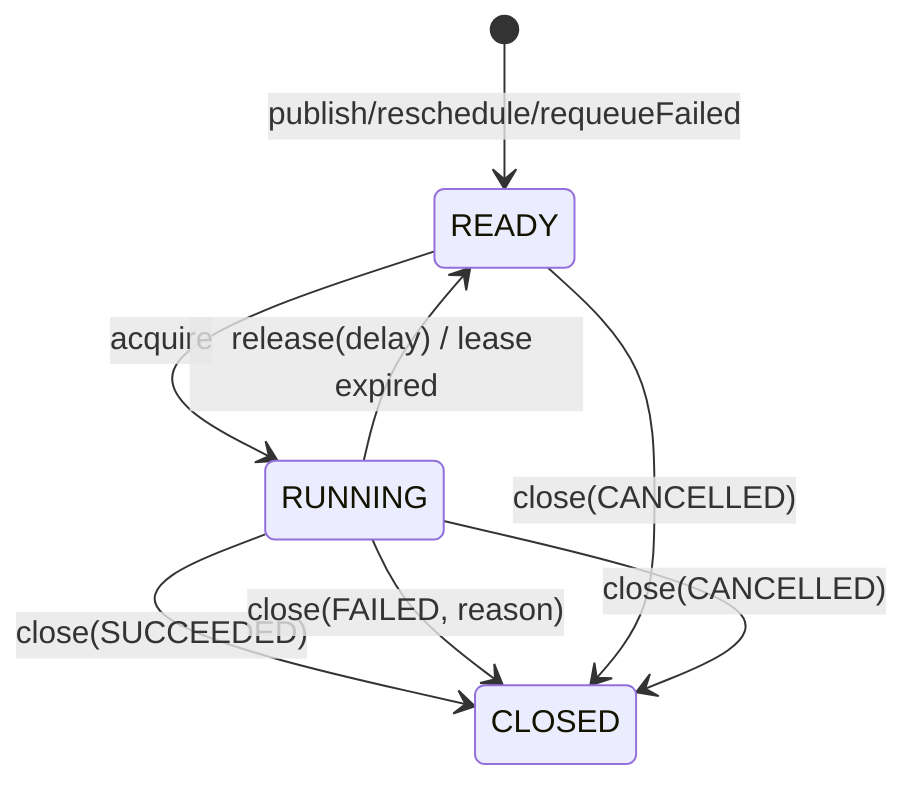

# team4u-lease

## 为什么需要它

在分布式系统中，经常会遇到这样一类“长任务”或“排他性任务”：

* 排他性执行：同一个任务在任意时刻只能由一个节点处理。
* 可靠性保证：长任务需要续约，如果执行节点中途宕机或失联，任务应能自动被其他节点接管。
* 状态可见性：任务需要保留执行状态、结果、失败原因以及业务上下文，方便查询与人工运维。
* 低成本集成：不想为了这些基础需求引入复杂的 MQ 平台或重量级工作流引擎。

`team4u-lease` 通过可抢占的任务记录加可过期的独占租约，为这类场景提供了一个轻量且稳妥的解决方案。

## 核心概念

### 什么是租约 (Lease)

当 Worker 成功获取一个任务时，并不是永久占有，而是获得了一段有过期时间的独占执行权。

这段权限即为 Lease，包含：
* `taskId`：任务标识
* `workerId`：执行节点标识
* `leaseToken`：租约令牌，用于版本校验

后续的所有写回操作（心跳、完成、失败、释放）都必须带上这个凭证。如果租约过期或令牌不匹配，写回操作将被拒绝。

这种机制保证了：
1. 并发控制：同一时刻只有一个合法持有者能更新任务状态。
2. 异常接管：Worker 故障后，任务会在租约过期后自动重新变得可抢占。

### 队列与任务类型

- Queue (队列)：决定任务会被哪一类 Worker 节点订阅和拉取，是调度边界。
- TaskType (类型)：决定同一个队列内由哪个具体的本地 `Handler` 处理，是路由标识。

简单来说：Queue 解决“谁能拿到任务”，TaskType 解决“拿到后怎么处理”。

## 核心模型

### 生命周期状态：`LeaseTaskState`

任务通过三个维度表达其当前处境：

| 状态 | 说明 |
| --- | --- |
| `READY` | 待命状态，可供 Worker 获取执行（包含延迟生效的任务）。 |
| `RUNNING` | 已被某个 Worker 成功抢占，正在执行中。 |
| `CLOSED` | 终局状态，任务已结束，不再自动流转。 |

### 结束结果：`LeaseTaskOutcome`

当状态为 `CLOSED` 时，通过 `Outcome` 表达最终结局：
* `SUCCEEDED`：执行成功。
* `FAILED`：执行失败。
* `CANCELLED`：人工或系统取消。

### 失败原因：`LeaseTaskFailureReason`

当 outcome 为 `FAILED` 时，记录具体的失败诱因：
* `HANDLER_EXCEPTION`：业务处理器抛出异常。
* `RETRY_EXHAUSTED`：由于重试逻辑目前由外部重试组件或管理端控制，框架本身记录该状态以标识重试次数耗尽（需配合外部集成）。
* `ABORTED_BY_POLICY`：被执行策略拦截。
* `MISSING_HANDLER`：本地未注册对应的处理器。
* `MANUAL_FAIL`：人工手动标记失败。

## 状态流转



## 执行语义与细节

### 获取与抢占 (Acquire)
* Worker 只能从 `READY` 状态或租约已过期的 `RUNNING` 状态中抢占任务。
* 抢占成功后，任务进入 `RUNNING`，且 `deliveryCount` 自增。

### 成功完成 (Close SUCCEEDED)
* 状态变为 `CLOSED + SUCCEEDED`。
* 清空历史错误信息（`errorMessage`）和租约残留字段。

### 释放 (Release)
* 主动交还执行权，任务回到 `READY` 状态。
* 不增加 `failureCount`。常用于 Worker 优雅停机或本地资源不足时。

### 心跳续约 (Heartbeat)
* 刷新租约过期时间为 `now + leaseMillis`。
* 续约失败不直接终止业务逻辑，但会记录预警日志。
* 业务代码可通过 `LeaseExecutionContext.requestHeartbeat()` 手动触发立即续约。

### 缺失处理器决策 (MissingHandlerStrategy)
当 Worker 抢到一个任务但本地没有对应的 `Handler` 时：
* `FAIL_FAST` (默认)：立即将任务标记为 `CLOSED + FAILED`，原因为 `MISSING_HANDLER`。
* `RETRY_LATER`：调用 `release` 将任务放回队列（延迟 `pollWaitMillis` 毫秒后可见），不增加失败次数。适用于异构节点部署时，希望由特定节点处理特定任务的场景。

## 主要接口与配置

### 运行时接口：`LeaseRuntimeClient`
Worker 执行过程中调用的底层 API。
```java
// 获取任务
LeaseGrant acquire(LeaseAcquireRequest request) throws InterruptedException;
// 关闭任务 (成功/失败/取消)
LeaseRuntimeResult close(LeaseHandle handle, LeaseCloseRequest request);
// 主动释放
LeaseRuntimeResult release(LeaseHandle handle, LeaseReleaseRequest request);
// 心跳续约
LeaseRuntimeResult heartbeat(LeaseHandle handle, long extendMillis);
```

### 查询与管理接口
* LeaseQueryService：支持根据 `taskId` 获取详情或根据 `LeaseQueryRequest` 进行分页条件查询（支持过滤队列、类型、状态、结果等）。
* LeaseAdminService：支持控制面进行人工干预，如 `reschedule` (重排可见时间)、`requeueFailed` (重放失败任务) 等。

### 配置：`LeaseWorkerPolicy`
控制 Worker 的运行行为，支持以下参数：

| 参数 | 说明 | 默认值 | 校验规则 |
| --- | --- | --- | --- |
| `workerId` | 唯一身份标识 | 随机 UUID | 不能为空 |
| `leaseMillis` | 租赁（锁定）时长 | 30,000 ms | > 0 |
| `pollWaitMillis` | 轮询阻塞等待时长 | 1,000 ms | >= 0 |
| `heartbeatEnabled` | 是否开启自动心跳 | `true` | - |
| `heartbeatIntervalMillis` | 心跳间隔 | `leaseMillis / 3` | > 0 且 < `leaseMillis` |
| `missingHandlerStrategy` | 缺失处理器策略 | `FAIL_FAST` | - |

## 后端实现

### JDBC 后端 (JdbcLeaseBackend)

推荐用于需要持久化、多实例部署的生产环境。

* 表结构：核心存储在 `lease_task` 表。
* 抢占逻辑：采用乐观抢占模型。先查询候选 ID，再通过 `UPDATE ... WHERE id=? AND (status='READY' OR (status='RUNNING' AND expires_at <= now))` 进行原子竞争。
* 排序规则：
    1. `priority DESC` (高优先级优先)
    2. `created_at ASC` (遵循 FIFO)
    3. `task_id ASC` (确定性排序)

### 内存后端 (InMemoryLeaseBackend)

基于 `ConcurrentHashMap` 与 `DelayQueue` 实现。
* 特点：速度极快，进程重启即消失。
* 场景：单元测试、本地演示。

## 完整示例与生命周期管理

```java
// 1. 初始化后端 (内存版)
LeaseBackend backend = new InMemoryLeaseBackend();

// 2. 注册任务处理器
DefaultLeaseTaskHandlerRegistry registry = new DefaultLeaseTaskHandlerRegistry();
registry.register("order", "pay", context -> {
    System.out.println("Processing payment for: " + context.getPayload());
    // 业务预计较长，手动触发一次续约
    context.requestHeartbeat();
});

// 3. 配置并启动 Worker
LeaseWorker worker = new LeaseWorker(backend, registry, LeaseWorkerPolicy.builder()
        .workerId("worker-01")
        .leaseMillis(60_000L).build());
worker.start("lease-worker-main");

// 4. 发布任务
backend.publish(LeasePublishRequest.builder()
        .queue("order").taskType("pay").payload("{\"orderId\": 1001}").build());

// 5. 优雅停机
// shutdownGracefully 会等待当前正在执行的任务结束，停止新任务拉取并关闭心跳线程
worker.shutdownGracefully(5000); 
```

## 适用与局限

| 推荐场景 | 不太适合 |
| --- | --- |
| 中小规模异步任务执行 | 每秒数万次的超大规模消息吞吐 |
| 需要强单节点执行语义 | 需要 Topic 广播、Consumer Group 等 MQ 特性 |
| 需要高可见性与人工干预 | 复杂的 DAG 编排与大型工作流 |
| 现有数据库架构，希望低成本引入任务系统 | 纯内存毫秒级超高性能场景 |
