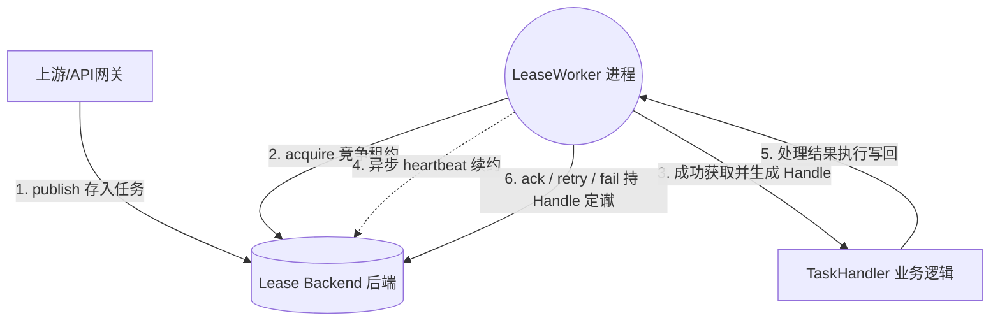

# [返回总目录](../README.md)

# team4u-lease：分布式任务与租约调度框架

[](https://openjdk.org/)
[](https://opensource.org/licenses/MIT)

## 📖 前因后果（背景与动机）

在微服务和分布式系统中，我们经常需要处理异步流程式任务或后置处理（如生成报表、批量发送营销邮件、异步回调通知等）。传统的做法通常存在以下痛点：

1.  **简单定时任务框架不佳**：比如普通的 `@Scheduled` 或者是 Spring 定时任务，很难在集群多个节点之间做安全的分发。如果同一时间多个节点执行同一任务，必然造成并发重复消费带来的数据错乱（惊群效应）。
2.  **常规消息队列（MQ）重投递失控**：虽然 MQ 擅长消息分发，但是对于长耗时任务支持性不佳。基于“超时未 ACK 就重发”的特性，若一个报表任务需要运行 5 分钟，而 MQ 超时设为 1 分钟，那么在任务结束前，MQ 已经将此任务强行派发给其余 4 个节点处理，最终系统发生“雪崩”。
3.  **数据库悲观锁性能差且易死锁**：使用 `SELECT ... FOR UPDATE` 在高并发场景下容易把数据库线程池打满；当应用非正常关闭时（如 OOM、杀进程），事务如果没有回滚，相关的任务记录将永久性锁死变为“死数据”。

为了优雅且彻底地解决长周期与高并发任务下的这些坑，`team4u-lease` 借鉴了分布式系统（如选主、文件访问排他）内的“**租约（Lease）协议**”，提供了一种安全、轻量、高灵活性且具备自愈能力的任务调度框架。它通过“**排他租约竞争 + 心跳自保守护**”的模型，完美兼顾了分布式任务的高可用调度与单任务执行的唯一性。

---

## 💡 背后的核心原理

整个 `team4u-lease` 的工作流，建立在“**拉取模型（Polling Pull）**”与“**防篡改租约（Lease Protocol）**”两大基石上：

### 1. 任务拉取与所有权竞争（防多点并跑）

框架核心驱动是 `LeaseWorker`，这是一个常驻内存的轮询线程。不同节点上的 `LeaseWorker` 会主动定时并发向后端 `LeaseBackend` 尝试“**申领（`acquire`）**”。

*   当 Worker 成功抢夺到一个可用任务时，也会同时获取一个带有期限的租约（`LeaseToken` 等准入凭证）。
*   这份租约代表：在限定的时间（`leaseMillis`）内，该任务专属当前节点，并加上了一把带有版本记录的“排他乐观锁”，其他任何请求都不可争抢该任务。

### 2. 心跳守护机制（解决长耗时与中途断电场景）

*   **超长执行保护**：普通锁往往是一次性赋予锁定时间，这不够灵活。我们的 Worker 在获取租约后，会异步开启一条心跳监控守护线程（`Heartbeat Guardian`）。在业务代码忙于执行长耗时任务时，该守护线程会持续地向 Backend 发送心跳指令请求延长自己执行该任务的截止时间。
*   **异常宕机自愈**：如果执行该任务的节点遭遇物理断网或意外宕机，该守护线程就随同主进程死亡，后端不再收到续命请求。这把任务防乱入的“租约锁”一旦随时间耗尽，其他存活的计算节点就能够检测到锁已释放，进而顺畅接手重试（实现自适应调度）。

### 3. 可靠的生命周期闭环体系

在业务处理器执行完代码后，Worker 会持之前核发给它的 `LeaseHandle` 去向 Backend 做最后防篡改的汇报验证：

*   **处理成功**：调用 `ack`，将任务标记为 `SUCCEEDED`。
*   **遇非致命错误**：框架捕获到业务抛出可重试异常时，会主动调用 `retry` 投递延迟计划，配合内部的“退避系统（Backoff Delay）”计算出的下回可见时间。
*   **彻底抛弃**：如重试到达上限（`maxFailures`），将该项标记为 `DEAD` 结束生命。

---

## 🏗 项目结构

`team4u-lease` 采用了模块化设计：

*   **`team4u-lease-core`**: 框架核心定义、Worker 实现及常用退避算法。
*   **`team4u-lease-memory`**: 内存版租约后端实现，非常适合单元测试和单机环境演示。

---

## 🚀 快速上手 (Quick Start)

只需几步代码配置，即可构建您的分布式调度 Worker，下方的演示为单机模拟完整生命周期：

### 1. 引入 Maven 依赖

在 pom.xml 中添加核心依赖与内存版后端：

```xml
<dependency>
    <groupId>com.team4u</groupId>
    <artifactId>team4u-lease-core</artifactId>
    <version>1.0.0-SNAPSHOT</version>
</dependency>
<dependency>
    <groupId>com.team4u</groupId>
    <artifactId>team4u-lease-memory</artifactId>
    <version>1.0.0-SNAPSHOT</version>
</dependency>
```

### 2. 定义核心业务处理器 Handler

实现 `LeaseTaskHandler`，不需要关心重试或抢锁等底层，只聚焦纯净的业务：

```java
import com.team4u.framework.lease.LeaseTaskHandler;
import com.team4u.framework.lease.LeaseExecutionContext;
import com.team4u.framework.lease.NonRetryableLeaseException;

public class PushNotificationHandler implements LeaseTaskHandler {
    @Override
    public void handle(LeaseExecutionContext context) throws Exception {
        // context 提供 payload、queue、taskType、deliveryCount、failureCount、attributes 等运行态信息
        System.out.println("【业务处理】拉取到通知推送任务，参数: " + context.getPayload());

        // 模拟执行一个复杂、耗时较长的网络操作
        Thread.sleep(5000);

        // 如果发现是无法修复的业务异常，可以抛出 NonRetryableLeaseException 立即终止重试
        if ("invalid-payload".equals(context.getPayload())) {
            throw new NonRetryableLeaseException("Payload 内容不合法");
        }

        System.out.println("【业务处理】推送成功。通知 LeaseWorker 去自动 Ack ");
    }
}
```

### 3. 配置运行策略并启动 Worker

接下来进行轻便的注册，演示用内置安全内存 `InMemoryLeaseBackend` 进行调度处理：

```java
import com.team4u.framework.lease.DefaultLeaseTaskHandlerRegistry;
import com.team4u.framework.lease.LeasePublishRequest;
import com.team4u.framework.lease.LeaseWorker;
import com.team4u.framework.lease.LeaseWorkerPolicy;
import com.team4u.framework.lease.memory.InMemoryLeaseBackend;

public class LeaseDemoApp {
    public static void main(String[] args) throws InterruptedException {
        // [模块 1]: 初始化内存版租约后端
        InMemoryLeaseBackend backend = new InMemoryLeaseBackend();

        // [模块 2]: 向注册表绑定 queue (订阅队列) + taskType (任务类型) -> 对应的业务类
        DefaultLeaseTaskHandlerRegistry registry = new DefaultLeaseTaskHandlerRegistry();
        registry.register("push-queue", "sms-task", new PushNotificationHandler());

        // [模块 3]: 自定义 Worker 运行策略
        LeaseWorkerPolicy policy = LeaseWorkerPolicy.builder()
                .workerId("Node-01")             // Worker 唯一标识，默认为自动生成的 UUID
                .leaseMillis(30_000L)            // 任务锁定时间，默认 30 秒
                .maxFailures(5)                  // 最大重试次数，默认 8 次
                .heartbeatEnabled(true)          // 是否开启心跳保护，默认开启
                .build();

        // [模块 4]: 启动 Worker，它将自动订阅 registry 中注册的所有 queue
        LeaseWorker worker = new LeaseWorker(backend, registry, policy);
        worker.start("Notification-Worker");

        // ----------------------------------------------------
        // [上游业务]: 向后端发布一个任务
        backend.publish(LeasePublishRequest.builder()
                .queue("push-queue")
                .taskType("sms-task")
                .payload("{\"phone\":\"13800138000\", \"content\":\"验证码：1234\"}")
                .delayMillis(1000L)              // 延迟 1 秒后开始调度
                .build());

        // 模拟应用运行一段时间
        Thread.sleep(15000);

        // 安全关闭 Worker
        worker.shutdown();
    }
}
```

---

## 🏗 核心抽象说明

为支持多种存储后端及扩展，框架设计了以下关键接口：

### 1. 任务生产与管理 (`LeaseProducer` / `LeaseAdminService`)

*   `publish()`: 发布任务，支持 `delayMillis` 延迟执行和 `priority` 优先级。
*   `cancel()` / `reschedule()`: 对未执行任务进行操作。
*   `requeueDead()`: 将状态为 `DEAD` 的任务重新投入调度队列。

### 2. 运行时操作与查询 (`LeaseRuntimeClient` / `LeaseQueryService`)

*   `acquire()`: 获取任务，支持阻塞等待 (`pollWaitMillis`) 和多队列订阅。
*   `ack()` / `retry()` / `fail()`: 任务执行结果反馈，需携带有效 `LeaseHandle`（包含 `taskId`, `workerId`, `leaseToken`）。
*   `heartbeat()`: 延长租约有效期。

### 3. Worker 策略配置 (`LeaseWorkerPolicy`)

*   **退避策略 (`Backoff`)**: 内置 `fixed`, `increment`, `exponential`, `exponentialJitter` 等多种算法。
*   **缺失处理器策略 (`MissingHandlerStrategy`)**: 
    *   `FAIL_FAST`: 找不到处理器时直接标记任务为 `DEAD`（默认）。
    *   `RETRY_LATER`: 释放任务回队列，等待后续可能的具备处理能力的 Worker。

---

## 🛠 开发最佳实践

1.  **业务幂等性**：由于网络超时或宕机可能导致同一任务被多次抢占执行，处理程序必须保证幂等。
2.  **合理设置租约时间**：`leaseMillis` 应大于业务平均处理时间。若业务处理时间波动剧烈，务必开启心跳功能。
3.  **精简 Payload**：`payload` 应只存储关键 ID，避免存储大数据量内容，以保证后端存储性能和调度灵活性。
4.  **善用 NonRetryableLeaseException**：对于确定无法通过重试解决的业务逻辑错误，直接抛出此异常，节省系统重试资源。

---

## 📊 系统工作流


