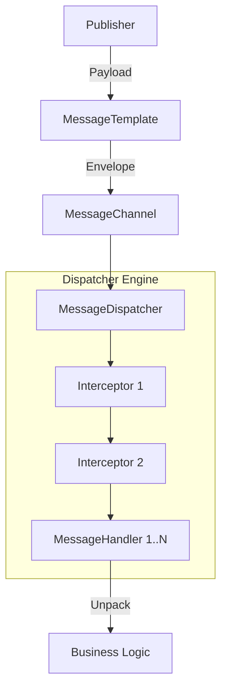

# 消息抽象框架模块

[](https://openjdk.java.net/)
[](https://opensource.org/licenses/MIT)

## 目录
- [简介](#简介)
- [快速入门](#快速入门)
- [核心特性](#核心特性)
- [典型场景](#典型场景)
- [架构与原理](#架构与原理)

---

## 简介

team4u-message 是一个高性能、强类型、高扩展的消息抽象框架。它通过“信封模式 (Message Envelope)”与“策略驱动分发 (Policy-Based Dispatching)”的设计理念，统一了 JVM 进程内事件总线与跨网络 MQ 消息的处理模型。

本模块通过对消息生命周期的深度解耦，解决了业务逻辑与底层传输介质、并发策略以及路由规则之间的硬编码耦合。开发者只需关注业务载荷 (Payload) 本身，其余的线程调度、拦截过滤、序列化适配及通道路由均由框架自动完成。

### 核心优势
* **强类型信封模型**：摒弃裸对象传递，通过统一的 `Message<T>` 信封携带业务载荷与元数据（Headers），实现全链路的可追溯性。
* **极速策略路由**：深度整合 `team4u-policy`，利用无锁有序策略链实现 O(1) 或近 O(n) 的极速订阅者查找。
* **职责彻底分离**：引入 `MessageDispatcher` 统筹调度，支持处理器级别的独立线程池配置，实现业务执行环境的物理隔离。
* **全生命周期拦截**：提供 `MessageInterceptor` 扩展点，支持在分发前、分发后及完成后进行横切逻辑注入（如 TraceId 传递、耗时统计）。
* **极致开发者体验**：提供 Lambda 构建器、自动泛型推断基类以及 Spring 全自动装配，让复杂的架构拥有极简的 API。

---

## 快速入门

### 引入依赖

```xml
<dependency>
    <groupId>com.team4u</groupId>
    <artifactId>team4u-message</artifactId>
    <version>1.0.0-SNAPSHOT</version>
</dependency>
```

### 定义消息载荷

```java
@Data
public class UserRegisteredEvent {
    private String userId;
    private String email;
}
```

### 声明消费者 (Subscriber)

只需继承 `AbstractMessageHandler` 并声明泛型，框架将自动完成类型匹配与消息拆包。

```java
@Component
public class WelcomeEmailHandler extends AbstractMessageHandler<UserRegisteredEvent> {

    @Override
    protected void onMessage(UserRegisteredEvent event, MessageHeaders headers) {
        // 直接处理业务对象，无需手动转型
        System.out.println("Sending welcome email to: " + event.getEmail());
    }
}
```

### 发送消息 (Publisher)

使用 `MessageTemplate` 门面，支持同步、异步及带回调的发送方式。

```java
@Autowired
private MessageTemplate messageTemplate;

public void registerUser(User user) {
    // 业务逻辑...
    
    // 发送裸对象，框架自动包装为带 ID 和时间戳的信封
    messageTemplate.send(new UserRegisteredEvent(user.getId(), user.getEmail()));
}
```

---

## 核心特性

### 信封模型 (Envelope & Headers)

消息在框架中流动时必须被包裹在 `Message` 中。`MessageHeaders` 提供了标准的元数据支持：
- `id`: 消息唯一标识 (UUID)。
- `timestamp`: 产生时间。
- `message-type`: 业务类型标识（支持全限定类名或自定义标识）。

### 拦截器体系 (Interceptors)

通过实现 `MessageInterceptor`，可以轻松实现全局切面功能：
```java
public class TraceInterceptor implements MessageInterceptor {
    @Override
    public boolean preHandle(Message<?> message) {
        // 从 Header 提取 TraceId 并存入 MDC
        return true; 
    }
}
```

### 异构系统兼容 (Extractor)

针对没有标准 Header 的第三方纯 JSON 消息，通过 `MessageExtractor` 从 JSON 内部字段中提取类型标识，确保路由依然生效。

```java
// 从 JSON 的 "event_type" 字段提取路由标识
MessageExtractor extractor = new MessageExtractor.JsonPropertyExtractor("event_type");
```

### Spring 自动装配

模块内置 `MessagingAutoConfiguration`。只要 Bean 实现了 `MessageHandler` 或 `MessageInterceptor` 接口，就会被自动识别并注册到全局调度引擎中，实现零配置集成。

---

## 典型场景

### 场景一：高性能进程内事件总线 (JVM In-Process)

适用于单机环境下的业务逻辑解耦，通过内存通道实现高效的消息发布订阅。

#### 1. 基础设施配置
```java
// 初始化核心调度器与 JVM 内存通道
MessageDispatcher dispatcher = new MessageDispatcher();
// 注册全局日志拦截器
dispatcher.addInterceptor(new LoggingMessageInterceptor());

JvmMessageChannel eventBus = new JvmMessageChannel("internal-bus", dispatcher);
MessageTemplate template = new MessageTemplate(eventBus);
```

#### 2. 定义业务处理器
```java
public class UserScoreHandler extends AbstractMessageHandler<UserActiveEvent> {
    @Override
    protected void onMessage(UserActiveEvent event, MessageHeaders headers) {
        // 增加用户积分逻辑...
        System.out.println("Updating score for user: " + event.getUserId());
    }
}
// 注册到分发器
dispatcher.addHandler(new UserScoreHandler());
```

#### 3. 发送事件
```java
// 业务触发，只需投递裸对象
template.send(new UserActiveEvent("user-123", "SIGN_IN"));
```

---

### 场景二：跨网络 MQ 集成 (以 Kafka 为例)

通过通道抽象，业务代码无需感知 Kafka 的 API 细节，实现传输介质的透明切换。

#### 1. 生产者配置与发送
```java
// 1. 从工厂获取 Kafka 通道（配置标识为 kafka.topic.order-created）
MqChannelFactoryHolder factoryHolder = new MqChannelFactoryHolder();
// 假设已注册了 KafkaFactory 实现
LifecycleMessageChannel kafkaChannel = factoryHolder.createAndStart("kafka.order-created");

// 2. 创建发送门面
MessageTemplate kafkaTemplate = new MessageTemplate(kafkaChannel);

// 3. 异步发送并监听结果
kafkaTemplate.sendAsync(new OrderCreatedEvent("ORD-999"), new MessageChannel.SendListener() {
    @Override
    public void onSucceeded(Message<?> message) {
        log.info("Order message pushed to Kafka successfully");
    }

    @Override
    public void onFailed(Message<?> message, Exception e) {
        log.error("Failed to push to Kafka", e);
    }
});
```

#### 2. 消费者配置与处理
```java
// 1. 定义消费者逻辑，并指定独立线程池以防消费阻塞
@Component
public class OrderSyncHandler extends AbstractMessageHandler<OrderCreatedEvent> {
    
    public OrderSyncHandler() {
        // 为当前消费者分配独立的并发执行资源
        setExecutor(Executors.newFixedThreadPool(4));
    }

    @Override
    protected void onMessage(OrderCreatedEvent order, MessageHeaders headers) {
        // 执行异步系统同步逻辑...
        log.info("Syncing order to legacy system: {}", order.getOrderId());
    }
}

// 2. 框架自动装配（Spring 环境下）或手动订阅
kafkaChannel.subscribe(orderSyncHandler);
```

---

## 架构与原理

### 核心执行流程

1. **投递 (Submit)**：业务调用 `MessageTemplate` 发送数据。
2. **路由 (Route)**：`MessageDispatcher` 根据消息载荷类型在 `OrderedPolicyChain` 中匹配处理器。
3. **拦截 (Intercept)**：正序执行拦截器链的 `preHandle` 方法。
4. **执行 (Execute)**：
    - 若处理器指定了 `Executor`，则进入独立线程池执行。
    - 否则进入全局分发执行流。
5. **回调 (Callback)**：依次执行拦截器的 `postHandle` 和 `afterCompletion`（倒序）。

### 逻辑架构图


