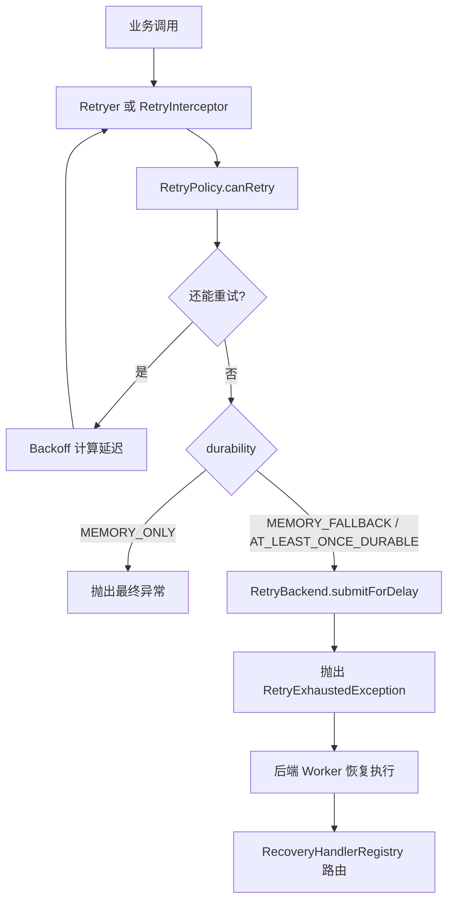

# [返回总目录](../README.md)

# team4u-retry

[](https://openjdk.org/)
[](https://opensource.org/licenses/MIT)

`team4u-retry` 是 Team4u Framework 的统一重试模块，提供：

- 同步重试：阻塞式执行 `Callable`
- 异步重试：基于 `CompletableFuture + ScheduledExecutorService`
- 注解重试：通过 `@Retryable` 接入
- Spring 自动代理：通过 `@EnableRetry` 自动织入
- 持久化降级：内存重试耗尽后移交后端队列
- 动态策略：支持从配置中心动态加载 `retry.policy.*`

如果你只想尽快上手，先看“快速开始”和“怎么选接入方式”。

## 目录

- [怎么选接入方式](#怎么选接入方式)
- [快速开始](#快速开始)
- [核心概念](#核心概念)
- [编程式重试](#编程式重试)
- [注解式重试](#注解式重试)
- [Spring 自动代理](#spring-自动代理)
- [持久化降级与恢复](#持久化降级与恢复)
- [动态策略与配置中心](#动态策略与配置中心)
- [完整示例：自定义 RetryBackend](#完整示例自定义-retrybackend)
- [完整示例：Spring Boot 接入](#完整示例spring-boot-接入)
- [关键边界与注意事项](#关键边界与注意事项)
- [实现结构](#实现结构)

---

## 怎么选接入方式

| 场景 | 推荐方式 | 特点 |
| --- | --- | --- |
| 你在普通 Java 代码里重试一段逻辑 | `Retryer.execute(Callable)` | 最简单，适合纯内存重试 |
| 你希望失败后可移交后端继续重试 | `Retryer.execute(taskType, payloadBuilder, task)` | 支持持久化降级 |
| 你的业务本身是异步调用 | `Retryer.executeAsync(...)` | 非阻塞，不占用当前线程 sleep |
| 你想零侵入地给服务方法加重试 | `@Retryable` + `RetryProxyFactory` | 不依赖 Spring |
| 你在 Spring 项目里 | `@EnableRetry` + `@Retryable` | 自动代理，接入成本最低 |

### 一句话决策

- 只需要本地重试：用 `Retryer.with(policy).execute(...)`
- 需要“内存失败后丢到后端队列”：用 `Retryer.builder()` 并配置 `RetryBackend`
- 已经在 Spring 里：优先用 `@EnableRetry`

---

## 快速开始

### 依赖

```xml
<dependency>
    <groupId>com.team4u</groupId>
    <artifactId>team4u-retry</artifactId>
    <version>1.0.0-SNAPSHOT</version>
</dependency>
```

### 最小示例：同步重试

```java
import com.team4u.framework.retry.RetryPolicy;
import com.team4u.framework.retry.Retryer;
import com.team4u.framework.retry.backoff.Backoff;

RetryPolicy policy = RetryPolicy.builder()
        .maxAttempts(3)
        .backoff(Backoff.fixed(200))
        .build();

Retryer retryer = Retryer.with(policy);

String result = retryer.execute(() -> {
    // 调用可能失败的下游服务
    return "ok";
});
```

### 最小示例：异步重试

```java
import com.team4u.framework.retry.RetryPolicy;
import com.team4u.framework.retry.Retryer;
import com.team4u.framework.retry.backoff.Backoff;

import java.util.concurrent.CompletableFuture;
import java.util.concurrent.Executors;
import java.util.concurrent.ScheduledExecutorService;

ScheduledExecutorService scheduler = Executors.newScheduledThreadPool(2);

RetryPolicy policy = RetryPolicy.builder()
        .maxAttempts(3)
        .backoff(Backoff.fixed(100))
        .build();

Retryer retryer = Retryer.with(policy);

CompletableFuture<String> future = retryer.executeAsync(
        "order.query",
        attempt -> "{\"orderId\":\"A1001\"}",
        this::asyncRemoteCall,
        scheduler
);
```

### 最小示例：注解重试

```java
public interface PayService {
    @Retryable(policy = "pay-notify")
    String notifyPay(String orderId);
}
```

---

## 核心概念

### 1. `RetryPolicy`

`RetryPolicy` 是不可变对象，用来定义“是否继续重试”和“下一次等多久”。

常用配置：

- `maxAttempts(int)`：总尝试次数，包含第一次调用
- `inMemoryAttempts(int)`：仅控制内存阶段的尝试次数
- `infiniteAttempts()`：无限重试，等价于 `maxAttempts = -1`
- `backoff(Backoff)`：退避策略
- `retryOn(...)`：只对这些异常重试
- `abortOn(...)`：命中这些异常立即停止
- `condition(String)`：基于 Criterion 表达式做更细粒度控制

示例：

```java
RetryPolicy policy = RetryPolicy.builder()
        .maxAttempts(5)
        .retryOn(java.io.IOException.class)
        .abortOn(IllegalArgumentException.class)
        .backoff(Backoff.exponentialJitter(100, 2.0, 3000))
        .condition("message contains 'timeout'")
        .build();
```

### 2. `Backoff`

内置退避算法：

- `Backoff.fixed(delay)`：固定间隔
- `Backoff.increment(initial, step)`：线性递增
- `Backoff.exponential(initial, multiplier, maxDelay)`：指数退避
- `Backoff.exponentialJitter(initial, multiplier, maxDelay)`：指数退避 + 抖动

如果你面对高并发失败风暴，优先考虑 `exponentialJitter`，它能减少瞬时重试扎堆。

### 3. 异常解包

框架会自动解包常见包装异常，再做重试判断，包括：

- `CompletionException`
- `ExecutionException`
- `InvocationTargetException`
- `UndeclaredThrowableException`

这意味着你在异步调用、代理调用下配置 `retryOn(...)` 时，通常仍然能命中真正的业务异常。

---

## 编程式重试

### 同步内存重试

适合简单、快速、纯内存场景。

```java
Retryer retryer = Retryer.with(policy);

String result = retryer.execute(() -> doBusiness());
```

注意：

- 该入口只支持 `MEMORY_ONLY`
- 如果你配置了持久化级别，不要调用这个重载

### 支持后端降级的同步重试

```java
Retryer retryer = Retryer.builder()
        .policy(policy)
        .backend(retryBackend)
        .durability(RetryDurability.MEMORY_FALLBACK)
        .build();

String result = retryer.execute(
        "pay-notify",
        attempt -> "{\"orderId\":\"A1001\"}",
        this::doBusiness
);
```

当内存重试耗尽但策略仍允许继续重试时：

- 框架会调用 `RetryBackend.submitForDelay(...)`
- 当前线程会收到 `RetryExhaustedException`
- 这个异常不表示任务彻底失败，而是表示任务已移交后端系统接管

### 非阻塞异步重试

```java
CompletableFuture<String> future = retryer.executeAsync(
        "pay-notify",
        attempt -> "{\"orderId\":\"A1001\"}",
        this::asyncRemoteCall,
        scheduler
);
```

特点：

- 不阻塞当前线程
- 通过 `ScheduledExecutorService` 延迟下一次尝试
- 调度器关闭等极端情况下，`future` 仍会正常异常完成，不会悬挂

---

## 注解式重试

### 基础用法

```java
public interface PayService {
    @Retryable(policy = "pay-notify", durability = RetryDurability.MEMORY_FALLBACK)
    String notifyPay(String orderId);
}
```

然后通过代理工厂接入：

```java
PayService proxy = RetryProxyFactory.createProxy(new PayServiceImpl(), retryBackend);
```

### `@Retryable` 参数说明

- `policy`：策略名，默认是 `default`
- `taskType`：任务类型，供后端恢复时路由
- `durability`：可靠性级别，默认 `MEMORY_ONLY`

### 什么时候需要提供 `RetryBackend`

当 `durability != MEMORY_ONLY` 时，必须提供 `RetryBackend`。否则会抛出 `IllegalStateException`。

---

## Spring 自动代理

如果你在 Spring 环境中，推荐使用这个方式，接入最轻。

### 开启功能

```java
@Configuration
@EnableRetry
public class RetryConfig {
}
```

### 注册策略

框架会根据 `policy` 名称查找对应策略。你可以通过 `RetryPolicyRegistry` 注册：

```java
RetryPolicyRegistry.global().register(new NamedRetryPolicy() {
    @Override
    public String key() {
        return "pay-policy";
    }

    @Override
    public RetryPolicy getPolicy() {
        return RetryPolicy.builder()
                .maxAttempts(3)
                .backoff(Backoff.fixed(100))
                .build();
    }
});
```

### 在 Bean 上使用

```java
@Service
public class PayServiceImpl {

    @Retryable(policy = "pay-policy")
    public String notifyPay(String orderId) {
        return "ok_" + orderId;
    }
}
```

### 代理模式说明

该模块遵循标准 Spring AOP 行为：

- 有接口时，通常可走 JDK 动态代理
- 无接口时，通常需要 CGLIB
- 在 Spring Boot 2.x+ 中，一般默认就是 CGLIB

如果你在非 Spring Boot 环境里需要强制类代理，可以显式开启：

```java
@Configuration
@EnableRetry
@EnableAspectJAutoProxy(proxyTargetClass = true)
public class RetryConfig {
}
```

---

## 持久化降级与恢复

### 可靠性级别

`RetryDurability` 提供三种模式：

- `MEMORY_ONLY`：只在当前进程内重试，最快，但不抗宕机
- `MEMORY_FALLBACK`：先内存重试，耗尽后移交后端
- `AT_LEAST_ONCE_DURABLE`：执行前先写 intent，保证至少一次持久化

### `RetryBackend` 职责

你需要实现 `RetryBackend` 来承接后端持久化与调度：

```java
public interface RetryBackend {
    String saveIntent(String taskType, String payload);
    void completeIntent(String intentId);
    void markTerminalFailure(String intentId, Throwable cause);
    void submitForDelay(String intentId, String taskType, String payload, long delay);
}
```

语义上可以理解为：

- `saveIntent(...)`：预写日志 / 预留执行意图
- `completeIntent(...)`：任务成功后清理 intent
- `markTerminalFailure(...)`：彻底失败，标记为终态
- `submitForDelay(...)`：把任务送入延迟队列

### 恢复执行

后端 Worker 取出任务后，按 `taskType` 路由到对应的恢复器：

```java
RecoveryHandlerRegistry.global().register(new RecoveryHandler() {
    @Override
    public String key() {
        return "pay-notify";
    }

    @Override
    public void recover(String payload) {
        // 从 payload 还原业务参数并继续执行
    }
});
```

### `MEMORY_FALLBACK` 的次数语义

设：

- `T = maxAttempts`，总尝试次数，包含第一次
- `M = inMemoryAttempts`，内存阶段尝试次数，包含第一次

则：

- 前台最多执行 `M` 次
- 只有 `M < T`，或者 `T == -1` 时，才会降级到后端
- 有限重试场景下，后端剩余次数为 `T - M`

默认值：

- `MEMORY_ONLY`：默认全部在内存中完成
- `MEMORY_FALLBACK` / `AT_LEAST_ONCE_DURABLE`：如果未显式配置 `inMemoryAttempts`，默认前台尝试 2 次

---

## 动态策略与配置中心

`DynamicRetryPolicyRegistry` 会监听前缀为 `retry.policy.` 的配置项，并在运行期返回最新策略。

示意：

```properties
retry.policy.pay-notify={"maxAttempts":5,"backoffType":"exponentialJitter"}
```

使用：

```java
RetryPolicy policy = DynamicRetryPolicyRegistry.getPolicy("pay-notify");
```

适合：

- 不改代码动态调节重试次数
- 针对不同任务类型配置不同策略
- 线上快速收敛重试风暴

---

## 完整示例：自定义 `RetryBackend`

下面这个例子不是生产实现，但足够帮助开发者理解接口职责，以及如何把 `team4u-retry` 接到自己的队列系统上。

### 一个最小内存版后端

```java
import com.team4u.framework.retry.RetryBackend;

import java.util.Map;
import java.util.Objects;
import java.util.concurrent.ConcurrentHashMap;
import java.util.concurrent.DelayQueue;
import java.util.concurrent.Delayed;
import java.util.concurrent.TimeUnit;

public class InMemoryRetryBackend implements RetryBackend {

    private final Map<String, IntentRecord> intents = new ConcurrentHashMap<>();
    private final DelayQueue<DelayedTask> queue = new DelayQueue<>();

    @Override
    public String saveIntent(String taskType, String payload) {
        String intentId = "intent-" + System.nanoTime();
        intents.put(intentId, new IntentRecord(intentId, taskType, payload, "PENDING"));
        return intentId;
    }

    @Override
    public void completeIntent(String intentId) {
        intents.remove(intentId);
    }

    @Override
    public void markTerminalFailure(String intentId, Throwable cause) {
        IntentRecord old = intents.get(intentId);
        if (old != null) {
            intents.put(intentId, new IntentRecord(old.intentId, old.taskType, old.payload, "TERMINAL"));
        }
    }

    @Override
    public void submitForDelay(String intentId, String taskType, String payload, long delay) {
        intents.putIfAbsent(intentId, new IntentRecord(intentId, taskType, payload, "QUEUED"));
        queue.offer(new DelayedTask(intentId, taskType, payload, delay));
    }

    public DelayedTask take() throws InterruptedException {
        return queue.take();
    }

    public static final class IntentRecord {
        public final String intentId;
        public final String taskType;
        public final String payload;
        public final String status;

        public IntentRecord(String intentId, String taskType, String payload, String status) {
            this.intentId = intentId;
            this.taskType = taskType;
            this.payload = payload;
            this.status = status;
        }
    }

    public static final class DelayedTask implements Delayed {
        public final String intentId;
        public final String taskType;
        public final String payload;
        private final long executeAtNanos;

        public DelayedTask(String intentId, String taskType, String payload, long delayMillis) {
            this.intentId = Objects.requireNonNull(intentId);
            this.taskType = Objects.requireNonNull(taskType);
            this.payload = payload;
            this.executeAtNanos = System.nanoTime() + TimeUnit.MILLISECONDS.toNanos(delayMillis);
        }

        @Override
        public long getDelay(TimeUnit unit) {
            long remaining = executeAtNanos - System.nanoTime();
            return unit.convert(remaining, TimeUnit.NANOSECONDS);
        }

        @Override
        public int compareTo(Delayed other) {
            return Long.compare(getDelay(TimeUnit.NANOSECONDS), other.getDelay(TimeUnit.NANOSECONDS));
        }
    }
}
```

### 对应的恢复器

```java
import com.team4u.framework.retry.recovery.RecoveryHandler;

public class PayNotifyRecoveryHandler implements RecoveryHandler {
    @Override
    public String key() {
        return "pay-notify";
    }

    @Override
    public void recover(String payload) {
        // 这里通常要做两件事：
        // 1. 反序列化 payload
        // 2. 调用真正的业务补偿逻辑
        System.out.println("recover payload = " + payload);
    }
}
```

### Worker 如何消费后端任务

```java
import com.team4u.framework.retry.recovery.RecoveryHandler;
import com.team4u.framework.retry.recovery.RecoveryHandlerRegistry;

public class RetryWorker implements Runnable {

    private final InMemoryRetryBackend backend;

    public RetryWorker(InMemoryRetryBackend backend) {
        this.backend = backend;
    }

    @Override
    public void run() {
        while (!Thread.currentThread().isInterrupted()) {
            try {
                InMemoryRetryBackend.DelayedTask task = backend.take();
                RecoveryHandler handler = RecoveryHandlerRegistry.global()
                        .get(task.taskType)
                        .orElseThrow(() -> new IllegalStateException("No RecoveryHandler for " + task.taskType));
                handler.recover(task.payload);
                backend.completeIntent(task.intentId);
            } catch (InterruptedException e) {
                Thread.currentThread().interrupt();
                break;
            } catch (Exception e) {
                // 生产环境里建议记录日志、做死信或重新入队，不要简单吞掉
                e.printStackTrace();
            }
        }
    }
}
```

### 怎么把它串起来

```java
InMemoryRetryBackend backend = new InMemoryRetryBackend();

RecoveryHandlerRegistry.global().register(new PayNotifyRecoveryHandler());

Thread worker = new Thread(new RetryWorker(backend), "retry-worker");
worker.start();

RetryPolicy policy = RetryPolicy.builder()
        .maxAttempts(5)
        .inMemoryAttempts(2)
        .backoff(Backoff.exponentialJitter(200, 2.0, 5000))
        .build();

Retryer retryer = Retryer.builder()
        .policy(policy)
        .backend(backend)
        .durability(RetryDurability.MEMORY_FALLBACK)
        .build();

retryer.execute(
        "pay-notify",
        attempt -> "{\"orderId\":\"A1001\"}",
        () -> {
            throw new RuntimeException("downstream timeout");
        }
);
```

### 生产实现建议

- `intentId` 不要用临时值，建议用业务幂等键或稳定哈希
- `payload` 要有明确版本号，避免后续字段变更导致恢复失败
- `submitForDelay(...)` 最好接消息队列或延迟队列，而不是只放内存
- `markTerminalFailure(...)` 建议落库并进入死信/告警链路
- Worker 执行恢复逻辑时，业务本身要具备幂等性

---

## 完整示例：Spring Boot 接入

下面是一个接近真实项目的接入方式，目标是让一个 `@Retryable` 方法在 Spring 中自动生效。

### 1. 注册策略

```java
import com.team4u.framework.retry.RetryPolicy;
import com.team4u.framework.retry.backoff.Backoff;
import com.team4u.framework.retry.proxy.NamedRetryPolicy;
import com.team4u.framework.retry.proxy.RetryPolicyRegistry;
import org.springframework.context.annotation.Configuration;

import jakarta.annotation.PostConstruct;

@Configuration
public class RetryPolicyConfig {

    @PostConstruct
    public void registerPolicies() {
        RetryPolicyRegistry.global().register(new NamedRetryPolicy() {
            @Override
            public String key() {
                return "pay-policy";
            }

            @Override
            public RetryPolicy getPolicy() {
                return RetryPolicy.builder()
                        .maxAttempts(3)
                        .backoff(Backoff.fixed(200))
                        .build();
            }
        });
    }
}
```

如果你的项目是 JDK 8 / Spring 5 风格，把 `jakarta.annotation.PostConstruct` 换成 `javax.annotation.PostConstruct`。

### 2. 开启自动代理

```java
import com.team4u.framework.retry.spring.EnableRetry;
import org.springframework.context.annotation.Configuration;

@Configuration
@EnableRetry
public class RetryAutoConfiguration {
}
```

### 3. 声明业务服务

```java
import com.team4u.framework.retry.proxy.Retryable;
import org.springframework.stereotype.Service;

import java.util.concurrent.atomic.AtomicInteger;

@Service
public class PayService {

    private final AtomicInteger counter = new AtomicInteger();

    @Retryable(policy = "pay-policy")
    public String notifyPay(String orderId) {
        if (counter.incrementAndGet() < 3) {
            throw new RuntimeException("temporary failure");
        }
        return "ok_" + orderId;
    }
}
```

### 4. 调用效果

```java
import org.springframework.boot.CommandLineRunner;
import org.springframework.stereotype.Component;

@Component
public class DemoRunner implements CommandLineRunner {

    private final PayService payService;

    public DemoRunner(PayService payService) {
        this.payService = payService;
    }

    @Override
    public void run(String... args) {
        String result = payService.notifyPay("A1001");
        System.out.println(result);
    }
}
```

执行结果预期：

- 前两次抛出 `RuntimeException`
- 第三次成功返回 `ok_A1001`
- 整个重试过程由代理自动完成，业务调用方不需要自己写循环

### 如果要接入持久化降级

在 Spring 容器里额外提供一个 `RetryBackend` Bean 即可：

```java
import com.team4u.framework.retry.RetryBackend;
import org.springframework.context.annotation.Bean;
import org.springframework.context.annotation.Configuration;

@Configuration
public class RetryBackendConfig {

    @Bean
    public RetryBackend retryBackend() {
        return new InMemoryRetryBackend();
    }
}
```

然后把业务方法改成：

```java
@Retryable(policy = "pay-policy", taskType = "pay-notify", durability = RetryDurability.MEMORY_FALLBACK)
public String notifyPay(String orderId) {
    // ...
}
```

此时要再配一套后端 Worker 和 `RecoveryHandler`，否则任务虽然能入队，但不会有人恢复执行。

---

## 关键边界与注意事项

### 1. `maxAttempts` 包含第一次调用

这点最容易误解。

- `maxAttempts(3)` 表示总共最多执行 3 次
- 不是“失败后再重试 3 次”

### 2. `Error` 永远不会重试

无论同步还是异步，`Error` 都会直接透传。

### 3. 中断会立即终止同步重试

同步模式下遇到 `InterruptedException` 会：

- 恢复线程中断标记
- 立即抛出
- 不再继续重试

### 4. 异步清理不是强一致同步完成

在 `AT_LEAST_ONCE_DURABLE` 模式下，`completeIntent(...)` 使用异步清理执行器，不保证一定在业务返回前完成。

### 5. 开启持久化前先确认参数可序列化

尤其是 `AT_LEAST_ONCE_DURABLE`。如果参数无法序列化，框架无法把任务安全移交到后端。

### 6. 非 Spring 场景注意线程池关闭

模块内部会使用全局执行器。应用关闭时建议显式调用：

```java
RetryExecutorManager.global().shutdown();
```

如需 daemon 线程，可设置：

```text
-Dteam4u.retry.executors.daemon=true
```

---

## 实现结构

### 主要类

- `Retryer`：统一执行入口
- `RetryPolicy`：重试策略定义
- `Backoff`：退避算法
- `RetryBackend`：持久化后端接口
- `RecoveryHandler` / `RecoveryHandlerRegistry`：恢复执行路由
- `@Retryable`：注解式接入
- `@EnableRetry`：Spring 自动代理开关

### 执行流程



---

## 给开发者的建议

- 默认从编程式接入开始，先把策略和语义跑通，再抽到注解
- 对 IO 异常、超时类故障用重试，对参数错误、幂等冲突这类业务异常慎用
- 高并发场景优先用指数退避加抖动，避免雪崩式重试
- 若启用持久化降级，先明确你的 `payload` 序列化协议和 Worker 恢复模型

如果你要继续补充文档，推荐下一步增加两类内容：

- 一个完整的 `RetryBackend` 示例实现
- 一个 Spring Boot 场景下的端到端示例
