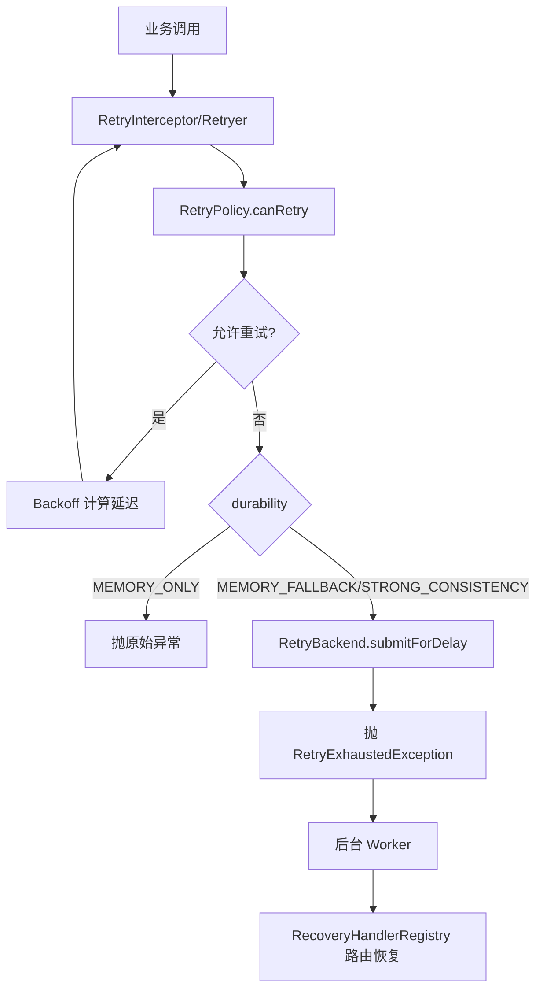

[返回总目录](../README.md)

# 重试模块

[](https://openjdk.java.net/)
[](https://opensource.org/licenses/MIT)

## 目录

- [简介](#简介)
- [快速入门](#快速入门)
- [核心特性](#核心特性)
- [编程式重试](#编程式重试)
- [注解式重试（结合 team4u-proxy）](#注解式重试结合-team4u-proxy)
- [动态策略与配置中心](#动态策略与配置中心)
- [持久化降级与恢复机制](#持久化降级与恢复机制)
- [架构与原理](#架构与原理)

---

## 简介

`team4u-retry` 是 Team4u Framework 的统一重试治理模块，提供：

1. **同步重试**：对 `Callable` 任务进行阻塞式重试。
2. **异步重试**：基于 `CompletableFuture` + `ScheduledExecutorService` 的非阻塞重试。
3. **注解重试**：通过 `@Retryable` + `team4u-proxy` 动态代理实现无侵入重试。
4. **动态策略**：通过配置中心热更新 `retry.policy.*` 策略。
5. **持久化降级**：内存重试耗尽后可降级到后端队列，支持恢复执行。

模块同时支持异常白名单/黑名单、多种退避算法、Criterion 表达式条件重试和异常解包（代理/异步包装异常自动剥离）。

### 核心优势

- **统一执行引擎**：`Retryer` 同时覆盖同步/异步调用模型。
- **策略驱动**：`RetryPolicy` 不可变，线程安全，易复用。
- **动态可调**：支持配置中心热更新重试参数，不必重启服务。
- **可靠性分级**：按业务重要性选择 `MEMORY_ONLY` / `MEMORY_FALLBACK` / `STRONG_CONSISTENCY`。
- **低侵入集成**：可直接编程式调用，也可注解接入代理链。

---

## 快速入门

### 引入依赖

```xml
<dependency>
    <groupId>com.team4u</groupId>
    <artifactId>team4u-retry</artifactId>
    <version>1.0.0-SNAPSHOT</version>
</dependency>
```

### 最小可用示例

```java
import com.team4u.framework.retry.RetryPolicy;
import com.team4u.framework.retry.Retryer;
import com.team4u.framework.retry.backoff.Backoff;

RetryPolicy policy = RetryPolicy.builder()
        .totalAttempts(3)
        .backoff(Backoff.fixed(200))
        .build();

Retryer retryer = Retryer.with(policy);

String result = retryer.execute(() -> {
    // 调用可能失败的下游
    return "ok";
});
```

---

## 核心特性

### 1) 可组合策略模型（RetryPolicy）

`RetryPolicy` 支持以下维度：

- `totalAttempts(int)`：全局总尝试次数（内存 + 后端总和，包含首次调用）。
- `inMemoryAttempts(int)`：前台内存尝试预算（可选，高级参数）。
- `infiniteAttempts()`：无限重试（`totalAttempts=-1`）。
- `backoff(Backoff)`：延迟计算策略。
- `retryOn(...)`：仅匹配这些异常及其子类时才重试。
- `abortOn(...)`：匹配这些异常及其子类时立刻终止重试。
- `condition(String)`：使用 `team4u-criterion` 表达式进行高阶过滤。

### 2) 多种退避算法（Backoff）

- `Backoff.fixed(delay)`：固定间隔。
- `Backoff.increment(initial, step)`：线性递增。
- `Backoff.exponential(initial, multiplier, maxDelay)`：指数退避（带上限）。
- `Backoff.exponentialJitter(initial, multiplier, maxDelay)`：指数 + 全抖动，打散惊群。

### 3) 异常解包与一致行为

`RetryExceptionUtil.unwrap(...)` 会自动剥离常见包装异常：

- `CompletionException`
- `ExecutionException`
- `InvocationTargetException`
- `UndeclaredThrowableException`

确保策略判断总是基于“真实根因异常”。

---

## 编程式重试

### 1) 同步重试

```java
RetryPolicy policy = RetryPolicy.builder()
        .totalAttempts(3)
        .backoff(Backoff.exponential(100, 2.0, 2000))
        .retryOn(java.io.IOException.class)
        .abortOn(IllegalArgumentException.class)
        .condition("attempt <= 2 && message contains 'timeout'")
        .build();

Retryer retryer = Retryer.with(policy);

String data = retryer.execute(() -> remoteCall());
```

### 2) 非阻塞异步重试

```java
ScheduledExecutorService scheduler = Executors.newScheduledThreadPool(2);

RetryPolicy policy = RetryPolicy.builder()
        .totalAttempts(3)
        .backoff(Backoff.fixed(100))
        .build();

Retryer retryer = Retryer.with(policy);

CompletableFuture<String> future = retryer.executeAsync(
        "order.query",              // taskType
        "{\"orderId\":\"A1001\"}", // payload
        () -> asyncRemoteCall(),     // Supplier<CompletableFuture<T>>
        scheduler
);
```

---

## 注解式重试（结合 team4u-proxy）

`@Retryable` 作用于方法层，`value` 为策略 key（默认 `default`），`durability` 为可靠性级别。

```java
import com.team4u.framework.retry.proxy.Retryable;

public interface PayService {

    @Retryable(value = "pay-notify", durability = RetryDurability.MEMORY_FALLBACK)
    String notifyPay(String orderId);
}
```

接入拦截器：

```java
PayService proxy = ProxyBuilder.forClass(PayService.class)
        .withDelegate(new PayServiceImpl())
        .addInterceptor(new RetryInterceptor(retryBackend))
        .build();
```

### 策略来源优先级

`RetryInterceptor` 获取策略顺序：

1. `DynamicRetryPolicyRegistry`（配置中心动态策略）
2. `RetryPolicyRegistry.global()`（本地静态注册策略）

---

## 动态策略与配置中心

动态策略固定前缀：`retry.policy.`
例如策略 ID 为 `pay-notify`，配置键为：`retry.policy.pay-notify`

### 配置结构（JSON）

```json
{
  "totalAttempts": 5,
  "inMemoryAttempts": 2,
  "backoffType": "exponentialJitter",
  "initialDelay": 200,
  "multiplier": 2.0,
  "maxDelay": 5000,
  "retryOnExceptions": ["java.io.IOException"],
  "abortOnExceptions": ["java.lang.IllegalArgumentException"],
  "condition": "attempt <= 3 && message contains 'timeout'"
}
```

### 字段说明

| 字段 | 说明 |
| :--- | :--- |
| `totalAttempts` | 全局总尝试次数（内存 + 后端总和，含首次） |
| `inMemoryAttempts` | 前台内存尝试次数预算（可选，不填自动推导） |
| `backoffType` | `fixed` / `increment` / `exponential` / `exponentialJitter` |
| `initialDelay` | 初始延迟（毫秒） |
| `multiplier` | 递增步长（increment）或倍率（exponential） |
| `maxDelay` | 最大延迟（毫秒） |
| `retryOnExceptions` | 允许重试异常类名列表 |
| `abortOnExceptions` | 终止重试异常类名列表 |
| `condition` | Criterion 条件表达式 |

---

## 持久化降级与恢复机制

### 1) 可靠性级别（RetryDurability）

- `MEMORY_ONLY`：仅内存重试，性能最高，宕机可能丢任务。
- `MEMORY_FALLBACK`：前台内存预算耗尽且仍有全局剩余额度时，提交后端延迟队列。
- `STRONG_CONSISTENCY`：执行前先写入重试意图（WAL），成功后再完成清理，避免任务丢失。

### 次数语义（重点）

- 默认只需配置 `totalAttempts`，表示**全局总次数上限**。
- `inMemoryAttempts` 为高级可选参数；不配置时自动推导：
  - `MEMORY_ONLY`：`inMemoryAttempts = totalAttempts`
  - `MEMORY_FALLBACK/STRONG_CONSISTENCY`：`inMemoryAttempts = min(2, totalAttempts)`
- 无论 durability 如何选择，**总尝试次数不会超过 `totalAttempts`**。

### 2) 后端能力接口（RetryBackend）

如需持久化降级，需要实现：

- `saveIntent(taskType, payload)`：预写意图。
- `completeIntent(intentId)`：成功后完成/清理。
- `submitForDelay(intentId, taskType, payload, delay)`：提交延迟重试。

当内存重试耗尽且启用持久化时，框架会抛出 `RetryExhaustedException`，表示任务已转入后台系统接管。

### 3) 恢复执行（RecoveryHandler）

后台 Worker 拉取到任务后，可通过 `RecoveryHandlerRegistry.global()` 按 `taskType` 路由恢复处理器：

```java
RecoveryHandlerRegistry.global().register(new RecoveryHandler() {
    @Override
    public String key() {
        return "pay-notify";
    }

    @Override
    public void recover(String payload) throws Exception {
        // 反序列化 payload 并恢复业务调用
    }
});
```

---

## 架构与原理

### 核心执行流程

1. 业务发起调用（编程式或 `@Retryable` 代理调用）。
2. 选择策略：动态策略优先，静态策略兜底。
3. `Retryer` 执行重试循环：
   - 失败后异常解包。
   - 按 `canRetry` 判定（次数/异常/表达式）。
   - 计算 `Backoff` 延迟并进入下一次尝试。
4. 若重试耗尽：
   - `MEMORY_ONLY`：直接抛原始异常。
   - `MEMORY_FALLBACK` / `STRONG_CONSISTENCY`：提交 `RetryBackend` 并抛 `RetryExhaustedException`。
5. 后台系统按 `taskType` 分发 `RecoveryHandler` 进行恢复。

### 时序图


