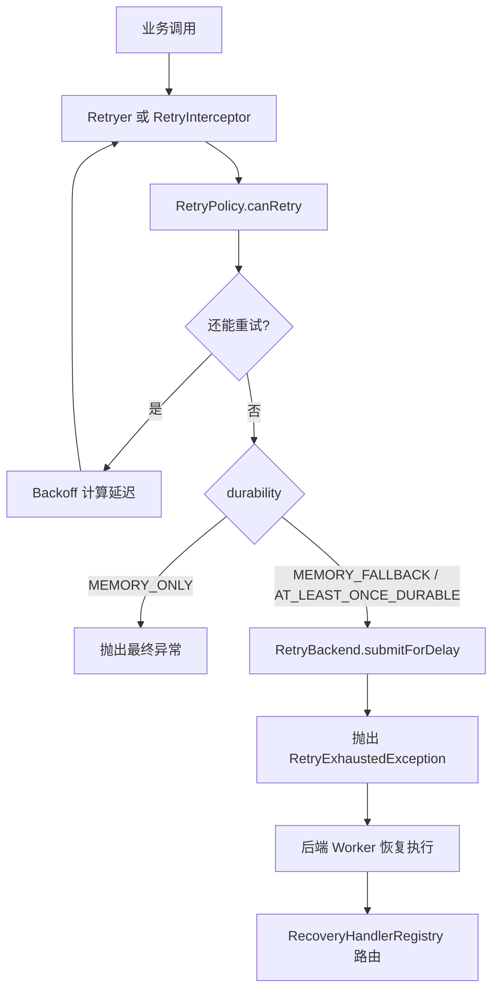

# [返回总目录](../README.md)

# team4u-retry

[](https://openjdk.org/)
[](https://opensource.org/licenses/MIT)

`team4u-retry` 是 Team4u Framework 的统一重试模块，提供：

- 同步重试：阻塞式执行 `Callable`
- 异步重试：基于 `CompletableFuture + ScheduledExecutorService`
- 注解式重试：通过 `@Retryable` 接入
- Spring 自动代理：通过 `@EnableRetry` 自动织入
- 持久化降级：内存重试耗尽后移交后端队列
- 动态策略：支持从配置中心动态加载 `retry.policy.*`

如果你只想尽快上手，先看“快速开始”和“怎么选接入方式”。

## 目录

- [怎么选接入方式](#怎么选接入方式)
- [快速开始](#快速开始)
- [核心概念](#核心概念)
- [编程式重试](#编程式重试)
- [注解式重试](#注解式重试)
- [Spring 自动代理](#spring-自动代理)
- [持久化降级与恢复](#持久化降级与恢复)
- [动态策略与配置中心](#动态策略与配置中心)
- [完整示例：使用内置 Backend + Worker](#完整示例使用内置-backend--worker)
- [完整示例：Spring Boot 接入](#完整示例spring-boot-接入)
- [关键边界与注意事项](#关键边界与注意事项)
- [实现结构](#实现结构)

---

## 怎么选接入方式

| 场景 | 推荐方式 | 特点 |
| --- | --- | --- |
| 你在普通 Java 代码里重试一段逻辑 | `Retryer.execute(Callable)` | 最简单，适合纯内存重试 |
| 你希望失败后可移交后端继续重试 | `Retryer.execute(taskType, payloadBuilder, task)` | 支持持久化降级 |
| 你的业务本身是异步调用 | `Retryer.executeAsync(...)` | 非阻塞，不占用当前线程 sleep |
| 你想零侵入地给服务方法加重试 | `@Retryable` + `RetryProxyFactory` | 不依赖 Spring |
| 你在 Spring 项目里 | `@EnableRetry` + `@Retryable` | 自动代理，接入成本最低 |

### 一句话决策

- 只需要本地重试：用 `Retryer.with(policy).execute(...)`
- 需要“内存失败后移交到后端队列”：用 `Retryer.builder()` 并配置 `RetryBackend`
- 已经在 Spring 里：优先用 `@EnableRetry`

---

## 快速开始

### 依赖

```xml
<dependency>
    <groupId>com.team4u</groupId>
    <artifactId>team4u-retry</artifactId>
    <version>1.0.0-SNAPSHOT</version>
</dependency>
```

### 最小示例：同步重试

```java
import com.team4u.framework.retry.RetryPolicy;
import com.team4u.framework.retry.Retryer;
import com.team4u.framework.retry.backoff.Backoff;

RetryPolicy policy = RetryPolicy.builder()
        .maxAttempts(3)
        .backoff(Backoff.fixed(200))
        .build();

Retryer retryer = Retryer.with(policy);

String result = retryer.execute(() -> {
    // 调用可能失败的下游服务
    return "ok";
});
```

### 最小示例：异步重试

```java
import com.team4u.framework.retry.RetryPolicy;
import com.team4u.framework.retry.Retryer;
import com.team4u.framework.retry.backoff.Backoff;

import java.util.concurrent.CompletableFuture;
import java.util.concurrent.Executors;
import java.util.concurrent.ScheduledExecutorService;

ScheduledExecutorService scheduler = Executors.newScheduledThreadPool(2);

RetryPolicy policy = RetryPolicy.builder()
        .maxAttempts(3)
        .backoff(Backoff.fixed(100))
        .build();

Retryer retryer = Retryer.with(policy);

CompletableFuture<String> future = retryer.executeAsync(
        this::asyncRemoteCall,
        scheduler
);
```

说明：

- 这个写法在 `Retryer.with(policy)` 下仍然是 `MEMORY_ONLY`
- 纯内存异步重试不需要 `taskType` 和 `payloadBuilder`
- 只有当你需要失败后移交后端继续恢复时，才需要使用带 `taskType/payloadBuilder` 的那个 `executeAsync(...)` 重载

### 最小示例：注解式重试

```java
public interface PayService {
    @Retryable(policy = "pay-notify")
    String notifyPay(String orderId);
}
```

---

## 核心概念

### 1. `RetryPolicy`

`RetryPolicy` 是不可变对象，用来定义“是否继续重试”和“下一次等多久”。

常用配置：

- `maxAttempts(int)`：总尝试次数，包含第一次调用
- `inMemoryAttempts(int)`：仅控制内存阶段的尝试次数
- `infiniteAttempts()`：无限重试，等价于 `maxAttempts = -1`
- `backoff(Backoff)`：退避策略
- `retryOn(...)`：只对这些异常重试
- `abortOn(...)`：命中这些异常立即停止
- `condition(String)`：基于 Criterion 表达式做更细粒度控制

示例：

```java
RetryPolicy policy = RetryPolicy.builder()
        .maxAttempts(5)
        .retryOn(java.io.IOException.class)
        .abortOn(IllegalArgumentException.class)
        .backoff(Backoff.exponentialJitter(100, 2.0, 3000))
        .condition("message contains 'timeout'")
        .build();
```

### 2. `Backoff`

内置退避算法：

- `Backoff.fixed(delay)`：固定间隔
- `Backoff.increment(initial, step)`：线性递增
- `Backoff.exponential(initial, multiplier, maxDelay)`：指数退避
- `Backoff.exponentialJitter(initial, multiplier, maxDelay)`：指数退避 + 抖动

如果你面对高并发失败风暴，优先考虑 `exponentialJitter`，它能减少瞬时重试扎堆。

### 3. 异常解包

框架会自动解包常见包装异常，再做重试判断，包括：

- `CompletionException`
- `ExecutionException`
- `InvocationTargetException`
- `UndeclaredThrowableException`

这意味着你在异步调用、代理调用下配置 `retryOn(...)` 时，通常仍然能命中真正的业务异常。

---

## 编程式重试

### 同步内存重试

适合简单、快速、纯内存场景。

```java
Retryer retryer = Retryer.with(policy);

String result = retryer.execute(() -> doBusiness());
```

注意：

- 该入口只支持 `MEMORY_ONLY`
- 如果你配置了持久化级别，不要调用这个重载

### 支持后端降级的同步重试

```java
Retryer retryer = Retryer.builder()
        .policy(policy)
        .backend(retryBackend)
        .durability(RetryDurability.MEMORY_FALLBACK)
        .build();

String result = retryer.execute(
        "pay-notify",
        context -> "{\"orderId\":\"A1001\"}",
        this::doBusiness
);
```

这里的三个参数可以这样理解：

- `taskType`：告诉后端“这是什么任务”
- `payloadBuilder`：告诉后端“恢复这个任务需要什么快照数据”
- `task`：当前进程里此刻真正要执行的业务逻辑

所以 `payloadBuilder` 不是“业务方法入参构造器”，而是“任务恢复快照构造器”。
比如支付通知失败后要交给后端继续重试，`payload` 至少要能让后端知道是哪一个订单：

```java
context -> "{\"orderId\":\"A1001\"}"
```

如果没有这份 `payload`，后端最多只知道“有个 `pay-notify` 任务失败了”，但不知道该恢复哪一单，也就无法继续执行。

其中 `context` 提供显式语义：

- `context.getPhase()`：当前是 `PREPARE_INTENT` 还是 `HANDOFF_TO_BACKEND`
- `context.getExecutedAttempts()`：预写阶段固定为 `0`，降级入队阶段表示已执行过的尝试次数

当内存重试耗尽但策略仍允许继续重试时：

- 框架会调用 `RetryBackend.submitForDelay(...)`
- 当前线程会收到 `RetryExhaustedException`
- 这个异常不表示任务彻底失败，而是表示任务已移交后端系统接管

### 非阻塞异步重试

```java
CompletableFuture<String> future = retryer.executeAsync(
        "pay-notify",
        context -> "{\"orderId\":\"A1001\"}",
        this::asyncRemoteCall,
        scheduler
);
```

大多数场景下你不需要区分 `context.getPhase()`，直接返回同一份 payload 即可：

```java
context -> "{\"orderId\":\"A1001\"}"
```

只有当“预写 intent 的快照”和“真正入队给后端恢复的快照”需要不同内容时，才建议按 phase 分支：

```java
context -> {
    if (context.getPhase() == RetryPayloadContext.Phase.PREPARE_INTENT) {
        return "{\"orderId\":\"A1001\",\"stage\":\"intent\"}";
    }
    return "{\"orderId\":\"A1001\",\"stage\":\"handoff\",\"executedAttempts\":"
            + context.getExecutedAttempts() + "}";
}
```

特点：

- 不阻塞当前线程
- 通过 `ScheduledExecutorService` 延迟下一次尝试
- 调度器关闭等极端情况下，`future` 仍会正常异常完成，不会悬挂

---

## 注解式重试

### 基础用法

```java
public interface PayService {
    @Retryable(policy = "pay-notify", durability = RetryDurability.MEMORY_FALLBACK)
    String notifyPay(String orderId);
}
```

然后通过代理工厂接入：

```java
PayService proxy = RetryProxyFactory.createProxy(new PayServiceImpl(), retryBackend);
```

### `@Retryable` 参数说明

- `policy`：策略名，默认是 `default`
- `taskType`：任务类型，供后端恢复时路由
- `durability`：可靠性级别，默认 `MEMORY_ONLY`

关于 `taskType`，还需要补充一个注解模式下的默认约定：

- 如果 `@Retryable(taskType = "...")` 显式声明了 `taskType`，始终优先使用显式值
- 如果 `taskType` 为空且 `durability != MEMORY_ONLY`，框架会自动落到默认 Proxy 恢复任务类型 `RetryTaskTypes.DEFAULT_PROXY_RECOVERY`
- 如果 `durability == MEMORY_ONLY`，不会进入后端恢复链路，因此也不会使用默认恢复任务类型

这个默认 key 是框架保留值，适合配合通用快照恢复器使用；业务侧如果需要自定义路由，仍建议显式声明自己的 `taskType`。

当 `durability != MEMORY_ONLY` 时，注解式接入不会直接把“原始方法调用现场”丢给后端，而是会先把方法信息和参数快照序列化成一份 `RetryTaskSnapshot`，再交给 `RetryBackend`。这意味着：

- `taskType` 决定后端如何路由任务
- `payload` 不一定是你手写的业务 JSON；在注解场景下，它通常是一份框架生成的快照
- 如果你希望后端 Worker 能自动恢复执行，就需要约定好它如何识别并消费这份快照
- 快照里除了参数 JSON，还会包含 `beanName`、`methodName`、`argTypes`、`taskId`、`createdAt`、`executedAttempts`、`maxAttempts` 等恢复所需元数据

换句话说，编程式接入更适合“我自己定义 payload 结构”；注解式接入更适合“我接受框架托管方法调用快照”。

### 注解快照的生成时机

这次版本里，注解式持久化快照的构建语义更明确了：

- `MEMORY_ONLY`：不会序列化方法参数，也不会构建快照
- `MEMORY_FALLBACK`：只有当前进程内的内存重试耗尽、真正要移交后端时，才会延迟构建一次快照
- `AT_LEAST_ONCE_DURABLE`：会在执行前就冻结一份快照，用于 `saveIntent(...)`

这样做的目的，是避免 `MEMORY_FALLBACK` 在本地就能成功时产生不必要的序列化开销，同时保证 `AT_LEAST_ONCE_DURABLE` 模式下“先记账、后执行”的语义成立。

### 注解快照的冻结语义

一旦框架构建出 `RetryTaskSnapshot`，其中用于恢复的关键内容会保持稳定：

- 参数值会按构建快照时的状态被冻结，不会受到业务方法后续修改入参对象的影响
- 同一个业务意图在整个重试生命周期内会复用同一个 `taskId`
- 同一份快照在预写 intent 和后续移交后端时会保持一致的 `createdAt`

这意味着后端看到的是一份稳定的恢复材料，而不是被运行时继续修改过的调用现场。

### 什么时候需要提供 `RetryBackend`

当 `durability != MEMORY_ONLY` 时，必须提供 `RetryBackend`。否则会抛出 `IllegalStateException`。

### 参数序列化约束

只要涉及后端降级，参数就必须能够被序列化为 payload。默认实现使用 JSON 序列化方法参数，因此第一次接入时建议优先关注这几类对象：

- Web 请求对象、流、线程上下文、本地连接等不可安全重建的参数
- 过大对象或带循环引用的对象
- 恢复阶段并不需要的辅助参数

对于第三类参数，可以使用 `@RetryIgnore` 显式跳过序列化；但要注意，凡是被忽略的参数，后端恢复时就不应该再依赖它。

---

## Spring 自动代理

如果你在 Spring 环境中，推荐使用这个方式，接入最轻。

### 开启功能

```java
@Configuration
@EnableRetry
public class RetryConfig {
}
```

### 注册策略

框架会根据 `policy` 名称查找对应策略。你可以通过 `RetryPolicyRegistry` 注册：

```java
RetryPolicyRegistry.global().register(new NamedRetryPolicy() {
    @Override
    public String key() {
        return "pay-policy";
    }

    @Override
    public RetryPolicy getPolicy() {
        return RetryPolicy.builder()
                .maxAttempts(3)
                .backoff(Backoff.fixed(100))
                .build();
    }
});
```

如果同一个 `policy` 同时存在“静态注册”和“动态配置”，运行期会优先使用动态配置中心中的最新值；静态注册更适合作为默认值或本地开发兜底。

### 在 Bean 上使用

```java
@Service
public class PayServiceImpl {

    @Retryable(policy = "pay-policy")
    public String notifyPay(String orderId) {
        return "ok_" + orderId;
    }
}
```

### 代理模式说明

该模块遵循标准 Spring AOP 行为：

- 有接口时，通常可走 JDK 动态代理
- 无接口时，通常需要 CGLIB
- 在 Spring Boot 2.x+ 中，一般默认就是 CGLIB

因此也应按标准 Spring AOP 边界来理解它：

- 同一个 Bean 内部的自调用通常不会经过代理，因此不会触发重试
- `final` 类 / `final` 方法不适合依赖类代理增强
- 如果你同时使用 `@Transactional`、日志、监控等其他 Advisor，最终生效顺序仍取决于 Spring AOP 的代理链顺序

如果你的业务要求“自调用也能触发重试”，建议把待重试逻辑拆到独立 Bean，或者改用编程式接入。

### 默认恢复处理器注册

对于注解式持久化降级，框架提供了一套默认 Proxy 恢复链路：

- Spring 场景下，开启 `@EnableRetry` 后，默认恢复处理器会自动注册
- 非 Spring Proxy 场景下，可以显式调用 `RetryProxyFactory.registerDefaultRecoveryHandler()`
- 也可以直接调用 `RecoveryHandlerRegistry.ensureDefaultProxyRecoveryHandlerRegistered()`

示例：

```java
RetryProxyFactory.registerDefaultRecoveryHandler();
```

如果你在非 Spring Boot 环境里需要强制类代理，可以显式开启：

```java
@Configuration
@EnableRetry
@EnableAspectJAutoProxy(proxyTargetClass = true)
public class RetryConfig {
}
```

---

## 持久化降级与恢复

### 可靠性级别

`RetryDurability` 提供三种模式：

- `MEMORY_ONLY`：只在当前进程内重试，最快，但不抗宕机
- `MEMORY_FALLBACK`：先内存重试，耗尽后移交后端
- `AT_LEAST_ONCE_DURABLE`：执行前先写 intent，保证至少一次持久化

这里的“至少一次”强调的是“任务意图至少被可靠记录一次”，不是“业务只会被执行一次”。如果业务成功返回后，异步清理 intent 失败，后端仍有可能再次看到该任务并尝试恢复，所以业务补偿逻辑必须天然支持幂等。

这里有三个容易混淆的概念，可以先区分开：

- `payload`：恢复这次任务所需要的快照数据
- `intent`：这次任务已经被系统正式记录和托管过的一条意图记录
- `intentId`：这条意图记录的唯一标识

可以把它理解成：

- `payload` 回答“后端要拿什么数据来恢复这次任务”
- `intent` 回答“系统是否已经正式记下这次任务，并开始对它负责”

所以，`payload` 更像恢复材料，`intent` 更像任务台账，`intentId` 则是该意图记录的唯一标识。

### `RetryBackend` 职责

你需要实现 `RetryBackend` 来承接后端持久化与调度：

```java
public interface RetryBackend {
    String saveIntent(String taskType, String payload);
    void completeIntent(String intentId);
    void markTerminalFailure(String intentId, Throwable cause);
    void submitForDelay(String intentId, String taskType, String payload, long delay);
}
```

框架也提供了两套最小可用实现，适合快速验证完整链路：

- `InMemoryRetryBackend`：单进程内存版，适合单测、本地开发、demo
- `LocalFileRetryBackend`：单机文件版，默认可落到 `backend-retry.txt`

如果你希望直接用框架内置 Worker 消费它们，还可以配合：

- `WorkerReadableRetryBackend`：在 `RetryBackend` 之上补充阻塞式 `take()`
- `RetryWorker`：按 `taskType` 路由到 `RecoveryHandler`

语义上可以理解为：

- `saveIntent(...)`：预写日志 / 记录执行意图
- `completeIntent(...)`：任务成功后清理 intent
- `markTerminalFailure(...)`：彻底失败，标记为终态
- `submitForDelay(...)`：把任务送入延迟队列

此外，第一次实现 `RetryBackend` 时，通常还要明确这几个约束：

- `delay` 是“从现在开始再延迟多久”，不是绝对执行时间
- `submitForDelay(...)` 收到的 payload 应被视为一次可独立恢复的任务快照，后端应原样保存
- 如果后端 Worker 恢复失败，后续如何重试、死信、告警，由你的后端系统负责，不由当前进程继续托管
- `intentId` 最好是稳定可追踪的主键，而不是只适用于 demo 的临时值

### 恢复执行

后端 Worker 取出任务后，按 `taskType` 路由到对应的恢复器：

```java
RecoveryHandlerRegistry.global().register(new RecoveryHandler() {
    @Override
    public String key() {
        return "pay-notify";
    }

    @Override
    public void recover(String payload) {
        // 从 payload 还原业务参数并继续执行
    }
});
```

这里有两个常见接入模型：

- 编程式接入：`payload` 是你自己定义的业务快照，`RecoveryHandler` 负责反序列化并补偿执行
- 注解式接入：`payload` 往往是框架生成的方法调用快照，后端可以选择自己解析，也可以直接使用框架提供的通用恢复器 `SnapshotRecoveryHandler`

无论采用哪种模型，Worker 都应把“恢复失败后的再次重试 / 死信 / 告警”纳入自己的责任范围，而不是假定框架会在进程外继续自动兜底。

### 通用快照恢复器：`SnapshotRecoveryHandler`

如果你的后端消费的是注解式接入生成的 `RetryTaskSnapshot`，可以直接注册通用恢复器，而不必每个任务类型都手写一套反序列化逻辑：

```java
RecoveryHandlerRegistry.global().register(new SnapshotRecoveryHandler("pay-notify"));
```

对于默认 Proxy 恢复链路，框架还保留了一个默认任务类型：

```java
RetryTaskTypes.DEFAULT_PROXY_RECOVERY
// team4u.retry.proxy.default-recovery
```

规则如下：

- 如果 `@Retryable(taskType = "...")` 显式声明了 `taskType`，仍然优先使用显式值
- 如果 `taskType` 为空且 `durability != MEMORY_ONLY`，框架自动使用 `DEFAULT_PROXY_RECOVERY`
- 如果 `durability == MEMORY_ONLY`，不会走后端恢复，仍保持本地语义

它的恢复流程可以概括为：

1. 反序列化 `RetryTaskSnapshot`
2. 根据 `beanName` 从 `BeanManager` 查找 Bean（查不到时再尝试按类名解析）
3. 根据 `methodName + argTypes` 反射定位目标方法
4. 按 `argJsonValues` 恢复参数
5. 调用目标方法执行业务恢复

对简单类型（如 `String`、基本类型及其包装类），框架会做直接转换；对复杂对象，则按 JSON 反序列化恢复。

其中 Bean 的解析顺序可以理解为：

1. `BeanManager.getBean(String)`
2. 如果 `beanName` 像类名，再尝试 `Class.forName(beanName)`
3. `BeanManager.getBean(Class)`

因此，注解模式下默认快照中的 `beanName` 需要能被 `BeanManager` 解析到。

### Worker 如何调用恢复器

后端消费任务时，通常只需要按 `taskType` 找到对应的 `RecoveryHandler`，然后把 `payload` 交给它：

```java
public class RetryRecoveryWorker {

    public void handle(String taskType, String payload) throws Exception {
        RecoveryHandler handler = RecoveryHandlerRegistry.global()
                .get(taskType)
                .orElseThrow(() -> new IllegalStateException("RecoveryHandler not found. taskType=" + taskType));

        handler.recover(payload);
    }
}
```

如果你走的是默认 Proxy 快照恢复链路，那么 Worker 本身通常不需要知道目标方法签名，只需要正确路由 `taskType + payload` 即可。

如果你直接使用框架内置 Worker，调用方式就是：

```java
import com.team4u.framework.retry.worker.InMemoryRetryBackend;
import com.team4u.framework.retry.worker.RetryWorker;

InMemoryRetryBackend backend = new InMemoryRetryBackend();
RetryWorker worker = new RetryWorker(backend);
worker.start("retry-worker");
```

### 恢复阶段为什么不会再次进入重试代理

`SnapshotRecoveryHandler` 在执行恢复逻辑时，会通过 `RecoveryExecutionContext` 为当前线程打上“恢复中”标记。代理层发现当前线程处于恢复态后，会直接执行目标方法，而不会再次进入整条重试链路。

这样做是为了避免后端 Worker 恢复任务时再次触发：

- 重复 `saveIntent(...)`
- 再次 `submitForDelay(...)`
- 恢复执行再次进入代理链

因此，后端恢复调用可以被理解为“拿着已保存好的快照直接补偿执行”，而不是“重新从调用侧入口完整走一遍重试托管流程”。

### `MEMORY_FALLBACK` 的次数语义

设：

- `T = maxAttempts`，总尝试次数，包含第一次
- `M = inMemoryAttempts`，内存阶段尝试次数，包含第一次

则：

- 当前进程内最多执行 `M` 次
- 只有 `M < T`，或者 `T == -1` 时，才会降级到后端
- 有限重试场景下，后端剩余次数为 `T - M`

默认值：

- `MEMORY_ONLY`：默认全部在内存中完成
- `MEMORY_FALLBACK` / `AT_LEAST_ONCE_DURABLE`：如果未显式配置 `inMemoryAttempts`，默认当前进程内尝试 2 次

---

## 动态策略与配置中心

`DynamicRetryPolicyRegistry` 会监听前缀为 `retry.policy.` 的配置项，并在运行期返回最新策略。

示意：

```properties
retry.policy.pay-notify={"maxAttempts":5,"backoffType":"exponentialJitter"}
```

一个更完整的示意：

```properties
retry.policy.pay-notify={
  "maxAttempts": 5,
  "inMemoryAttempts": 2,
  "backoffType": "exponentialJitter",
  "initialDelay": 200,
  "multiplier": 2.0,
  "maxDelay": 5000
}
```

使用：

```java
RetryPolicy policy = DynamicRetryPolicyRegistry.getPolicy("pay-notify");
```

约定上需要注意：

- key 不带前缀，调用时传 `pay-notify`，底层会查找 `retry.policy.pay-notify`
- 动态策略查不到时，注解式接入会回退到 `RetryPolicyRegistry` 中的静态注册
- 动态配置更适合做线上调参；静态注册更适合提供默认策略和本地兜底
- 如果配置内容非法，应在接入配置中心时尽早校验，避免把错误配置带到运行期

适合：

- 不改代码动态调节重试次数
- 针对不同任务类型配置不同策略
- 线上快速收敛重试风暴

---

## 完整示例：使用内置 Backend + Worker

下面这个例子使用框架内置的 `InMemoryRetryBackend + RetryWorker`，是最小可运行方案。生产环境仍然可以按你的存储和调度系统自定义 `RetryBackend`。

### 对应的恢复器

```java
import com.team4u.framework.retry.recovery.RecoveryHandler;

public class PayNotifyRecoveryHandler implements RecoveryHandler {
    @Override
    public String key() {
        return "pay-notify";
    }

    @Override
    public void recover(String payload) {
        // 这里通常要做两件事：
        // 1. 反序列化 payload
        // 2. 调用真正的业务补偿逻辑
        System.out.println("recover payload = " + payload);
    }
}
```

### 怎么把它串起来

```java
import com.team4u.framework.retry.RetryDurability;
import com.team4u.framework.retry.RetryPolicy;
import com.team4u.framework.retry.Retryer;
import com.team4u.framework.retry.backoff.Backoff;
import com.team4u.framework.retry.recovery.RecoveryHandlerRegistry;
import com.team4u.framework.retry.worker.InMemoryRetryBackend;
import com.team4u.framework.retry.worker.RetryWorker;

InMemoryRetryBackend backend = new InMemoryRetryBackend();

RecoveryHandlerRegistry.global().register(new PayNotifyRecoveryHandler());

RetryWorker worker = new RetryWorker(backend);
worker.start("retry-worker");

RetryPolicy policy = RetryPolicy.builder()
        .maxAttempts(5)
        .inMemoryAttempts(2)
        .backoff(Backoff.exponentialJitter(200, 2.0, 5000))
        .build();

Retryer retryer = Retryer.builder()
        .policy(policy)
        .backend(backend)
        .durability(RetryDurability.MEMORY_FALLBACK)
        .build();

retryer.execute(
        "pay-notify",
        context -> "{\"orderId\":\"A1001\"}",
        () -> {
            throw new RuntimeException("downstream timeout");
        }
);
```

如果你希望在本地验证“进程重启后仍能恢复”，可以切换到文件版 backend：

```java
import java.nio.file.Paths;
import com.team4u.framework.retry.worker.LocalFileRetryBackend;
import com.team4u.framework.retry.worker.RetryWorker;

LocalFileRetryBackend backend = new LocalFileRetryBackend(Paths.get("backend-retry.txt"));
RetryWorker worker = new RetryWorker(backend);
worker.start("file-retry-worker");
```

### 生产实现建议

- `intentId` 不要用临时值，建议用业务幂等键或稳定哈希
- `payload` 要有明确版本号，避免后续字段变更导致恢复失败
- `submitForDelay(...)` 最好接消息队列或延迟队列，而不是只放内存；内置 `InMemoryRetryBackend` / `LocalFileRetryBackend` 更适合测试、开发和演示场景
- `markTerminalFailure(...)` 建议落库并进入死信/告警链路
- Worker 执行恢复逻辑时，业务本身要具备幂等性
- 如果你使用注解式快照恢复，建议把 `beanName + methodName + argTypes` 视为恢复协议的一部分，避免随意改签名导致旧任务无法恢复

---

## 完整示例：Spring Boot 接入

下面是一个接近真实项目的接入方式，目标是让一个 `@Retryable` 方法在 Spring 中自动生效。

### 1. 注册策略

```java
import com.team4u.framework.retry.RetryPolicy;
import com.team4u.framework.retry.backoff.Backoff;
import com.team4u.framework.retry.proxy.NamedRetryPolicy;
import com.team4u.framework.retry.proxy.RetryPolicyRegistry;
import org.springframework.context.annotation.Configuration;

import jakarta.annotation.PostConstruct;

@Configuration
public class RetryPolicyConfig {

    @PostConstruct
    public void registerPolicies() {
        RetryPolicyRegistry.global().register(new NamedRetryPolicy() {
            @Override
            public String key() {
                return "pay-policy";
            }

            @Override
            public RetryPolicy getPolicy() {
                return RetryPolicy.builder()
                        .maxAttempts(3)
                        .backoff(Backoff.fixed(200))
                        .build();
            }
        });
    }
}
```

如果你的项目是 JDK 8 / Spring 5 风格，把 `jakarta.annotation.PostConstruct` 换成 `javax.annotation.PostConstruct`。

### 2. 开启自动代理

```java
import com.team4u.framework.retry.spring.EnableRetry;
import org.springframework.context.annotation.Configuration;

@Configuration
@EnableRetry
public class RetryAutoConfiguration {
}
```

### 3. 声明业务服务

```java
import com.team4u.framework.retry.proxy.Retryable;
import org.springframework.stereotype.Service;

import java.util.concurrent.atomic.AtomicInteger;

@Service
public class PayService {

    private final AtomicInteger counter = new AtomicInteger();

    @Retryable(policy = "pay-policy")
    public String notifyPay(String orderId) {
        if (counter.incrementAndGet() < 3) {
            throw new RuntimeException("temporary failure");
        }
        return "ok_" + orderId;
    }
}
```

### 4. 调用效果

```java
import org.springframework.boot.CommandLineRunner;
import org.springframework.stereotype.Component;

@Component
public class DemoRunner implements CommandLineRunner {

    private final PayService payService;

    public DemoRunner(PayService payService) {
        this.payService = payService;
    }

    @Override
    public void run(String... args) {
        String result = payService.notifyPay("A1001");
        System.out.println(result);
    }
}
```

执行结果预期：

- 前两次抛出 `RuntimeException`
- 第三次成功返回 `ok_A1001`
- 整个重试过程由代理自动完成，业务调用方不需要自己写循环

### 如果要接入持久化降级

在 Spring 容器里额外提供一个 `RetryBackend` Bean 即可：

```java
import com.team4u.framework.retry.RetryBackend;
import com.team4u.framework.retry.worker.InMemoryRetryBackend;
import org.springframework.context.annotation.Bean;
import org.springframework.context.annotation.Configuration;

@Configuration
public class RetryBackendConfig {

    @Bean
    public RetryBackend retryBackend() {
        return new InMemoryRetryBackend();
    }
}
```

然后把业务方法改成：

```java
@Retryable(policy = "pay-policy", taskType = "pay-notify", durability = RetryDurability.MEMORY_FALLBACK)
public String notifyPay(String orderId) {
    // ...
}
```

此时还需要再配一套后端 Worker 和 `RecoveryHandler`，否则任务虽然能入队，但不会被恢复处理。

例如：

```java
import com.team4u.framework.retry.recovery.RecoveryHandlerRegistry;
import com.team4u.framework.retry.worker.InMemoryRetryBackend;
import com.team4u.framework.retry.worker.RetryWorker;
import org.springframework.context.annotation.Bean;

@Bean(initMethod = "start", destroyMethod = "shutdown")
public RetryWorker retryWorker(InMemoryRetryBackend backend) {
    RecoveryHandlerRegistry.ensureDefaultProxyRecoveryHandlerRegistered();
    return new RetryWorker(backend);
}
```

---

## 关键边界与注意事项

### 1. `maxAttempts` 包含第一次调用

这点最容易误解。

- `maxAttempts(3)` 表示总共最多执行 3 次
- 不是“失败后再重试 3 次”

### 2. `Error` 永远不会重试

无论同步还是异步，`Error` 都会直接透传。

### 3. 中断会立即终止同步重试

同步模式下遇到 `InterruptedException` 会：

- 恢复线程中断标记
- 立即抛出
- 不再继续重试

### 4. 异步清理不是强一致同步完成

在 `AT_LEAST_ONCE_DURABLE` 模式下，`completeIntent(...)` 使用异步清理执行器，不保证一定在业务返回前完成。

这意味着“业务成功”与“intent 已删除”之间存在短暂窗口。如果你的后端会扫描未清理 intent，请把恢复逻辑设计成幂等操作。

### 5. 开启持久化前先确认参数可序列化

尤其是 `AT_LEAST_ONCE_DURABLE`。如果参数无法序列化，框架无法把任务安全移交到后端。

注解式接入默认会序列化方法参数；不需要恢复的参数可以用 `@RetryIgnore` 跳过，但一旦跳过，就不能再指望恢复阶段拿到它。

另外，注解式恢复默认依赖方法签名和参数类型精确匹配：

- `argTypes` 与 `argJsonValues` 数量必须一致
- 恢复时必须还能定位到同名方法
- `beanName` 必须仍然能从 `BeanManager` 解析到目标 Bean，或能回退到可加载的类名

### 6. 后端恢复执行不会再次自动托管重试

通用快照恢复器会显式跳过代理层的重试管线，避免恢复过程重复写 intent 或重复入队。

这也意味着：

- 后端 Worker 执行的是一次“恢复调用”，不是重新走一遍完整的调用侧重试流程
- 如果恢复失败，后续是否再次重试、是否死信、是否告警，应由你的后端消费系统负责

### 7. 非 Spring 场景注意线程池关闭

模块内部会使用全局执行器。应用关闭时建议显式调用：

```java
RetryExecutorManager.global().shutdown();
```

如需 daemon 线程，可设置：

```text
-Dteam4u.retry.executors.daemon=true
```

### 8. Spring 场景仍受 AOP 代理边界约束

`@EnableRetry` 并不会改变 Spring AOP 的基本规则。自调用、`final` 方法、以及多个 Advisor 的链路顺序，都应按标准 Spring 代理模型理解和验证。

---

## 实现结构

### 主要类

- `Retryer`：统一执行入口
- `RetryPolicy`：重试策略定义
- `Backoff`：退避算法
- `RetryBackend`：持久化后端接口
- `RecoveryHandler` / `RecoveryHandlerRegistry`：恢复执行路由
- `@Retryable`：注解式接入
- `@EnableRetry`：Spring 自动代理开关

### 执行流程



---

## 给开发者的建议

- 默认从编程式接入开始，先验证策略配置和执行语义，再抽象到注解式接入
- 对 IO 异常、超时类故障用重试，对参数错误、幂等冲突这类业务异常慎用
- 高并发场景优先用指数退避加抖动，避免雪崩式重试
- 若启用持久化降级，先明确你的 `payload` 序列化协议和 Worker 恢复模型
