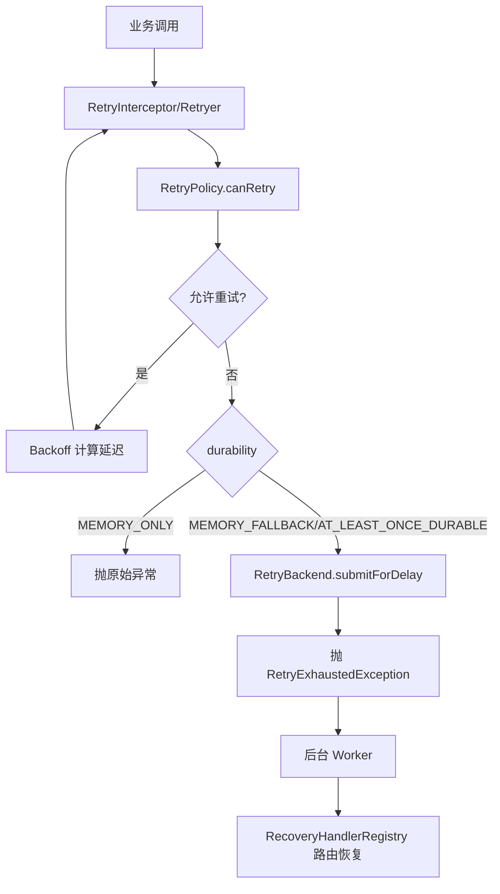

[返回总目录](../README.md)

# 重试模块

[](https://openjdk.java.net/)
[](https://opensource.org/licenses/MIT)

## 目录

- [简介](#简介)
- [快速入门](#快速入门)
- [核心语义与模型](#核心语义与模型)
- [编程式重试](#编程式重试)
- [注解式重试（结合 team4u-proxy）](#注解式重试结合-team4u-proxy)
- [动态策略与配置中心](#动态策略与配置中心)
- [持久化降级与恢复机制](#持久化降级与恢复机制)
- [关键边界与注意事项](#关键边界与注意事项)
- [架构与原理](#架构与原理)

---

## 简介

`team4u-retry` 是 Team4u Framework 的统一重试治理模块，提供：

1. **同步重试**：对 `Callable` 任务进行阻塞式重试。
2. **异步重试**：基于 `CompletableFuture + ScheduledExecutorService` 的真非阻塞重试。
3. **注解重试**：通过 `@Retryable` + `team4u-proxy` 动态代理实现无侵入接入。
4. **动态策略**：支持配置中心热更新 `retry.policy.*` 策略。
5. **持久化降级**：内存重试耗尽后可降级到后端队列，支持恢复执行。

模块支持异常白名单/黑名单、多种退避算法、Criterion 条件表达式，以及常见包装异常解包。

---

## 快速入门

### 引入依赖

```xml
<dependency>
    <groupId>com.team4u</groupId>
    <artifactId>team4u-retry</artifactId>
    <version>1.0.0-SNAPSHOT</version>
</dependency>
```

### 最小可用示例（同步）

```java
import com.team4u.framework.retry.RetryPolicy;
import com.team4u.framework.retry.Retryer;
import com.team4u.framework.retry.backoff.Backoff;

RetryPolicy policy = RetryPolicy.builder()
        .maxAttempts(3)
        .backoff(Backoff.fixed(200))
        .build();

Retryer retryer = Retryer.with(policy);

String result = retryer.execute(() -> {
    // 调用可能失败的下游
    return "ok";
});
```

### 最小可用示例（异步）

```java
import java.util.concurrent.*;

ScheduledExecutorService scheduler = Executors.newScheduledThreadPool(2);

RetryPolicy policy = RetryPolicy.builder()
        .maxAttempts(3)
        .backoff(Backoff.fixed(100))
        .build();

Retryer retryer = Retryer.with(policy);

CompletableFuture<String> future = retryer.executeAsync(
        "order.query",                       // taskType
        () -> "{\"orderId\":\"A1001\"}", // payloadSupplier
        () -> asyncRemoteCall(),              // Supplier<CompletableFuture<T>>
        scheduler
);
```

---

## 核心语义与模型

### 1) RetryPolicy（策略对象）

`RetryPolicy` 是不可变对象（线程安全），可通过 Builder 组合以下能力：

- `maxAttempts(int)`：全局总尝试次数（**包含首次调用**，内存 + 后端总和）。
- `inMemoryAttempts(int)`：前台内存尝试预算（可选高级参数）。
- `infiniteAttempts()`：无限重试（`maxAttempts = -1`）。
- `backoff(Backoff)`：延迟计算策略。
- `retryOn(...)`：仅匹配这些异常及其子类时允许重试。
- `abortOn(...)`：匹配这些异常及其子类时立刻终止重试。
- `condition(String)`：Criterion 表达式条件重试（基于 `attempt/maxAttempts/cause/message`）。

#### 判定顺序（`canRetry`）

1. 次数上限判定：`currentAttempt >= maxAttempts`（且非无限）直接不可重试。
2. 异常解包（见下文）。
3. `abortOn` 命中则不可重试。
4. 若配置了 `retryOn` 且未命中，则不可重试。
5. 若配置了 `condition`，则以表达式结果为准（内置 `message` 防空保护）。
6. 其余情况可重试。

`getDelayMillis(currentAttempt)` 的 `currentAttempt` 语义为“当前失败对应的尝试序号”。
例如第 N 次执行失败后，下一次执行前等待 `getDelayMillis(N)`。

### 2) Backoff（退避算法）

- `Backoff.fixed(delay)`：固定间隔。
- `Backoff.increment(initial, step)`：线性递增。
- `Backoff.exponential(initial, multiplier, maxDelay)`：指数退避，上限截断。
- `Backoff.exponentialJitter(initial, multiplier, maxDelay)`：指数 + 全抖动，打散惊群效应。

### 3) 异常解包语义（RetryExceptionUtil）

自动剥离以下包装异常（最大深度 10，基于 `IdentityHashMap` 物理防死循环）：

- `CompletionException` / `ExecutionException`
- `InvocationTargetException` / `UndeclaredThrowableException`

> 说明：并非所有包装异常都会被剥离。例如普通 `RuntimeException(new BizException(...))` 不在自动解包范围内。

---

## 编程式重试

### 1) 同步重试

```java
Retryer retryer = Retryer.builder()
        .policy(policy)
        .backend(retryBackend)
        .durability(RetryDurability.MEMORY_FALLBACK)
        .build();

String result = retryer.execute(
        "pay-notify",
        () -> "{\"orderId\":\"A1001\"}", // 延迟序列化 payload
        () -> doBusiness()
);
```

- 若内存重试耗尽且仍有全局额度，会调用 `RetryBackend.submitForDelay(...)`。
- 此时抛 `RetryExhaustedException`，表示任务已转入后台系统接管。

### 2) 非阻塞异步重试

```java
CompletableFuture<String> future = retryer.executeAsync(
        "pay-notify",
        () -> "{\"orderId\":\"A1001\"}",
        () -> asyncRemoteCall(),
        scheduler
);
```

- 重试调度不阻塞当前线程。内置 `RejectedExecutionException` 保护，确保在调度器关闭等极端情况下 `future` 仍能正确完成异常回调。

---

## 注解式重试（结合 team4u-proxy）

### 1) 使用方式

```java
public interface PayService {
    @Retryable(policy = "pay-notify", durability = RetryDurability.MEMORY_FALLBACK)
    String notifyPay(String orderId);
}
```

### 2) 接入拦截器

```java
PayService proxy = RetryProxyFactory.createProxy(new PayServiceImpl(), retryBackend);
```

- 拦截器内部采用全局单例 `SCHEDULER`，具备线程安全初始化和防资源泄漏设计。
- **Backend 要求**：当 `durability` 不是 `MEMORY_ONLY` 时必须提供 `RetryBackend`，否则会抛出带有方法签名和策略 key 的
  `IllegalStateException`。

### 3) Spring 自动代理 (零编程接入)

在 Spring 环境下，你可以开启自动扫描功能，系统会自动为所有标记了 `@Retryable` 的 Bean 生成代理。

#### 开启功能

```java
@Configuration
@EnableRetry // 开启重试自动代理扫描
public class RetryConfig {

    @Bean
    public RetryBackend retryBackend() {
        // 注册重试后端实现
        return new MemoryRetryBackend();
    }
}
```

#### 使用方式

```java
@Service
public class PayServiceImpl implements PayService {

    @Override
    @Retryable("pay-policy") // 直接标注注解即可，无需手动创建代理
    public String notifyPay(String orderId) {
        // ... 业务逻辑
    }
}
```

#### AOP 代理模式说明

本框架遵循 Spring 的标准 AOP 机制，不再硬编码强制使用 CGLIB。代理模式完全由您的 Spring 环境决定：

- **Spring Boot 2.x+**：默认强制使用 CGLIB 代理（`spring.aop.proxy-target-class=true`）。
- **标准 Spring 项目**：默认优先使用 JDK 动态代理（若目标类实现了接口）。

若需显式自定义代理行为（例如在非 Spring Boot 环境下强制使用 CGLIB 以支持无接口类的重试），请在您的配置类上添加如下注解：

```java
@Configuration
@EnableRetry
@EnableAspectJAutoProxy(proxyTargetClass = true) // 显式开启并强制 CGLIB
public class RetryConfig { ... }
```

- **实现原理**：通过注册标准的 `Advisor`，利用 Spring AOP 基础设施自动织入。
- **兼容性**：完美兼容 Spring 事务（`@Transactional`）等其他切面。建议通过 `@Order` 调整优先级（默认为
  `LOWEST_PRECEDENCE - 1`，通常在事务之外重试）。

---

## 持久化降级与恢复机制

### 1) 可靠性级别（RetryDurability）

- `MEMORY_ONLY`：极速，不防宕机。
- `MEMORY_FALLBACK`：内存优先，耗尽后持久化，防内存堆积。
- `AT_LEAST_ONCE_DURABLE`：执行前预写日志（WAL），成功后异步清理（`retry-cleanup-pool`），确保任务不丢失。

### 2) 后端接口与恢复

- 实现 `RetryBackend` 存储接口。
- 注册 `RecoveryHandler` 按 `taskType` 路由恢复逻辑。

### 3) MEMORY_FALLBACK 次数计算（重点）

设：

- `T = maxAttempts`（全局总尝试次数，**包含首次**）
- `M = inMemoryAttempts`（前台内存尝试预算，**包含首次**）

则：

1. 前台最多执行 `M` 次。
2. 仅当 `T == -1`（无限）或 `M < T` 时，内存耗尽后才会转后台。
3. 有限重试（`T != -1`）时，后台可用剩余次数为 `T - M`。
4. 未显式配置 `M` 时：
    - `MEMORY_FALLBACK` 默认 `M = min(2, T)`
    - 若 `T = -1`，默认 `M = 2`
5. 转后台时的首次延迟，按“下一次尝试编号”计算，即 `policy.getDelayMillis(M + 1)`（有限场景会受 `T` 上限约束）。

示例：

- `T=5, M=2`：前台 2 次，后台最多 3 次。
- `T=2, M=2`：前台 2 次，不会转后台。
- `T=-1, M=2`：前台 2 次后可持续转后台（由后台系统策略决定最终上限）。

---

## 关键边界与注意事项

1. **`maxAttempts` 包含首次调用**。
2. **`Error` 永远不会重试**（同步/异步均直接抛出）。
3. **线程中断响应**：同步重试遵循 `InterruptedException`，检测到中断会立即恢复中断状态并终止重试链。
4. **异步清理语义**：`AT_LEAST_ONCE_DURABLE` 下的意图清理是异步的，不保证在业务返回前完成。
5. **策略热更新**：通过 `DynamicRetryPolicyRegistry` 实现，策略变更即时生效。
6. **解包深度**：默认为 10 层，足以覆盖绝大多数中间件和代理框架嵌套。
7. **线程池退出行为**：`RetryExecutorManager` 默认使用非 daemon 线程。非 Spring 场景建议在应用关闭时显式调用
   `RetryExecutorManager.global().shutdown()`；如需 daemon 线程可设置系统参数 `-Dteam4u.retry.executors.daemon=true`。

---

## 架构与原理

### 时序图


