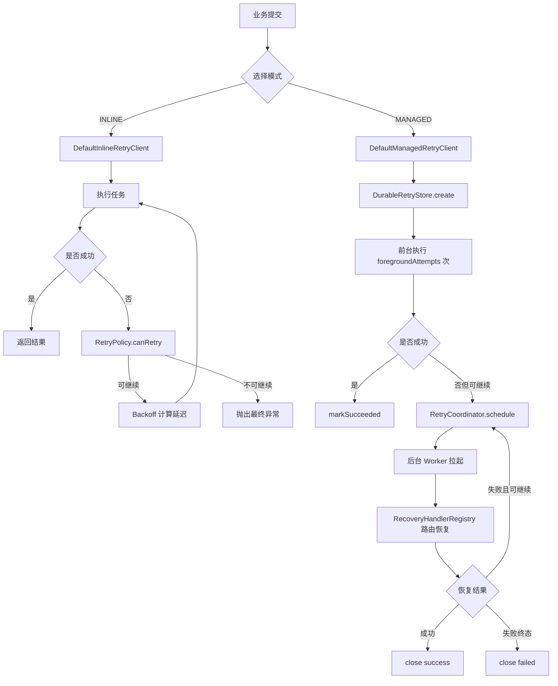

# team4u-retry

`team4u-retry` 是 Team4u Framework 的统一重试模块，提供两类能力：

* INLINE（进程内重试）：所有重试都在当前进程内完成，适合同步/异步的轻量级失败恢复。
* MANAGED（托管重试）：任务先写入持久化存储，当前进程做有限次前台尝试，预算耗尽后交给后端调度与恢复执行，适合需要抗进程故障的场景。

它适用于支付通知、第三方接口调用、消息补偿、下游短暂不可用等“可重试且需要幂等保障”的业务。

---

## 你可以用它做什么

* 对同步逻辑做阻塞式重试
* 对 `CompletableFuture` 异步调用做非阻塞重试
* 通过 `@Retryable` 给接口 / 方法增加声明式重试
* 在 Spring 项目中通过 `@EnableRetry` 自动织入重试代理
* 在 MANAGED 模式下，把任务可靠托管到后端，由 Worker 继续恢复执行
* 通过配置中心动态加载和热更新重试策略

---

## 什么时候适合用重试

适合重试的典型场景：

* 网络抖动、超时、短暂不可用
* 下游服务限流后的延迟恢复
* 第三方接口偶发失败
* 消息投递、通知回调、补偿执行

不适合直接重试的场景：

* 参数错误
* 权限错误
* 幂等冲突
* 明确的业务拒绝类异常
* 资源永久不存在

> 提醒：重试只能提高成功率，不能替代幂等设计。

---

## 目录

* [模块划分](#模块划分)
* [两种运行模式](#两种运行模式)
* [快速开始](#快速开始)
* [核心概念](#核心概念)
* [异常与终止规则](#异常与终止规则)
* [编程式接入](#编程式接入)
* [注解式接入](#注解式接入)
* [Spring 接入](#spring-接入)
* [动态策略配置](#动态策略配置)
* [基于 Lease 的托管实现](#基于-lease-的托管实现)
* [注意事项](#注意事项)
* [FAQ](#faq)
* [核心类与执行流程](#核心类与执行流程)

---

## 模块划分

当前项目包含 4 个子模块：

| 模块                               | 作用                                | 适用场景                 |
| -------------------------------- | --------------------------------- | -------------------- |
| `team4u-retry-core`              | 核心重试能力、策略、模式、存储抽象                 | 纯 Java / 基础组件        |
| `team4u-retry-proxy`             | `@Retryable` 代理增强、参数快照序列化         | 非 Spring 的声明式重试      |
| `team4u-retry-spring`            | Spring 自动接入、`@EnableRetry`、生命周期管理 | Spring / Spring Boot |
| `team4u-retry-lease-integration` | 基于 `team4u-lease` 的托管存储与调度实现      | 需要持久化托管与恢复执行         |

一般建议：

* 只需要轻量重试：先用 `core`
* 想用注解式声明重试：加 `proxy`
* Spring 项目：加 `spring`
* 需要托管重试 / 抗进程故障：加 `lease-integration`

---

## 两种运行模式

### 1）INLINE

仅当前进程内重试。

特点：

* 不依赖持久化存储
* 失败后立即按退避策略重试
* 进程退出后不会继续执行
* 适合快速失败恢复

### 2）MANAGED

任务先被可靠记录，再由前台 + 后台协同完成重试。

特点：

* 依赖 `DurableRetryStore` 做持久化
* 当前线程先执行有限次前台尝试
* 前台预算耗尽后，由 `RetryCoordinator` 调度后台继续执行
* 适合需要抗宕机、跨进程恢复的场景

### 模式对照

| 维度                            | INLINE  | MANAGED    |
| ----------------------------- | ------- | ---------- |
| 是否需要持久化                       | 否       | 是          |
| 是否支持异步 `CompletableFuture` 重试 | 是       | 需由托管模型自行封装 |
| 是否需要 `foregroundAttempts`     | 否，且不能配置 | 是，且必须显式配置  |
| 失败后是否可由后端继续恢复                 | 否       | 是          |
| 是否适合抗进程故障                     | 否       | 是          |

---

## 快速开始

### Maven 依赖

最小依赖：

```xml
<dependency>
    <groupId>com.team4u</groupId>
    <artifactId>team4u-retry-core</artifactId>
    <version>1.0.0-SNAPSHOT</version>
</dependency>
```

如果需要 Spring 自动接入：

```xml
<dependency>
    <groupId>com.team4u</groupId>
    <artifactId>team4u-retry-spring</artifactId>
    <version>1.0.0-SNAPSHOT</version>
</dependency>
```

如果需要基于 Lease 的托管重试：

```xml
<dependency>
    <groupId>com.team4u</groupId>
    <artifactId>team4u-retry-lease-integration</artifactId>
    <version>1.0.0-SNAPSHOT</version>
</dependency>
```

### 示例 1：INLINE 同步重试

```java
import com.team4u.framework.retry.backoff.Backoffs;
import com.team4u.framework.retry.client.DefaultInlineRetryClient;
import com.team4u.framework.retry.policy.RetryPolicy;

RetryPolicy policy = RetryPolicy.builder()
        .maxAttempts(3)
        .backoff(Backoffs.fixed(200))
        .build();

String result = DefaultInlineRetryClient.getInstance().execute(policy, () -> {
    // 业务逻辑
    return "ok";
});
```

### 示例 2：INLINE 异步重试

```java
import com.team4u.framework.retry.backoff.Backoffs;
import com.team4u.framework.retry.client.DefaultInlineRetryClient;
import com.team4u.framework.retry.policy.RetryPolicy;

import java.util.concurrent.CompletableFuture;
import java.util.concurrent.Executors;
import java.util.concurrent.ScheduledExecutorService;

ScheduledExecutorService scheduler = Executors.newScheduledThreadPool(2);

RetryPolicy policy = RetryPolicy.builder()
        .maxAttempts(3)
        .backoff(Backoffs.fixed(100))
        .build();

CompletableFuture<String> future = DefaultInlineRetryClient.getInstance().executeAsync(
        policy,
        this::asyncRemoteCall,
        scheduler
);
```

### 示例 3：MANAGED 托管提交

```java
import com.team4u.framework.retry.backoff.Backoffs;
import com.team4u.framework.retry.client.DefaultManagedRetryClient;
import com.team4u.framework.retry.domain.ManagedSubmitResult;
import com.team4u.framework.retry.domain.RecoverySpec;
import com.team4u.framework.retry.domain.RetryTaskSpec;
import com.team4u.framework.retry.policy.RetryPolicy;

RetryPolicy policy = RetryPolicy.builder()
        .maxAttempts(5)
        .foregroundAttempts(2)
        .backoff(Backoffs.exponentialJitter(200, 2.0, 5000))
        .build();

RetryTaskSpec<String> spec = RetryTaskSpec.<String>builder()
        .taskName("pay-notify")
        .idempotencyKey("order-A1001")
        .policy(policy)
        .recovery(RecoverySpec.of("pay-notify", "{\"orderId\":\"A1001\"}"))
        .executor(() -> {
            throw new RuntimeException("downstream timeout");
        })
        .build();

ManagedSubmitResult<String> result = managedRetryClient.submit(spec);

if (result.isAccepted()) {
    // 已被可靠托管，后续由后台继续执行
}
```

---

## 核心概念

### 1. `RetryPolicy`

`RetryPolicy` 定义：

* 是否继续重试
* 每次重试之间等待多久

常用配置：

* `maxAttempts(int)`：总尝试次数，包含首次执行；`-1` 表示无限重试
* `foregroundAttempts(int)`：MANAGED 模式下，前台最多执行多少次
* `backoff(Backoff)`：退避策略
* `retryOn(...)`：只对指定异常重试
* `abortOn(...)`：命中后立即终止
* `condition(String)`：表达式控制是否继续重试

示例：

```java
RetryPolicy policy = RetryPolicy.builder()
        .maxAttempts(5)
        .foregroundAttempts(2)
        .retryOn(java.io.IOException.class)
        .abortOn(IllegalArgumentException.class)
        .backoff(Backoffs.exponentialJitter(100, 2.0, 3000))
        .condition("message contains 'timeout'")
        .build();
```

### 2. `Backoff`

`Backoff` 决定失败后等待多久再执行下一次尝试。

统一通过 `Backoffs` 创建：

* `Backoffs.fixed(delay)`：固定间隔
* `Backoffs.increment(initialDelay, stepMillis)`：线性递增
* `Backoffs.exponential(initialDelay, multiplier, maxDelay)`：指数退避
* `Backoffs.exponentialJitter(initialDelay, multiplier, maxDelay)`：指数退避 + 抖动

高并发失败场景，优先推荐：

```java
Backoffs.exponentialJitter(...)
```

也支持 Builder 形式：

```java
Backoff backoff = Backoffs.exponentialJitterBuilder()
        .initialDelay(200)
        .multiplier(2.0)
        .maxDelay(5000)
        .build();
```

以及通用扩展：

```java
Backoff backoff = Backoffs.builder("myCustomType")
        .param("foo", 1)
        .param("bar", "value")
        .build();
```

### 3. `ManagedSubmitResult`

MANAGED 模式不会简单地“抛异常表示所有结果”，而是返回明确的提交结果模型：

* `Completed`：前台执行成功
* `Accepted`：任务已经被可靠托管，后续由后台继续执行
* `Failed`：明确终态失败，不再重试
* `Rejected`：参数、配置或依赖不满足要求，任务未被接受

### 4. `RetryTaskSpec`

`RetryTaskSpec` 用于完整描述一个托管任务，包括：

* `taskName`：任务类型
* `idempotencyKey`：幂等键
* `executor`：前台执行逻辑
* `recovery`：后续恢复所需载荷
* `policy`：任务使用的重试策略

### 5. `RecoverySpec`

`RecoverySpec` 定义托管恢复所需的数据：

* `taskName`：恢复处理器路由键
* `payload`：恢复执行所需的业务数据

---

## 异常与终止规则

| 情况                                                 | 是否重试     | 说明           |
| -------------------------------------------------- | -------- | ------------ |
| 命中 `retryOn`                                       | 是        | 按策略继续        |
| 命中 `abortOn`                                       | 否        | 立即终止         |
| `CompletionException` / `ExecutionException` 等包装异常 | 看根因      | 框架会先解包       |
| `InterruptedException`                             | 否        | 立即停止，并恢复中断标记 |
| `Error`                                            | 否        | 直接透传         |
| MANAGED 模式前台预算耗尽                                   | 不在当前线程继续 | 任务转入后台调度     |

---

## 编程式接入

### INLINE：同步执行

```java
String result = DefaultInlineRetryClient.getInstance().execute(policy, this::doBusiness);
```

### INLINE：异步执行

```java
CompletableFuture<String> future = DefaultInlineRetryClient.getInstance().executeAsync(
        policy,
        this::asyncRemoteCall,
        scheduler
);
```

### MANAGED：托管执行

```java
RetryTaskSpec<String> spec = RetryTaskSpec.<String>builder()
        .taskName("order-submit")
        .idempotencyKey("order-123")
        .policy(policy)
        .recovery(RecoverySpec.of("order-submit", "{\"orderId\":\"123\"}"))
        .executor(this::doBusiness)
        .build();

ManagedSubmitResult<String> submitResult = managedRetryClient.submit(spec);
```

### 什么时候会被拒绝

以下情况通常会得到 `Rejected`：

* MANAGED 模式未提供 `DurableRetryStore`
* 未提供 `RetryCoordinator`
* 未提供 `RecoveryHandlerRegistry`
* `RetryPolicy` 未显式设置 `foregroundAttempts`
* `RecoverySpec` 缺失或 `taskName` 为空

---

## 注解式接入

### 基础用法

```java
public interface PayService {

    @Retryable(policy = "pay-policy")
    String notifyPay(String orderId);
}
```

非 Spring 场景下，可以通过代理工厂创建代理对象。

### `@RetryIgnore`

对于以下参数，不建议放入恢复快照：

* `HttpServletRequest`
* `InputStream`
* 上下文对象
* 超大对象
* 不可序列化对象

此时可以在参数上添加 `@RetryIgnore`，框架会在持久化快照时跳过该参数。

### 注解模式下的恢复数据

注解式调用进入托管模型时，框架通常会保存调用快照，包括：

* `beanName`
* `methodName`
* `argTypes`
* `argValues`

恢复阶段会基于这些信息重新定位方法并执行补偿调用。

---

## Spring 接入

### 1）开启自动代理

```java
@Configuration
@EnableRetry
public class RetryConfig {
}
```

### 2）注册策略

```java
RetryPolicyFactoryRegistry.global().register(new RetryPolicyFactory() {
    @Override
    public String key() {
        return "pay-policy";
    }

    @Override
    public RetryPolicy create() {
        return RetryPolicy.builder()
                .maxAttempts(3)
                .backoff(Backoffs.fixed(100))
                .build();
    }
});
```

### 3）在 Bean 上使用

```java
@Service
public class PayServiceImpl {

    @Retryable(policy = "pay-policy")
    public String notifyPay(String orderId) {
        return "ok_" + orderId;
    }
}
```

### 4）生命周期管理

`team4u-retry-spring` 已内置生命周期配置，会在 Spring 容器销毁时调用线程池关闭逻辑。

### 5）Spring AOP 边界

需要注意：

* 同一个 Bean 内部自调用通常不会经过代理
* `final` 类 / `final` 方法不适合依赖类代理增强
* 与 `@Transactional`、日志、监控等多个 Advisor 共存时，顺序取决于代理链

如果要求“自调用也能触发重试”，建议拆分到独立 Bean，或改用编程式接入。

---

## 动态策略配置

动态策略注册表基于配置前缀：

```text
retry.policy.
```

例如：

```properties
retry.policy.order-submit={
  "maxAttempts": 6,
  "localAttempts": 2,
  "backoff": {
    "type": "exponentialJitter",
    "params": {
      "initialDelay": 500,
      "multiplier": 2.0,
      "maxDelay": 10000
    }
  },
  "retryOnExceptions": ["java.net.SocketTimeoutException", "java.io.IOException"],
  "abortOnExceptions": ["java.lang.IllegalArgumentException"],
  "condition": ""
}
```

> 兼容说明：当前配置模型里字段名仍为 `localAttempts`，工厂在构建 `RetryPolicy` 时会映射到 `foregroundAttempts`。

可配置字段包括：

* `maxAttempts`
* `localAttempts`
* `backoff.type`
* `backoff.params`
* `retryOnExceptions`
* `abortOnExceptions`
* `condition`

---

## 基于 Lease 的托管实现

如果项目已经使用 `team4u-lease`，可以直接复用：

* `LeaseDurableRetryStore`：实现 `DurableRetryStore` 与 `RetryCoordinator`
* 默认恢复队列：`retry-recovery`

### 典型职责

* `create(...)`：保存初始托管意图
* `schedule(...)`：更新任务状态并重新调度
* `markSucceeded(...)`：标记成功终态
* `markFailed(...)`：标记失败终态
* `cancel(...)`：显式取消任务

### 恢复执行

后端 Worker 拿到任务后，会根据 `taskName` 找到对应的 `RecoveryHandler` 执行恢复：

```java
public class PayNotifyRecoveryHandler implements RecoveryHandler<String> {
    @Override
    public String taskName() {
        return "pay-notify";
    }

    @Override
    public void recover(String payload, RecoveryContext context) throws Exception {
        System.out.println("recover payload = " + payload);
    }
}
```

---

## 注意事项

### 1. `foregroundAttempts` 只属于 MANAGED 模式

* INLINE 模式不能配置 `foregroundAttempts`
* MANAGED 模式必须显式配置 `foregroundAttempts`

### 2. MANAGED 模式不是“纯抛异常语义”

托管任务更推荐通过 `ManagedSubmitResult` 判断结果，而不是只依赖异常分支。

### 3. 托管模式必须具备幂等性

一旦任务被可靠记录，业务恢复逻辑必须能够接受“至少一次”执行语义。

### 4. `Error` 不会进入重试

例如 `OutOfMemoryError` 等系统级错误会直接透传，不会做无意义重试。

### 5. 线程中断会立即停止重试

遇到 `InterruptedException` 时，框架会恢复中断标记并停止后续调度。

### 6. 非 Spring 场景记得关闭线程池

应用退出前建议调用：

```java
RetryExecutorManager.global().shutdown();
```

---

## FAQ

### `maxAttempts(3)` 是重试 3 次还是总共 3 次？

总共 3 次，包含首次执行。

### `foregroundAttempts(2)` 表示什么？

表示在 MANAGED 模式下，当前进程内最多执行 2 次；如果策略允许继续重试，后续会交给后台调度。

### 为什么 INLINE 模式配置了 `foregroundAttempts` 会报错？

因为 INLINE 模式只负责当前进程内执行，不存在“前台预算 + 后台接管”的概念。

### 为什么 MANAGED 模式没有配置 `foregroundAttempts` 会被拒绝？

因为托管模型要求明确区分“前台执行多少次”与“什么时候交给后台”，这是模式语义的一部分。

### `CompletionException` 会直接参与策略判断吗？

不会，框架会先解包，再基于根因异常判断是否重试。

### 为什么恢复阶段不会再次进入代理重试？

因为恢复阶段的语义是“补偿执行”，不是重新从业务入口走一遍调用侧重试流程，否则会造成重复托管和递归套娃。

---

## 核心类与执行流程

### 主要类

* `RetryPolicy`：重试策略定义
* `Backoff` / `Backoffs`：退避策略与门面
* `DefaultInlineRetryClient`：INLINE 模式执行器
* `DefaultManagedRetryClient`：MANAGED 模式执行器
* `RetryTaskSpec`：托管任务定义
* `ManagedSubmitResult`：托管提交结果
* `DurableRetryStore`：持久化存储抽象
* `RetryCoordinator`：任务调度协调器
* `RecoveryHandler` / `RecoveryHandlerRegistry`：恢复执行路由
* `@Retryable`：声明式接入
* `@EnableRetry`：Spring 自动代理开关

### 执行流程


