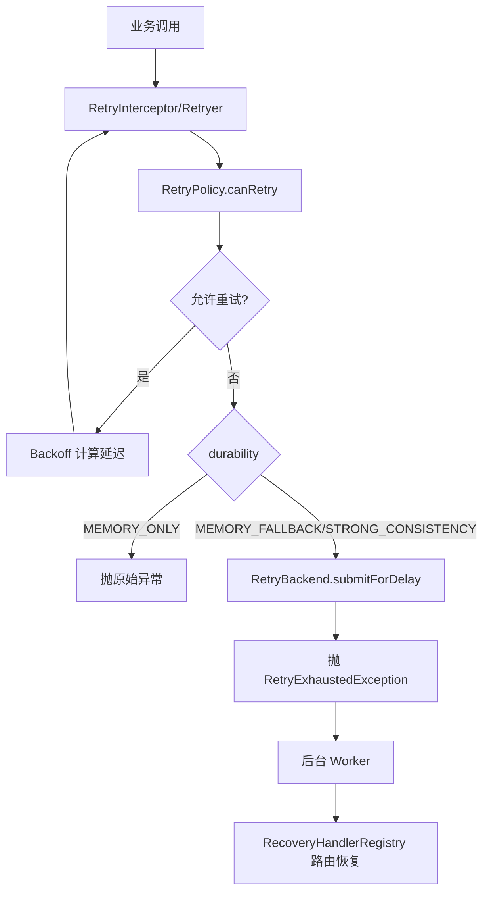

[返回总目录](../README.md)

# 重试模块

[](https://openjdk.java.net/)
[](https://opensource.org/licenses/MIT)

## 目录

- [简介](#简介)
- [快速入门](#快速入门)
- [核心语义与模型](#核心语义与模型)
- [编程式重试](#编程式重试)
- [注解式重试（结合 team4u-proxy）](#注解式重试结合-team4u-proxy)
- [动态策略与配置中心](#动态策略与配置中心)
- [持久化降级与恢复机制](#持久化降级与恢复机制)
- [关键边界与注意事项](#关键边界与注意事项)
- [架构与原理](#架构与原理)

---

## 简介

`team4u-retry` 是 Team4u Framework 的统一重试治理模块，提供：

1. **同步重试**：对 `Callable` 任务进行阻塞式重试。
2. **异步重试**：基于 `CompletableFuture + ScheduledExecutorService` 的真非阻塞重试。
3. **注解重试**：通过 `@Retryable` + `team4u-proxy` 动态代理实现无侵入接入。
4. **动态策略**：支持配置中心热更新 `retry.policy.*` 策略。
5. **持久化降级**：内存重试耗尽后可降级到后端队列，支持恢复执行。

模块支持异常白名单/黑名单、多种退避算法、Criterion 条件表达式，以及常见包装异常解包。

---

## 快速入门

### 引入依赖

```xml
<dependency>
    <groupId>com.team4u</groupId>
    <artifactId>team4u-retry</artifactId>
    <version>1.0.0-SNAPSHOT</version>
</dependency>
```

### 最小可用示例（同步）

```java
import com.team4u.framework.retry.RetryPolicy;
import com.team4u.framework.retry.Retryer;
import com.team4u.framework.retry.backoff.Backoff;

RetryPolicy policy = RetryPolicy.builder()
        .totalAttempts(3)
        .backoff(Backoff.fixed(200))
        .build();

Retryer retryer = Retryer.with(policy);

String result = retryer.execute(() -> {
    // 调用可能失败的下游
    return "ok";
});
```

### 最小可用示例（异步）

> 注意：`executeAsync` 的第二个参数是 `Supplier<String> payloadSupplier`，不是直接 `String`。

```java
import java.util.concurrent.*;

ScheduledExecutorService scheduler = Executors.newScheduledThreadPool(2);

RetryPolicy policy = RetryPolicy.builder()
        .totalAttempts(3)
        .backoff(Backoff.fixed(100))
        .build();

Retryer retryer = Retryer.with(policy);

CompletableFuture<String> future = retryer.executeAsync(
        "order.query",                       // taskType
        () -> "{\"orderId\":\"A1001\"}", // payloadSupplier
        () -> asyncRemoteCall(),              // Supplier<CompletableFuture<T>>
        scheduler
);
```

---

## 核心语义与模型

### 1) RetryPolicy（策略对象）

`RetryPolicy` 是不可变对象（线程安全），可通过 Builder 组合以下能力：

- `totalAttempts(int)`：全局总尝试次数（**包含首次调用**，内存 + 后端总和）。
- `inMemoryAttempts(int)`：前台内存尝试预算（可选高级参数）。
- `infiniteAttempts()`：无限重试（`totalAttempts = -1`）。
- `backoff(Backoff)`：延迟计算策略。
- `retryOn(...)`：仅匹配这些异常及其子类时允许重试。
- `abortOn(...)`：匹配这些异常及其子类时立刻终止重试。
- `condition(String)`：Criterion 表达式条件重试（基于 `attempt/totalAttempts/cause/message`）。

#### 判定顺序（`canRetry`）

1. 次数上限判定：`currentAttempt >= totalAttempts`（且非无限）直接不可重试。
2. 异常解包（见下文）。
3. `abortOn` 命中则不可重试。
4. 若配置了 `retryOn` 且未命中，则不可重试。
5. 若配置了 `condition`，则以表达式结果为准。
6. 其余情况可重试。

#### Builder 默认值与校验

- 默认：`totalAttempts=3`，`backoff=fixed(1000)`，`inMemoryAttempts=null`。
- 非法值：
  - `totalAttempts == 0` 或 `< -1`：抛 `IllegalArgumentException`
  - `inMemoryAttempts <= 0`：抛 `IllegalArgumentException`
  - 有限重试时 `inMemoryAttempts > totalAttempts`：抛 `IllegalArgumentException`

### 2) Backoff（退避算法）

- `Backoff.fixed(delay)`：固定间隔。
- `Backoff.increment(initial, step)`：线性递增。第 n 次延迟：`initial + (n-1) * step`。
- `Backoff.exponential(initial, multiplier, maxDelay)`：指数退避，上限截断。
- `Backoff.exponentialJitter(initial, multiplier, maxDelay)`：指数 + 全抖动，随机区间为 `[initial, upperBound]`。

### 3) 异常解包语义（RetryExceptionUtil）

仅自动剥离以下包装异常（最大深度 10，防循环）：

- `CompletionException`
- `ExecutionException`
- `InvocationTargetException`
- `UndeclaredThrowableException`

> 说明：并非所有包装异常都会被剥离。例如普通 `RuntimeException(new BizException(...))` 不在自动解包范围内。

### 4) 内存预算自动推导（重要）

当 `inMemoryAttempts` 未显式配置时，`Retryer` 按 durability 推导：

- `MEMORY_ONLY`：`inMemoryAttempts = totalAttempts`
- `MEMORY_FALLBACK / STRONG_CONSISTENCY`：`inMemoryAttempts = min(2, totalAttempts)`
- 若 `totalAttempts = -1`：
  - `MEMORY_ONLY` -> `Integer.MAX_VALUE`
  - 持久化模式 -> `2`

> 结论：在持久化模式下，不显式配 `inMemoryAttempts` 时，前台默认只跑 2 次。

---

## 编程式重试

### 1) 同步重试（纯内存）

```java
RetryPolicy policy = RetryPolicy.builder()
        .totalAttempts(3)
        .backoff(Backoff.exponential(100, 2.0, 2000))
        .retryOn(java.io.IOException.class)
        .abortOn(IllegalArgumentException.class)
        .condition("attempt <= 2 && message contains 'timeout'")
        .build();

Retryer retryer = Retryer.with(policy);
String data = retryer.execute(() -> remoteCall());
```

### 2) 同步重试（带持久化降级）

```java
Retryer retryer = Retryer.builder()
        .policy(policy)
        .backend(retryBackend)
        .durability(RetryDurability.MEMORY_FALLBACK)
        .build();

String result = retryer.execute(
        "pay-notify",
        () -> "{\"orderId\":\"A1001\"}",
        () -> doBusiness()
);
```

行为说明：

- 若内存重试耗尽且仍有全局剩余额度，会调用 `RetryBackend.submitForDelay(...)`。
- 此时抛 `RetryExhaustedException`，表示任务已转入后台系统接管。

### 3) 非阻塞异步重试

```java
Retryer retryer = Retryer.builder()
        .policy(policy)
        .backend(retryBackend)
        .durability(RetryDurability.STRONG_CONSISTENCY)
        .build();

CompletableFuture<String> future = retryer.executeAsync(
        "pay-notify",
        () -> "{\"orderId\":\"A1001\"}",
        () -> asyncRemoteCall(),
        scheduler
);
```

行为说明：

- 重试调度通过 `scheduler.schedule(...)` 触发，不阻塞当前线程。
- 若 `asyncTask.get()` 返回 `null`，视为失败并进入重试/降级分支。
- `Error` 不参与重试，直接失败。

---

## 注解式重试（结合 team4u-proxy）

### 1) 注解定义

`@Retryable` 作用于方法层：

- `value`：策略 key（默认 `default`）
- `durability`：可靠性级别（默认 `MEMORY_ONLY`）

```java
import com.team4u.framework.retry.proxy.Retryable;

public interface PayService {

    @Retryable(value = "pay-notify", durability = RetryDurability.MEMORY_FALLBACK)
    String notifyPay(String orderId);
}
```

### 2) 接入拦截器

```java
PayService proxy = ProxyBuilder.forClass(PayService.class)
        .withDelegate(new PayServiceImpl())
        .addInterceptor(new RetryInterceptor(retryBackend))
        .build();
```

### 3) 策略来源优先级

`RetryInterceptor` 获取策略顺序：

1. `DynamicRetryPolicyRegistry`（配置中心动态策略）
2. `RetryPolicyRegistry.global()`（本地静态注册策略）

若都不存在，抛 `IllegalArgumentException`。

### 4) 持久化快照内容

注解拦截时会构造 `RetryTaskSnapshot`，并序列化为 payload：

- `beanName`
- `methodName`
- `argTypes`
- `argJsonValues`

> `globalAttempt` 字段目前定义在快照模型中，但拦截器当前未赋值。

---

## 动态策略与配置中心

动态策略固定前缀：`retry.policy.`

例如策略 ID 为 `pay-notify`，配置键为：`retry.policy.pay-notify`

### 配置结构（JSON）

```json
{
  "totalAttempts": 5,
  "inMemoryAttempts": 2,
  "backoffType": "exponentialJitter",
  "initialDelay": 200,
  "multiplier": 2.0,
  "maxDelay": 5000,
  "retryOnExceptions": ["java.io.IOException"],
  "abortOnExceptions": ["java.lang.IllegalArgumentException"],
  "condition": "attempt <= 3 && message contains 'timeout'"
}
```

### 字段说明

| 字段 | 说明 |
| :--- | :--- |
| `totalAttempts` | 全局总尝试次数（内存 + 后端总和，含首次） |
| `inMemoryAttempts` | 前台内存尝试预算（可选，不填自动推导） |
| `backoffType` | `fixed` / `increment` / `exponential` / `exponentialJitter` |
| `initialDelay` | 初始延迟（毫秒） |
| `multiplier` | `increment` 下转 long 作为步长；`exponential*` 下作为倍率 |
| `maxDelay` | 最大延迟（毫秒，仅 exponential 系列使用） |
| `retryOnExceptions` | 允许重试异常类名列表 |
| `abortOnExceptions` | 终止重试异常类名列表 |
| `condition` | Criterion 条件表达式 |

### 映射与容错规则

- `backoffType` 不识别时，回落为 `fixed`。
- 异常类名加载失败时，记录日志并忽略该项，不中断策略构建。
- `totalAttempts / inMemoryAttempts` 的非法值最终在 `RetryPolicy.build()` 阶段抛出异常。

---

## 持久化降级与恢复机制

### 1) 可靠性级别（RetryDurability）

- `MEMORY_ONLY`：仅内存重试，性能最高，宕机可能丢任务。
- `MEMORY_FALLBACK`：前台内存预算耗尽且仍有全局剩余额度时，提交后端延迟队列。
- `STRONG_CONSISTENCY`：执行前先写重试意图（WAL），成功后异步清理。

### 2) 后端能力接口（RetryBackend）

如需持久化降级，实现以下接口：

- `saveIntent(taskType, payload)`：预写意图。
- `completeIntent(intentId)`：成功后完成/清理。
- `submitForDelay(intentId, taskType, payload, delay)`：提交延迟重试。

### 3) 恢复执行（RecoveryHandler）

后台 Worker 拉取任务后，可通过 `RecoveryHandlerRegistry.global()` 按 `taskType` 路由：

```java
RecoveryHandlerRegistry.global().register(new RecoveryHandler() {
    @Override
    public String key() {
        return "pay-notify";
    }

    @Override
    public void recover(String payload) throws Exception {
        // 反序列化 payload 并恢复业务调用
    }
});
```

---

## 关键边界与注意事项

1. **`totalAttempts` 包含首次调用**，不是“额外重试次数”。
2. **`Error` 不重试**（同步与异步均直接失败）。
3. 是否会降级到后端不仅取决于 durability，还取决于：
   - `totalAttempts == -1`，或
   - `inMemoryAttempts < totalAttempts`
4. `STRONG_CONSISTENCY` 成功后的 `completeIntent` 是**异步执行**，不保证在业务返回前完成。
5. `@Retryable` 方法若找不到对应策略 key，会直接抛 `IllegalArgumentException`。
6. 异常解包是“有限白名单”而非全量递归；文档和策略匹配应基于这一事实。

---

## 架构与原理

### 核心执行流程

1. 业务发起调用（编程式或 `@Retryable` 代理调用）。
2. 选择策略：动态策略优先，静态策略兜底。
3. `Retryer` 执行重试循环：
   - 失败后异常解包。
   - 按 `canRetry` 判定（次数/异常/表达式 + 内存预算）。
   - 计算 `Backoff` 延迟并进入下一次尝试。
4. 若内存重试耗尽：
   - `MEMORY_ONLY`：抛原始异常。
   - `MEMORY_FALLBACK` / `STRONG_CONSISTENCY`：提交 `RetryBackend` 并抛 `RetryExhaustedException`。
5. 后台系统按 `taskType` 分发 `RecoveryHandler` 恢复执行。

### 时序图


