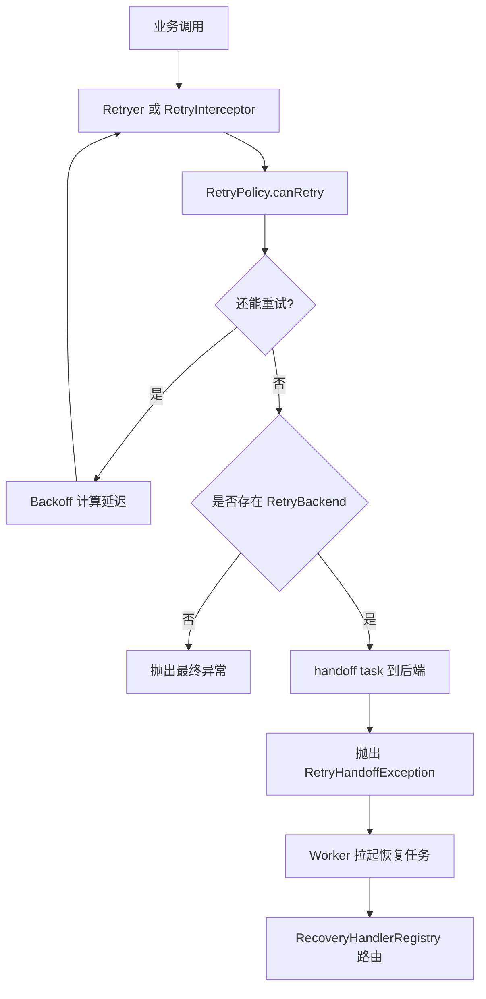

# [返回总目录](../README.md)

# team4u-retry

[](https://openjdk.org/)
[](https://opensource.org/licenses/MIT)

`team4u-retry` 是 Team4u Framework 的统一重试模块，用来为同步调用、异步调用、注解方法、Spring Bean 提供一致的重试能力。

它不仅支持常规的进程内重试，还支持在本地重试耗尽后将任务移交到后端持久化系统继续恢复执行，适合支付通知、下游调用、消息补偿等“允许重试且需要抗进程故障”的场景。

## 你可以用它做什么

* 对一段同步逻辑做阻塞式重试
* 对 `CompletableFuture` 异步调用做非阻塞重试
* 通过 `@Retryable` 给方法声明式加重试
* 在 Spring 项目中通过 `@EnableRetry` 自动织入重试代理
* 在本地重试耗尽后，把任务移交给后端继续恢复执行
* 从配置中心动态加载和更新重试策略

## 什么时候适合用重试

适合重试的典型场景：

* 网络抖动、超时、短暂不可用
* 下游服务限流后的延迟恢复
* 第三方接口偶发失败
* 消息投递、通知回调、补偿执行

不适合直接重试的场景：

* 参数错误
* 权限错误
* 幂等冲突
* 明确的业务拒绝类异常

## 目录

* [接入方式怎么选](#接入方式怎么选)
* [快速开始](#快速开始)
* [核心概念](#核心概念)
* [编程式接入](#编程式接入)
* [注解式接入](#注解式接入)
* [Spring 接入](#spring-接入)
* [持久化降级与恢复执行](#持久化降级与恢复执行)
* [动态策略与配置中心](#动态策略与配置中心)
* [完整示例：内置 Backend + Worker](#完整示例内置-backend--worker)
* [完整示例：Spring-Boot-接入](#完整示例spring-boot-接入)
* [FAQ](#faq)
* [核心类与执行流程](#核心类与执行流程)

## 接入方式怎么选

| 你的场景              | 推荐方式                                              | 说明         |
|-------------------|---------------------------------------------------|------------|
| 普通 Java 代码里重试一段逻辑 | `Retryer.execute(Callable)`                       | 最简单，纯内存模式  |
| 失败后需要移交后端继续重试     | `Retryer.execute(taskType, payloadBuilder, task)` | 支持持久化降级    |
| 业务本身就是异步调用        | `Retryer.executeAsync(...)`                       | 非阻塞重试      |
| 想给接口方法无侵入加重试      | `@Retryable` + `RetryProxyFactory`                | 不依赖 Spring |
| 已经在 Spring 项目里    | `@EnableRetry` + `@Retryable`                     | 接入成本最低     |

## 运行模式对照

| 模式         | 是否需要持久化适配器        | 是否需要 payloadBuilder | 本地耗尽后       | 调用方看到什么               | 是否需要 Worker |
|------------|-------------------|---------------------|-------------|-----------------------|-------------|
| 纯内存同步/异步   | 否                 | 否                   | 直接结束        | 最终业务异常                | 否           |
| 持久化降级（编程式） | 是（`RetryBackend`） | 是                   | handoff 到后端 | RetryHandoffException | 是           |
| 持久化降级（注解式） | 是（`RetryBackend`） | 否（框架快照）             | handoff 到后端 | RetryHandoffException | 是           |

### 一句话建议

* 只需要本地重试：用 `Retryer.with(policy).execute(...)`
* 需要失败后交给后端恢复：用 `Retryer.builder()` 并配置 `RetryBackend`
* 已经在 Spring 中：优先用 `@EnableRetry`

## 快速开始

### Maven 依赖

编程式最小依赖：

```xml

<dependency>
    <groupId>com.team4u</groupId>
    <artifactId>team4u-retry-core</artifactId>
    <version>1.0.0-SNAPSHOT</version>
</dependency>
```

注解式代理额外需要：

```xml

<dependency>
    <groupId>com.team4u</groupId>
    <artifactId>team4u-retry-proxy</artifactId>
    <version>1.0.0-SNAPSHOT</version>
</dependency>
```

Spring 自动代理额外需要：

```xml

<dependency>
    <groupId>com.team4u</groupId>
    <artifactId>team4u-retry-spring</artifactId>
    <version>1.0.0-SNAPSHOT</version>
</dependency>
```

如果你要对接 `team4u-lease` 做持久化恢复，还需要：

```xml

<dependency>
    <groupId>com.team4u</groupId>
    <artifactId>team4u-retry-lease-integration</artifactId>
    <version>1.0.0-SNAPSHOT</version>
</dependency>
```

### 1）同步重试：最小示例

```java
import com.team4u.framework.retry.RetryPolicy;
import com.team4u.framework.retry.Retryer;
import com.team4u.framework.retry.Backoff;

RetryPolicy policy = RetryPolicy.builder()
        .maxAttempts(3)
        .backoff(Backoff.fixed(200))
        .build();

Retryer retryer = Retryer.with(policy);

String result = retryer.execute(() -> {
    // 调用可能失败的逻辑
    return "ok";
});
```

适合：

* 本地快速重试
* 不需要任务持久化
* 不需要后端恢复

### 2）异步重试：最小示例

```java
import com.team4u.framework.retry.RetryPolicy;
import com.team4u.framework.retry.Retryer;
import com.team4u.framework.retry.Backoff;

import java.util.concurrent.CompletableFuture;
import java.util.concurrent.Executors;
import java.util.concurrent.ScheduledExecutorService;

ScheduledExecutorService scheduler = Executors.newScheduledThreadPool(2);

RetryPolicy policy = RetryPolicy.builder()
        .maxAttempts(3)
        .backoff(Backoff.fixed(100))
        .build();

Retryer retryer = Retryer.with(policy);

CompletableFuture<String> future = retryer.executeAsync(
        this::asyncRemoteCall,
        scheduler
);
```

说明：

* 这是纯内存异步重试
* 不会阻塞当前线程去 `sleep`
* 通过 `ScheduledExecutorService` 调度下一次尝试

### 3）注解式重试：最小示例

```java
public interface PayService {
    @Retryable(policy = "pay-notify")
    String notifyPay(String orderId);
}
```

如果你不在 Spring 中，可以通过代理工厂接入：

```java
PayService proxy = RetryProxyFactory.createProxy(new PayServiceImpl(), null);
```

如果你在 Spring 中，直接配合 `@EnableRetry` 使用即可。

### 4）最小示例：本地重试耗尽后移交后端

当你配置了 `RetryBackend` 时，本地重试次数耗尽后会抛出 `RetryHandoffException` 并将任务移交给后端：

```java
try{
        retryer.execute("pay-notify",ctx ->"{\"orderId\":\"A1001\"}",()->{
        throw new

RuntimeException("downstream timeout");
    });
            }catch(
RetryHandoffException ex){
        // 表示前台本地尝试已经结束，但任务已交给后端继续恢复
        // 这个异常不是“彻底失败”，而是“托管权转移”
        }
```

## 核心概念

理解这个模块，先把 4 个概念分清楚：

### 1. `RetryPolicy`

`RetryPolicy` 用来定义两件事：

* 是否继续重试
* 下一次等多久

常用配置：

* `maxAttempts(int)`：总尝试次数，包含第一次调用
* `localAttempts(int)`：持久化模式下，当前进程内最多尝试多少次
* `infiniteAttempts()`：无限重试
* `backoff(Backoff)`：退避策略
* `retryOn(...)`：仅对指定异常重试
* `abortOn(...)`：命中后立即终止
* `condition(String)`：使用表达式做进一步控制

示例：

```java
RetryPolicy policy = RetryPolicy.builder()
        .maxAttempts(5)
        .retryOn(java.io.IOException.class)
        .abortOn(IllegalArgumentException.class)
        .backoff(Backoff.exponentialJitter(100, 2.0, 3000))
        .condition("message contains 'timeout'")
        .build();
```

补充一点当前默认行为：

* 纯内存模式下，`localAttempts` 默认等于 `maxAttempts`
* 持久化模式下，如果不显式设置 `localAttempts`，当前实现默认只在前台尝试 2 次

### 2. `Backoff`

`Backoff` 决定每次失败后等待多久再重试。

内置算法：

* `Backoff.fixed(delay)`：固定间隔
* `Backoff.increment(initial, step)`：线性递增
* `Backoff.exponential(initial, multiplier, maxDelay)`：指数退避
* `Backoff.exponentialJitter(initial, multiplier, maxDelay)`：指数退避 + 抖动

高并发失败场景推荐优先使用：

```java
Backoff.exponentialJitter(...)
```

这样可以减少大量请求同时重试带来的“扎堆”问题。

## 异常与终止规则

| 情况                                                 | 是否重试     | 说明                               |
|----------------------------------------------------|----------|----------------------------------|
| 命中 `retryOn`                                       | 是        | 按策略继续                            |
| 命中 `abortOn`                                       | 否        | 立即终止                             |
| `CompletionException` / `ExecutionException` 等包装异常 | 看根因      | 框架会先解包                           |
| `InterruptedException`                             | 否        | 立即终止并恢复中断标记                      |
| `Error`                                            | 否        | 直接透传                             |
| 持久化模式下本地预算耗尽                                       | 不在当前线程继续 | 交给后端，前台抛 `RetryHandoffException` |

### 3. 内存重试 vs 持久化重试

这是最关键的语义区别。

#### 内存重试

* 所有重试都发生在当前进程内
* 简单、轻量、接入最快
* 进程挂掉后不会继续重试

#### 持久化重试

* 执行前先把任务意图写入后端
* 当前进程先尝试一部分
* 本地尝试耗尽后，任务移交后端继续恢复执行
* 更适合需要抗宕机的场景

### 4. 恢复执行

当任务被移交到后端后，后端 Worker 会根据 `taskType` 找到对应的 `RecoveryHandler`，然后使用保存下来的 `payload` 或快照继续恢复执行。

可以把它理解成：

* 调用侧负责首次执行和本地重试
* 后端负责任务托管和后续恢复

## 编程式接入

### 同步内存重试

```java
Retryer retryer = Retryer.with(policy);

String result = retryer.execute(() -> doBusiness());
```

这是最简单的方式，只适用于纯内存模式。

### 支持后端降级的同步重试

```java
Retryer retryer = Retryer.builder()
        .policy(policy)
        .retryBackend(RetryBackend)
        .build();

String result = retryer.execute(
        "pay-notify",
        context -> "{\"orderId\":\"A1001\"}",
        this::doBusiness
);
```

三个参数分别表示：

* `taskType`：任务类型，告诉后端“这是什么任务”
* `payloadBuilder`：告诉后端“恢复这个任务需要哪些数据”
* `task`：当前线程内真正执行的业务逻辑

这里的 `payloadBuilder` 不是为了构造业务入参，而是为了生成一份可恢复的快照。

例如支付通知失败后要交给后端继续处理，至少要能知道是哪笔订单：

```java
context ->"{\"orderId\":\"A1001\"}"
```

否则后端只能知道“有个 pay-notify 任务失败了”，却不知道该恢复哪一条业务。

### `RetryPayloadContext` 是什么

`payloadBuilder` 会收到一个 `RetryPayloadContext`，用于告诉你当前处于哪个阶段。

当前代码里你会稳定拿到的阶段是：

* `PREPARE_INTENT`：任务执行前，准备写入后端意图

枚举中还定义了：

* `HANDOFF_TO_BACKEND`：本地重试耗尽，正式移交后端

可用信息：

* `getPhase()`：当前阶段
* `getExecutedAttempts()`：已经执行过多少次

但当前默认执行路径中，`payloadBuilder` 实际只会收到一次 `PREPARE_INTENT` 回调，所以大多数场景直接返回固定 payload 即可：

```java
context ->"{\"orderId\":\"A1001\"}"
```

如果后续持久化实现扩展为在 handoff 阶段再次构建快照，再利用 `HANDOFF_TO_BACKEND` 分支即可。

### 异步非阻塞重试

```java
CompletableFuture<String> future = retryer.executeAsync(
        "pay-notify",
        context -> "{\"orderId\":\"A1001\"}",
        this::asyncRemoteCall,
        scheduler
);
```

特点：

* 不阻塞当前线程
* 下一次尝试由 `ScheduledExecutorService` 调度
* 调度器异常关闭时，`future` 会异常完成，不会悬挂

## 注解式接入

### 基础用法

```java
public interface PayService {
    @Retryable(policy = "pay-notify")
    String notifyPay(String orderId);
}
```

通过代理工厂创建代理：

```java
PayService proxy = RetryProxyFactory.createProxy(new PayServiceImpl(), RetryBackend);
```

### `@Retryable` 参数说明

* `policy`：策略名，默认 `default`
* `taskType`：任务类型，用于后端恢复路由

规则如下：

* 如果显式写了 `taskType`，优先使用显式值
* 如果没写 `taskType`，但运行时存在 `RetryBackend`，则自动使用默认任务类型：
  `RetryTaskTypes.DEFAULT_PROXY_RECOVERY`
* 如果没有 `RetryBackend`，则只做本地重试，不进入后端恢复链路

### 注解模式下保存的不是你手写的 JSON

和编程式接入不同，注解式接入通常不会让你手工写 payload。

当存在 `RetryBackend` 时，框架会把方法调用现场冻结成一份 `RetryTaskSnapshot`，里面会包含：

* `beanName`
* `methodName`
* `argTypes`
* `argJsonValues`
* `taskId`
* `createdAt`
* `executedAttempts`
* `maxAttempts`
* `policyKey`
* `lastError`
* `lastAttemptAt`
* `nextAttemptAt`

也就是说：

* 编程式接入：你自己定义 payload 结构
* 注解式接入：框架帮你托管方法调用快照

### 注解快照的冻结语义

一旦 `RetryTaskSnapshot` 被构建出来，恢复所需的关键数据就会固定下来：

* 参数按构建时的状态冻结
* 同一个业务意图在整个重试周期内复用同一个 `taskId`
* `createdAt` 在整个生命周期中保持一致

这能确保后端拿到的是一份稳定的恢复材料，而不是运行时被继续修改过的对象。

### `@RetryIgnore`

如果某些参数不适合被序列化，比如：

* `HttpServletRequest`
* `InputStream`
* 本地连接对象
* 线程上下文对象
* 超大对象

可以用 `@RetryIgnore` 标记跳过：

```java
public interface TestService {
    void doWork(String name, @RetryIgnore Object secret);
}
```

但要注意：凡是被忽略的参数，恢复阶段就不能再依赖它。

## Spring 接入

如果你已经在 Spring 中，推荐这个方式，接入成本最低。

### 1）开启自动代理

```java
@Configuration
@EnableRetry
public class RetryConfig {
}
```

### 2）注册策略

```java
RetryPolicyRegistry.global().register(new NamedRetryPolicy() {
    @Override
    public String key() {
        return "pay-policy";
    }

    @Override
    public RetryPolicy getPolicy() {
        return RetryPolicy.builder()
                .maxAttempts(3)
                .backoff(Backoff.fixed(100))
                .build();
    }
});
```

如果同一个策略同时存在：

* 静态注册
* 动态配置中心

则运行期优先使用动态配置。

### 3）在 Bean 上使用

```java
@Service
public class PayServiceImpl {

    @Retryable(policy = "pay-policy")
    public String notifyPay(String orderId) {
        return "ok_" + orderId;
    }
}
```

> ⚠️ 注意
> 在 Spring 中提供 `RetryBackend` 只代表允许持久化降级。
> 如果没有同时启动后端 Worker 并注册对应 `RecoveryHandler`，
> 任务虽然会成功入队，但不会被恢复执行。

### 4）Spring AOP 边界

这个模块遵循标准 Spring AOP 规则，因此要注意：

* 同一个 Bean 内部自调用通常不会经过代理
* `final` 类 / `final` 方法不适合依赖类代理增强
* 与 `@Transactional`、日志、监控等多个 Advisor 共存时，生效顺序取决于代理链顺序

如果你要求“自调用也能触发重试”，建议把待重试逻辑拆到独立 Bean，或者改用编程式接入。

## FAQ

### `maxAttempts(3)` 是重试 3 次还是总共 3 次？

包含首次调用在内，共 3 次（即最多额外重试 2 次）。

### `RetryHandoffException` 是不是表示任务彻底失败？

不是。

在纯内存模式下，重试耗尽通常意味着当前调用结束并向上抛出最终异常。
但在配置了 `RetryBackend` 的持久化模式下，当前线程的本地尝试预算耗尽后，
框架会把任务移交给后端系统继续恢复执行，此时前台抛出的
`RetryHandoffException` 表示“当前线程不再继续重试”，
而不是“整个任务生命周期已经彻底失败”。

### 为什么恢复阶段不会再次进入重试代理？

因为后端恢复调用的语义是“基于已保存快照执行一次补偿恢复”，
不是“重新从业务入口再走一整遍调用侧重试托管流程”。
这样可以避免重复预写 intent、重复入队和恢复过程递归套娃。

### 为什么加了 `@RetryIgnore` 后恢复时拿不到这个参数？

因为标记了 `@RetryIgnore` 的参数不会被序列化到快照中。恢复阶段是反序列化快照后通过反射调用的，缺失的参数会以 `null` 传入。

### 为什么 Spring 里自调用没有触发重试？

这是 Spring AOP 的标准限制。代理对象只在外部调用时生效，类内部方法直接调用 `this.xxx()` 会绕过代理。
建议将重试方法移到另一个 Bean，或者通过 `AopContext.currentProxy()` 拿到代理对象调用。

### `Error` 会触发重试吗？

不会。例如 `OutOfMemoryError` 等 `Error` 类错误会直接透传，不做无意义重试。

### 线程中断（`InterruptedException`）后会继续重试吗？

不会。遇到 `InterruptedException` 时，框架会立即停止后续重试，恢复线程中断标记并抛出异常。

### 为什么任务成功后，后端依然显示处于进行中？

持久化模式下的清理（`delete` call）通常是异步的。业务成功返回与后端状态更新之间可能存在极短的时间差，因此后端恢复逻辑必须具备幂等性。

### 应用关闭时需要注意什么？

在非 Spring 场景下，建议显式调用 `RetryExecutorManager.global().shutdown()` 以优雅关闭内置线程池。

### 模式语义

当前有两种运行模式：

#### 1）无 `RetryBackend`

* 仅在当前进程内重试
* 速度快
* 不抗进程故障

#### 2）有 `RetryBackend`

* 任务执行前先记录一条 intent
* 当前进程先做有限次尝试
* 本地尝试耗尽后通过 `handoff(taskId, delay)` 交给后端

这里要特别注意：

> “至少一次”指的是任务意图至少被可靠记录一次，并不等价于“业务只会执行一次”。

所以你的业务恢复逻辑应该具备幂等性。

### `payload`、`intent`、`taskId` 的区别

这三个概念很容易混。

* `payload`：恢复任务所需的数据快照
* `intent`：系统已经记录并接管这次任务的事实
* `taskId`：这条持久化任务的唯一标识

可以简单理解为：

* `payload` 回答“后端拿什么来恢复”
* `intent` 回答“系统是否已经正式托管这次任务”

### `RetryBackend` 的职责

当前 `Retryer` 实际对接的是 `RetryBackend`，它承担持久化能力：

```java
public interface RetryBackend {

    void prepare(RetryTaskSnapshot snapshot);

    void handoff(String taskId, long delayMillis);

    void saveProgress(RetryTaskSnapshot snapshot);

    void complete(String taskId);

    void terminalFail(String taskId, Throwable cause);
}
```

语义上：

* `prepare(...)`：执行前预写任务意图；已有 `taskId` 时也可用于补充最新快照
* `handoff(...)`：本地重试耗尽后，正式激活后端恢复链路
* `saveProgress(...)`：后端恢复失败但仍需继续重试时，保存执行进度
* `complete(...)`：任务成功后清理或终止该任务
* `terminalFail(...)`：达到终态失败时，记录最终失败原因

### 基于 Lease 的内置适配

如果你使用的是 lease 能力，可以直接使用：

* `LeaseRetryBackend`
* `RetryLeaseWorker`

说明：

* `LeaseRetryBackend` 当前会把整个 `RetryTaskSnapshot` 序列化后写入 lease `payload`
* 所以 lease 任务里的 `payload` 不再只是业务 JSON，而是完整快照
* 编程式接入和注解式接入都可以复用同一条恢复链路
* 后端恢复失败但仍可重试时，会更新快照进度并通过 lease `release(delay)` 重新入队
* 达到终态失败时，会同时调用 retry 后端 `terminalFail(...)` 和 lease 运行时 `fail(...)`

默认恢复队列为：

```java
retry-recovery
```

### 恢复执行：`RecoveryHandler`

后端 Worker 拿到任务后，会按 `taskType` 路由到对应的恢复器：

```java
RecoveryHandlerRegistry.global().register(new RecoveryHandler() {
    @Override
    public String key() {
        return "pay-notify";
    }

    @Override
    public void recover(RetryTaskSnapshot snapshot) {
        String payload = snapshot.getPayload();
        // 反序列化 payload 并继续执行业务
    }
});
```

这里的 `snapshot` 除了业务 `payload`，还会携带：

* `taskId`
* `taskType`
* `executedAttempts`
* `maxAttempts`
* `policyKey`
* `lastError`
* `lastAttemptAt`
* `nextAttemptAt`

因此恢复器可以根据快照做更精细的补偿和日志输出，而不只是拿到一段原始字符串。

### 通用快照恢复器：`SnapshotRecoveryHandler`

如果你的 payload 是注解模式生成的 `RetryTaskSnapshot`，可以直接注册通用恢复器：

```java
RecoveryHandlerRegistry.global().

register(
        new SnapshotRecoveryHandler("pay-notify")
);
```

对于默认代理恢复链路，框架还提供了默认任务类型：

```java
RetryTaskTypes.DEFAULT_PROXY_RECOVERY
// team4u.retry.proxy.default-recovery
```

它会自动完成：

1. 反序列化 `RetryTaskSnapshot`
2. 根据 `beanName` 找到目标 Bean
3. 根据 `methodName + argTypes` 定位方法
4. 反序列化参数
5. 调用目标方法继续恢复执行

### 为什么恢复执行不会再次进入重试代理

恢复阶段会通过 `RecoveryExecutionContext` 标记当前线程处于“恢复中”。

代理层检测到该状态后，会直接执行目标方法，而不会再次进入整条重试管线，避免：

* 重复预写 intent
* 重复移交后端
* 恢复调用再次套娃进入重试链路

因此，恢复阶段可以理解为：

* 一次补偿执行
* 而不是重新从入口完整走一遍调用侧托管流程

## 动态策略与配置中心

`DynamicRetryPolicyRegistry` 支持从配置中心读取前缀为 `retry.policy.` 的配置。

例如：

```properties
retry.policy.pay-notify={
"maxAttempts"=5,
"localAttempts"=2,
"backoffType"="exponentialJitter",
"initialDelay"=200,
"multiplier"=2.0,
"maxDelay"=5000
}=
```

获取方式：

```java
RetryPolicy policy = DynamicRetryPolicyRegistry.getPolicy("pay-notify");
```

约定：

* 传入的 key 不带前缀
* 底层会查找 `retry.policy.pay-notify`
* 动态策略查不到时，注解式接入会回退到静态注册表

适用场景：

* 线上动态调参
* 针对不同任务类型设置不同策略
* 快速收敛重试风暴

## 完整示例：内置 Backend + Worker

下面这个例子使用 `team4u-lease-memory` 和 retry 的 lease 集成层，适合本地开发和 demo。

### 1）注册恢复器

```java
import com.team4u.framework.retry.recovery.RecoveryHandler;

public class PayNotifyRecoveryHandler implements RecoveryHandler {
    @Override
    public String key() {
        return "pay-notify";
    }

    @Override
    public void recover(RetryTaskSnapshot snapshot) {
        System.out.println("recover payload = " + snapshot.getPayload());
    }
}
```

### 2）启动 Worker 并执行任务

```java
import com.team4u.framework.lease.memory.InMemoryLeaseBackend;
import com.team4u.framework.retry.RetryPolicy;
import com.team4u.framework.retry.Retryer;
import com.team4u.framework.retry.Backoff;
import com.team4u.framework.retry.integration.lease.LeaseRetryBackend;
import com.team4u.framework.retry.integration.lease.RetryLeaseWorker;
import com.team4u.framework.retry.recovery.RecoveryHandlerRegistry;

InMemoryLeaseBackend backend = new InMemoryLeaseBackend();
LeaseRetryBackend retryBackend = new LeaseRetryBackend(backend);

RecoveryHandlerRegistry.global().register(new PayNotifyRecoveryHandler());

RetryLeaseWorker worker = new RetryLeaseWorker(backend, retryBackend);
worker.start("retry-worker");

RetryPolicy policy = RetryPolicy.builder()
        .maxAttempts(5)
        .localAttempts(2)
        .backoff(Backoff.exponentialJitter(200, 2.0, 5000))
        .build();

Retryer retryer = Retryer.builder()
        .policy(policy)
        .retryBackend(retryBackend)
        .build();

retryer.execute(
        "pay-notify",
        context -> "{\"orderId\":\"A1001\"}",
        () -> {
            throw new RuntimeException("downstream timeout");
        }
);
```

### 生产建议

* 业务 payload 中尽量带稳定幂等键，而不是只依赖临时上下文
* `payload` 带上版本号
* 后端持久化建议接消息队列、数据库或 Redis 延迟结构
* 恢复逻辑必须具备幂等性
* 如果使用 lease 集成，恢复失败后的再次重试与终态失败会由 `RetryLeaseWorker + LeaseRetryBackend` 协同处理
* 告警、可视化和人工干预仍建议由外部运维系统补上

## 完整示例：Spring Boot 接入

### 1）注册策略

```java

@Configuration
public class RetryPolicyConfig {

    @PostConstruct
    public void registerPolicies() {
        RetryPolicyRegistry.global().register(new NamedRetryPolicy() {
            @Override
            public String key() {
                return "pay-policy";
            }

            @Override
            public RetryPolicy getPolicy() {
                return RetryPolicy.builder()
                        .maxAttempts(3)
                        .backoff(Backoff.fixed(200))
                        .build();
            }
        });
    }
}
```

JDK 8 / Spring 5 项目可使用 `javax.annotation.PostConstruct`。

### 2）开启自动代理

```java

@Configuration
@EnableRetry
public class RetryAutoConfiguration {
}
```

### 3）声明业务服务

```java

@Service
public class PayService {

    private final AtomicInteger counter = new AtomicInteger();

    @Retryable(policy = "pay-policy")
    public String notifyPay(String orderId) {
        if (counter.incrementAndGet() < 3) {
            throw new RuntimeException("temporary failure");
        }
        return "ok_" + orderId;
    }
}
```

### 4）调用效果

```java

@Component
public class DemoRunner implements CommandLineRunner {

    private final PayService payService;

    public DemoRunner(PayService payService) {
        this.payService = payService;
    }

    @Override
    public void run(String... args) {
        String result = payService.notifyPay("A1001");
        System.out.println(result);
    }
}
```

预期效果：

* 前两次抛异常
* 第三次成功
* 调用方无需自己写循环重试逻辑

### 5）如果要启用持久化降级

额外提供一个 `RetryBackend` Bean：

```java

@Configuration
public class RetryBackendConfig {

    @Bean
    public RetryBackend RetryBackend() {
        return new YourRetryBackend();
    }
}
```

然后业务方法声明任务类型：

```java

@Retryable(policy = "pay-policy", taskType = "pay-notify")
public String notifyPay(String orderId) {
    // ...
}
```

对于注解模式，这个适配器需要能够保存完整 `RetryTaskSnapshot` 并在恢复阶段提供给 `SnapshotRecoveryHandler` 或你的自定义
`RecoveryHandler`。

此时还需要配套的 Worker 和 `RecoveryHandler`，否则任务只能入队，无法恢复执行。

## 核心类与执行流程

### 主要类

* `Retryer`：统一执行入口
* `RetryPolicy`：重试策略定义
* `Backoff`：退避算法
* `RetryBackend`：后端持久化抽象
* `RecoveryHandler` / `RecoveryHandlerRegistry`：恢复执行路由
* `@Retryable`：注解式接入
* `@EnableRetry`：Spring 自动代理开关

### 执行流程


