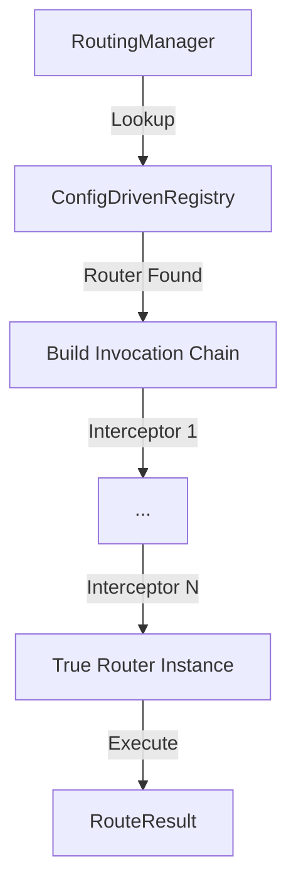

[返回总目录](../README.md)

# 路由管理模块

[](https://openjdk.java.net/)
[](https://opensource.org/licenses/MIT)

## 目录

- [简介](#简介)
- [快速入门](#快速入门)
- [核心特性](#核心特性)
- [编程式路由](#编程式路由)
- [声明式路由](#声明式路由)
- [典型场景](#典型场景)
- [路由诊断](#路由诊断)
- [路由拦截器](#路由拦截器)
- [SPI 扩展](#spi-扩展)
- [架构与原理](#架构与原理)

---

## 简介

team4u-router 是一个轻量级、插件化的 Java 路由框架。它旨在将复杂的业务决策逻辑从核心流程中解耦，通过声明式的规则配置（支持 JSON）来实现动态的逻辑分流。

它不仅支持简单的 Key-Value 精准匹配，还通过集成 [team4u-criterion](../team4u-criterion/README.md) 提供了强大的条件表达式解析能力，能够应对高度复杂的业务场景。

### 核心优势

* 配置驱动：路由规则支持动态重载，无需重启应用即可调整业务走向。
* 多种模式：内置精准匹配 (Map)、规则引擎 (Expression) 与权重分流 (Weight) 三种核心路由器。
* 透明集成：无缝对接 [team4u-config](../team4u-config/README.md)，实现路由规则的统一配置管理。
* 高性能：内置配置实例缓存，确保极致的路由性能。
* 路由诊断：提供完善的 Trace 能力，支持查看每一条规则的匹配状态及表达式计算细节。
* 极简 API：统一入口 `RoutingManager`，极简的交互逻辑，学习成本极低。

---

## 快速入门

### 引入依赖

```xml
<dependency>
    <groupId>com.team4u</groupId>
    <artifactId>team4u-router</artifactId>
    <version>1.0.0-SNAPSHOT</version>
</dependency>
```

### 准备路由配置

在配置中心或本地配置文件中定义路由规则（以 JSON 形式）。
**注意：** 默认情况下，配置键必须遵循 `router.{routerId}` 的命名约定（例如 `router.order-router`）。

`rules` 在代码中定义为列表结构以保证执行顺序：

```json
{
  "id": "order-router",
  "type": "expression",
  "rules": [
    {
      "condition": "region == 'CN'",
      "value": "china-handler"
    },
    {
      "condition": "amount > 1000",
      "value": "vip-handler"
    }
  ],
  "fallbackValue": "default-handler"
}
```

### 获取 RoutingManager 实例

`RoutingManager` 是所有路由操作的入口。你可以使用内置的标准单例，也可以通过 Builder 进行深度定制以实现环境隔离。

#### 1. 标准单例（推荐）

自动发现已注册的 SPI 扩展，并默认绑定到全局的 `ConfigManager`。

```java
RoutingManager manager = RoutingManager.global();
```

#### 2. 自定义实例 (Builder)

适合在需要环境隔离（如单元测试）、或使用不同配置源上下文时，通过 Builder 构建独立的实例。Builder 会自动通过 SPI 和包扫描发现工厂，**手动添加的工厂具有更高优先级**（会覆盖同名的自动发现工厂）：

```java
// 创建自定义的 Criteria，注册特定业务线的算子
Criteria myCriteria = Criteria.builder()
        .addOperator("is_special", (actual, expected) -> "special".equals(actual))
        .build();

RoutingManager customManager = RoutingManager.builder()
        // 指定自定义的 ConfigManager，而不是全局环境
        .configManager(myIsolatedConfigManager)
        // 指定自定义的配置前缀（默认为 "router."），例如改为 "biz.router."
        .configPrefix("biz.router.")
        // 指定自定义的解析器（默认使用基于 Hutool 的 JSON 解析器，支持 SPI 扩展）
        .configParser(new MyYamlRoutePolicyParser())
        // 手动注册带有自定义 Criteria 的表达式路由器工厂
        .addFactory(new ExpressionRouterFactory(myCriteria))
        .build();
```

> 最佳实践：通常情况下，在全局初始化阶段，如果使用了自定义构建，可以通过 `RoutingManager.setGlobal(customManager)` 将其放回全局，以便各处业务代码便捷调用。

### 执行路由

```java
// 1. 获取（或创建）路由管理器
RoutingManager manager = RoutingManager.global();

// 2. 准备请求上下文（支持 Map 或普通 POJO）
Map<String, Object> request = new HashMap<>();
request.put("region", "CN");
request.put("amount", 2000);

// 3. 执行路由逻辑（底层会自动查找配置项 router.order-router）
RouteResult<String> result = manager.route("router.order-router", request);

// 4. 处理匹配结果
if (result.isMatch()) {
    String handlerName = result.getValue();
    System.out.println("匹配到的处理器：" + handlerName); // 输出：china-handler
    // 获取命中的规则条件（表达式或 Key）
    System.out.println("命中的条件：" + result.getMatchedCondition()); // 输出：region == 'CN'
}

// 5. 也可以直接通过原始配置字符串进行路由（常用于测试或临时策略）
RouteResult<String> tempResult = manager.routeByConfig(rawJsonConfig, request);
// 支持类型转换的配置路由
RouteResult<TargetService> typedTempResult = manager.routeByConfig(rawJsonConfig, request, TargetService.class);

// 6. 执行带诊断信息的路由（Trace）
// 支持通过 routerId 诊断
RouteTrace<String> trace = manager.trace("router.order-router", request);
// 也支持通过原始配置诊断
RouteTrace<String> configTrace = manager.traceByConfig(rawJsonConfig, request);

System.out.println("路由总耗时：" + trace.getCostMs() + "ms");
```

### 类型安全路由（防类型擦除）

在处理复杂对象路由（如路由结果是一个包含 host 和 port 的 JSON 对象）时，默认解析出的值通常为原生的 `LinkedHashMap`。如果直接进行类型强转极易引发 `ClassCastException`。

为了解决这一痛点，`RoutingManager` 提供了带有目标类型参数的 `route` 方法，它会自动将解析结果转换为指定的 Java Bean（基于 Hutool 的 Convert）：

```java
// 假设路由配置返回的是一个复杂的服务节点信息：{"host": "127.0.0.1", "port": 8080}
// 传入目标类型 TargetService.class 进行自动转换绑定
RouteResult<TargetService> result = manager.route("router.service-router", request, TargetService.class);

if (result.isMatch()) {
    TargetService target = result.getValue();
    System.out.println("路由目标 Host：" + target.getHost());
    System.out.println("路由目标 Port：" + target.getPort());
}
```

---

## 编程式路由

除了通过 JSON 配置，`team4u-router` 还提供了强大的流式构建器（Fluent Builder），支持在代码中强类型、动态地构建路由策略。

### 1. 使用 RoutePolicyBuilder

你可以通过 `RoutePolicyBuilder` 快速创建 `map` 或 `expression` 类型的策略：

```java
// 1. 创建映射路由 (Map Router)
RoutePolicy mapPolicy = RoutePolicyBuilder.<String>map()
        .id("router.region-router")
        .rule("CN", "china-handler")
        .rule("US", "usa-handler")
        .fallback("default-handler")
        .build();

// 2. 创建表达式路由 (Expression Router)
RoutePolicy exprPolicy = RoutePolicyBuilder.<String>expression()
        .id("router.vip-router")
        .rule("userRank > 5", "vip-version")
        .rule("tags contains 'PREMIUM'", "premium-version")
        .fallback("standard-version")
        .ext("multiMatch", true) // 设置扩展属性
        .build();

// 3. 创建权重路由 (Weight Router)
RoutePolicy weightPolicy = RoutePolicyBuilder.<String>weight()
        .id("router.gray-router")
        .rule("20", "strategy-A") // 20% 流量
        .rule("30", "strategy-B") // 30% 流量
        .rule("50", "strategy-C") // 50% 流量
        .fallback("strategy-default")
        .build();
```

### 2. 执行编程式路由

`RoutingManager` 提供了直接针对 `RoutePolicy` 对象的路由方法：

```java
RoutingManager manager = RoutingManager.global();

// 执行路由
RouteResult<String> result = manager.routeByPolicy(exprPolicy, request);

// 执行带诊断信息的路由
RouteTrace<String> trace = manager.traceByPolicy(exprPolicy, request);
```

> [!TIP]
> 编程式路由非常适合单元测试、从数据库动态加载规则、或构建简单的静态路由策略等场景。

---

## 声明式路由

`team4u-router` 提供了基于注解的声明式路由支持，通过动态代理将接口方法调用透明地转发到具体的业务实现。这种模式下，业务方只需关注接口定义，而无需关心路由细节。

### 1. 标记路由注解

使用 `@Routed` 标记接口或方法，使用 `@RouteContext` 标记用于路由计算的参数：

```java
// 1. 在接口或方法上指定路由策略 ID
@Routed(routerId = "router.payment-router")
public interface PaymentService {

    // 2. 标记哪个参数作为路由计算的上下文 (如不标记，默认取第一个参数)
    String process(@RouteContext PaymentRequest request);
}

// 3. 不同的业务实现类，注册为不同名称的 Bean
@Component("alipay-service")
public class AlipayPaymentService implements PaymentService {
    @Override
    public String process(PaymentRequest request) {
        return "Using Alipay: " + request.getAmount();
    }
}

@Component("wechat-service")
public class WechatPaymentService implements PaymentService {
    @Override
    public String process(PaymentRequest request) {
        return "Using WeChat: " + request.getAmount();
    }
}
```

### 2. 创建并使用代理

通过 `RoutedProxyFactory` 一行代码即可创建代理实例。如果需要环境隔离或自定义配置，可以传入自定义的 `RoutingManager`：

```java
// 方式 A：使用全局默认路由管理器创建代理
PaymentService paymentService = RoutedProxyFactory.createProxy(PaymentService.class);

// 方式 B：使用自定义路由管理器创建代理（适用于环境隔离）
PaymentService customProxy = RoutedProxyFactory.createProxy(PaymentService.class, myCustomManager);

// 调用方法时，内部会自动：
// 1. 提取 request 对象
// 2. 根据 "payment-router" 策略执行路由，得到目标 Bean 名称（如 "alipay-service"）
// 3. 从容器中获取 Bean 并执行真实逻辑
paymentService.process(myRequest);
```

### 3. 热插拔 Bean 定位器

如果你不想使用代理，也可以通过 `RoutedBeanLocator` 手动根据路由规则查找 Bean。同样支持自定义路由管理器：

```java
// 方式 A：使用全局管理器手动查找匹配的 Bean 实例
PaymentService service = RoutedBeanLocator.locate("router.payment-router", myRequest, PaymentService.class);

// 方式 B：使用自定义管理器查找
PaymentService customService = RoutedBeanLocator.locate(myCustomManager, "payment-router", myRequest, PaymentService.class);

service.process(myRequest);
```

### 4. 路由规则配置

为了让上述 `router.payment-router` 生效，你需要在配置中心或配置文件中定义如下 JSON 规则。`value` 必须与 Spring 容器或 [`BeanManager`](../team4u-bean/README.md) 中的 Bean 名称对应：

```json
{
  "type": "expression",
  "rules": [
    {
      "condition": "paymentMethod == 'ALIPAY' && amount < 1000",
      "value": "alipay-service"
    },
    {
      "condition": "paymentMethod == 'WECHAT' || tags contains 'SMALL_AMOUNT'",
      "value": "wechat-service"
    }
  ],
  "fallbackValue": "default-payment-service"
}
```

> [!IMPORTANT]
> 声明式路由依赖于 [`BeanManager`](../team4u-bean/README.md) 容器。请确保路由策略配置的 `value` 字段与容器中 Bean 的名称一致。

### 5. Spring 集成

如果你的项目基于 Spring 框架，只需在配置类中添加 [`SpringBeanContainer`](../team4u-bean/README.md) 即可。它会自动将 Spring 容器中的所有 Bean 桥接到 [`BeanManager`](../team4u-bean/README.md) 中，供路由器及其它 SDK 组件使用：

```java
@Configuration
public class RoutingConfig {

    @Bean
    public SpringBeanContainer springBeanContainer() {
        // 该 Bean 初始化后会自动挂载到 BeanManager，实现两套容器体系的无缝集成
        return new SpringBeanContainer();
    }
}
```

---

## 核心特性

### 1. MapRouter (精准匹配)

适用于简单的查找表场景，根据请求值的字符串表现形式进行直接匹配。

*   配置类型：`type: "map"`
*   匹配逻辑：`rules.get(String.valueOf(request))`
*   兜底机制：使用 `fallbackValue` 字段作为唯一的兜底机制。
*   安全校验：内置重复 Key 校验，初始化时若检测到重复的 `condition` 会抛出异常，防止逻辑冲突。

### 2. ExpressionRouter (表达式路由)

集成 [team4u-criterion](../team4u-criterion/README.md)，支持复杂的布尔逻辑和多条件判断。

*   配置类型：`type: "expression"`
*   短路匹配：默认情况下，规则按定义的顺序依次执行，一旦匹配成功立即返回。
*   多重匹配：支持通过扩展属性 `ext.multiMatch` 开启多重匹配，返回所有命中的结果列表。
*   可靠兜底：使用 `fallbackValue` 字段作为唯一的兜底机制，在所有表达式均不匹配后执行。
*   多样化输入：支持 `Map`、`POJO` 或 `MatchContext` 作为输入。
*   算子解耦：支持通过 `ExpressionRouterFactory` 注入自定义的 `Criteria` 实例。

#### 多重匹配配置说明

当需要获取所有匹配成功的规则（例如在营销场景下匹配所有符合条件的优惠券）时，可以开启 `multiMatch` 模式：

```json
{
  "id": "coupon-router",
  "type": "expression",
  "ext": {
    "multiMatch": true
  },
  "rules": [
    {"condition": "isNewUser", "value": "coupon-A"},
    {"condition": "amount > 100", "value": "coupon-B"}
  ],
  "fallbackValue": ["default-coupon"]
}
```

在调用端，通过显式指定 `List.class` 即可获得类型转换后的匹配列表：

```java
RouteResult<List<String>> result = manager.route("router.coupon-router", request, List.class);
if (result.isMatch()) {
    List<String> matchedCoupons = result.getValue();
    // 多重匹配模式下，建议使用 getMatchedConditions() 获取全量条件列表
    List<String> conditions = result.getMatchedConditions();
}
```

### 3. WeightRouter (权重/比例分流)

适用于灰度发布、A/B 测试等需要按精确比例分发的场景，自动处理权重累加逻辑。

*   配置类型：`type: "weight"`
*   匹配逻辑：基于 Hash 取模。将请求（如 userId）映射为 `[0, totalWeight)` 范围内的整数，再通过 `TreeMap` 快速定位区间。
*   配置友好：无需手动计算累加概率，直接配置各个规则的相对权重。
*   高性能：$O(\log N)$ 查找复杂度，性能接近精准匹配。

### 4. 配置驱动与动态发现

`RoutingManager` 提供了完善的机制以确保高性能与灵活性：
*   配置实例缓存：内部通过 `ConfigDrivenRegistry` 自动监听配置变更，并缓存由配置生成的 `Router` 实例。
*   自动发现机制：`RoutingManager` 在构建时会通过 `PolicyScanner` 自动扫描包及 SPI (`RouterFactory`)，实现零配置集成。
*   声明式支持：提供 `@Routed`、`@RouteContext` 注解及 `RoutedProxyFactory`，实现零侵入的方法级动态路由。
*   高性能路由：`AbstractRouter` 封装了通用的类型转换逻辑，确保从原始配置到业务对象的平滑过渡。

---

## 路由诊断

对于复杂的表达式路由，仅知道最终结果往往是不够的。`RoutingManager` 提供了 `trace` 接口，允许开发者查看完整的匹配轨迹。

```java
// 执行诊断路由
RouteTrace<String> trace = manager.trace("router.order-router", request);

// 查看诊断细节
for (RuleTrace step : trace.getSteps()) {
    System.out.printf("条件: %s, 是否匹配: %b, 详细诊断: %s, 是否兜底: %b%n",
            step.getCondition(),
            step.isMatched(),
            step.getDiagnosticDetail(), // 对于表达式路由，这里包含 Criterion 渲染的计算细节
            step.isFallback()
    );
}
```

路由轨迹包含以下关键信息：
- `routerType`: 实际执行的路由器类型。
- `steps`: 每一个评估步骤的明细，包括是否匹配、原始条件以及底层诊断信息。
- `costMs`: 本次路由计算的耗时。
- `result`: 最终的路由结果。
    - `getMatchedCondition()`：获取首个命中的条件。
    - `getMatchedConditions()`：获取所有命中的条件列表（List<String>）。
        - 命中规则时：包含对应 Key 或表达式。
        - 命中兜底 (Fallback) 时：返回 `null`。

---

## 典型场景

### 场景 A：动态业务开关
通过修改配置中心中的 `rules`，可以实时切换业务路径（例如从 A 服务切换到 B 服务），实现平滑迁移或故障预案。router.order-router

配置示例 (MapRouter)：
```json
{
  "type": "map",
  "rules": [
    {"condition": "v1", "value": "handler-v1"},
    {"condition": "v2", "value": "handler-v2"}
  ],
  "fallbackValue": "handler-v1"
}
```

### 场景 B：基于业务标签的精细化分流
利用 `ExpressionRouter` 的条件匹配功能，针对特定用户属性（如等级、标签等）下发特定策略。

配置示例 (ExpressionRouter)：
```json
{
  "type": "expression",
  "rules": [
    {"condition": "userRank >= 5", "value": "vip-version"},
    {"condition": "tags contains 'BETA_USER'", "value": "beta-version"}
  ],
  "fallbackValue": "stable-version"
}
```

### 场景 C：精确的权重比例分流 (A/B 测试)
在 A/B 测试或灰度发布中，常需要将流量按精确比例切分。不再需要手动计算累加百分比，直接配置各分支对应的权重即可。

配置需求：
- 策略 A：占总流量的 20%
- 策略 B：占总流量的 30%
- 策略 C：占总流量的 50%

配置示例 (WeightRouter)：
```json
{
  "type": "weight",
  "rules": [
    {"condition": "20", "value": "strategy-A"},
    {"condition": "30", "value": "strategy-B"},
    {"condition": "50", "value": "strategy-C"}
  ],
  "fallbackValue": "strategy-default"
}
```

### 场景 D：多维度复杂定价/折扣路由
根据商品类目、用户等级、订单金额等多个维度，路由到不同的计算模型。

配置示例：
```json
{
  "type": "expression",
  "rules": [
    {"condition": "category == 'ELECTRONICS' && amount > 5000", "value": "special-discount-model"},
    {"condition": "userRank >= 5 || tags contains 'VIP'", "value": "vip-pricing-model"}
  ],
  "fallbackValue": "standard-pricing-model"
}
```

---

## SPI 扩展

框架支持通过 SPI 灵活插入自定义的路由器类型。

### 实现步骤

1.  定义工厂：实现 `RouterFactory` 接口。
    ```java
    public class MyRouterFactory implements RouterFactory {
        @Override
        public String key() { return "my-custom"; }

        @Override
        public Router create(RoutePolicy policy) { return new MyRouter(policy); }
    }
    ```
2.  注册工厂：
    *   **方式 A (推荐)：使用统一入口进行全局注册**
        ```java
        RouterBootstrap.global()
            .addFactory(new MyRouterFactory())
            .lock(); // 注册完成后锁定
        ```
    *   **方式 B：SPI 自动发现**
        在 `META-INF/services/com.team4u.framework.router.spi.RouterFactory` 中添加类全路径。
3.  使用：配置 JSON 中指定 `"type": "my-custom"` 即可。

### 注册优先级

`RoutingManager` 在构建时会通过以下顺序加载工厂，后加载的会覆盖先加载的（即优先级更高）：
1.  **SPI 发现**：通过 `ServiceLoader` 发现的 `RouterFactory`。
2.  **包扫描**：自动扫描 `com.team4u.framework.router` 包下的工厂。
3.  **全局注册**：通过 `RouterBootstrap.global().addFactory()` 注册的工厂。
4.  **手动添加**：通过 `Builder.addFactory()` 手动注册的工厂（具有最高优先级）。

---

## 路由拦截器

为了实现更通用的横切关注点（如监控、鉴权、全局上下文注入等），`team4u-router` 提供了基于 **责任链模式 (Chain of Responsibility)** 的通用拦截器机制。

拦截器位于 `RoutingManager` 这一层，对所有类型的 `Router`（Map, Expression, Weight 等）均生效。

### 1. 核心接口

- **`RouteInterceptor`**：拦截器核心接口，继承自 `OrderedPolicy`。
    - `intercept(invocation)`：执行拦截逻辑。
    - `priority()`：定义执行优先级（越小优先级越高）。
- **`RouteInvocation`**：拦截执行上下文。
    - `getRequest()` / `setRequest()`：允许在链条中增强或替换请求对象。
    - `proceed()`：驱动执行链向下流转。

### 2. 拦截器注册中心 (`RouteInterceptorRegistry`)

拦截器由 `RouteInterceptorRegistry` 统一管理，支持多种运行模式：

- **全局单例**：使用 `RouteInterceptorRegistry.global()`，注册后对全局生效。
- **自动发现**：支持通过 `autoScan()` 自动扫描 SPI 设置和 `com.team4u.framework.router` 包路径下的实现类。
- **实例隔离**：可以创建独立的注册表实例，通过 `RoutingManager.builder().interceptorRegistry(registry)` 绑定。

### 3. 典型使用场景

#### 场景 A：全局上下文注入 (Context Enricher)

自动将业务全局变量（如租户 ID、用户区域）注入请求上下文，无需在各业务处手动传递。

```java
public class GlobalContextInterceptor implements RouteInterceptor {
    @Override
    public <T> RouteResult<T> intercept(RouteInvocation<T> invocation) {
        Object request = invocation.getRequest();
        
        // 利用 team4u-criterion 的 MatchContext 增强原生请求
        MatchContext context = (request instanceof MatchContext) ? 
                               (MatchContext) request : MatchContext.of(request);
                               
        // 从 ThreadLocal 注入全局上下文
        context.set("tenantId", TenantContext.getTenantId());
        
        invocation.setRequest(context);
        return invocation.proceed();
    }
}
```

#### 场景 B：路由指标监控 (Metrics Monitor)

统一收集所有 Router 的匹配耗时、命中率和规则分布。

```java
public class RouteMetricsInterceptor implements RouteInterceptor {
    @Override
    public <T> RouteResult<T> intercept(RouteInvocation<T> invocation) {
        long start = System.currentTimeMillis();
        try {
            RouteResult<T> result = invocation.proceed();
            long cost = System.currentTimeMillis() - start;
            
            // 埋点上报：记录耗时与命中情况
            Metrics.record("router.cost", cost, "routerId", invocation.getRouterId());
            
            return result;
        } catch (Exception e) {
            Metrics.increment("router.error", "routerId", invocation.getRouterId());
            throw e;
        }
    }
}
```

#### 场景 C：异常熔断与兜底 (Graceful Fallback)

当表达式计算出错或配置解析严重异常时，防止阻断主业务流程。

```java
public class SafeFallbackInterceptor implements RouteInterceptor {
    @Override
    public <T> RouteResult<T> intercept(RouteInvocation<T> invocation) {
        try {
            return invocation.proceed();
        } catch (Exception e) {
            log.error("Routing failed for: {}", invocation.getRouterId(), e);
            // 发生异常时，短路并返回一个未匹配结果，防止上层业务中断
            return RouteResult.unmatch();
        }
    }
}
```

---

## 架构与原理

### 核心执行流程

1.  获取配置：`RoutingManager` 通过 `ConfigDrivenRegistry` 从 `ConfigManager` 获取配置。
2.  实例管理：`ConfigDrivenRegistry` 负责维护配置与 `Router` 实例的映射。
3.  驱动拦截器链：
    - 构建 `DefaultRouteInvocation`，封装 `RouterId`、`Router` 实例、`Request` 及当前生效的拦截器列表。
    - 按优先级执行拦截器。
4.  执行路由：最后一个拦截器执行 `invocation.proceed()` 时，调用真实的 `Router.route(request)`。

### 状态流转图


