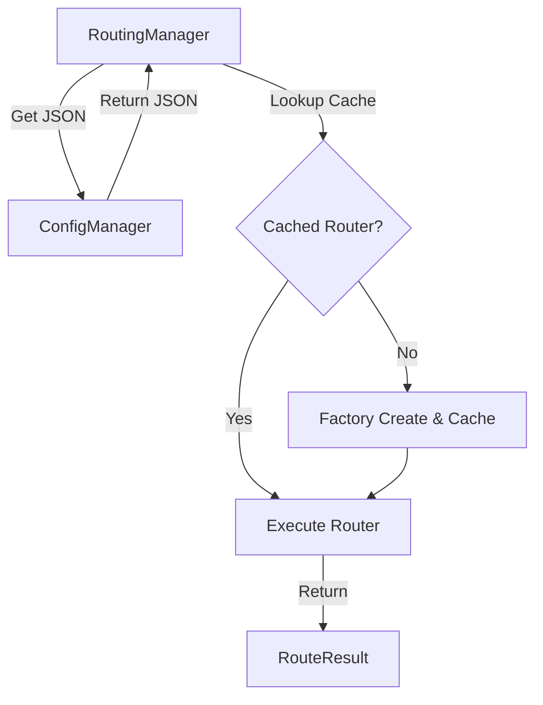

[返回总目录](../README.md)

# 路由管理模块

[](https://openjdk.java.net/)
[](https://opensource.org/licenses/MIT)

## 目录

- [简介](#简介)
- [快速入门](#快速入门)
- [核心特性](#核心特性)
- [典型场景](#典型场景)
- [SPI 扩展](#spi-扩展)
- [架构与原理](#架构与原理)

---

## 简介

team4u-router 是一个轻量级、插件化的 Java 路由框架。它旨在将复杂的业务决策逻辑从核心流程中解耦，通过声明式的规则配置（支持 JSON）来实现动态的逻辑分流。

它不仅支持简单的 Key-Value 精准匹配，还通过集成 [team4u-criterion](../team4u-criterion/README.md) 提供了强大的条件表达式解析能力，能够应对高度复杂的业务场景。

### 核心优势

* 配置驱动：路由规则支持动态重载，无需重启应用即可调整业务走向。
* 多种模式：内置精准匹配 (Map) 与规则引擎 (Expression) 两种核心路由器。
* 透明集成：无缝对接 [team4u-config](../team4u-config/README.md)，实现路由规则的统一配置管理。
* 高性能：内置 LRU 缓存，避免重复解析配置造成的性能开销。
* 极简 API：统一入口 `RoutingManager`，极简的交互逻辑，学习成本极低。

---

## 快速入门

### 引入依赖

```xml
<dependency>
    <groupId>com.team4u</groupId>
    <artifactId>team4u-router</artifactId>
    <version>1.0.0-SNAPSHOT</version>
</dependency>
```

### 准备路由配置

在配置中心或本地配置文件中定义路由规则（以 JSON 形式）：

```json
{
  "type": "expression",
  "rules": {
    "region == 'CN'": "china-handler",
    "amount > 1000": "vip-handler"
  },
  "fallbackValue": "default-handler"
}
```

### 获取 RoutingManager 实例

`RoutingManager` 是所有路由操作的入口。你可以使用内置的标准单例，也可以通过 Builder 进行深度定制以实现环境隔离。

#### 1. 标准单例（推荐）

自动发现已注册的 SPI 扩展，并默认绑定到全局的 `ConfigManager`。

```java
RoutingManager manager = RoutingManager.global();
```

#### 2. 自定义实例 (Builder)

适合在需要环境隔离（如单元测试）、或使用不同配置源上下文时，通过 Builder 构建独立的实例：

```java
// 创建自定义的 Criteria，注册特定业务线的算子
Criteria myCriteria = Criteria.builder()
        .addOperator("is_special", (actual, expected) -> "special".equals(actual))
        .build();

RoutingManager customManager = RoutingManager.builder()
        // 指定自定义的 ConfigManager，而不是全局环境
        .configManager(myIsolatedConfigManager)
        // 手动注册带有自定义 Criteria 的表达式路由器工厂，实现解耦与隔离
        .addFactory(new ExpressionRouterFactory(myCriteria))
        // 手动添加其他自定义路由工厂
        .addFactory(new MyCustomRouterFactory())
        .build();
```

> 最佳实践：通常情况下，在全局初始化阶段，如果使用了自定义构建，可以通过 `RoutingManager.setGlobal(customManager)` 将其放回全局，以便各处业务代码便捷调用。

### 执行路由

```java
// 1. 获取（或创建）路由管理器
RoutingManager manager = RoutingManager.global();

// 2. 准备请求上下文（支持 Map 或普通 POJO）
Map<String, Object> request = new HashMap<>();
request.put("region", "CN");
request.put("amount", 2000);

// 3. 执行路由逻辑
RouteResult<String> result = manager.route("order-router", request);

// 4. 处理匹配结果
if (result.isMatch()) {
    String handlerName = result.getValue();
    System.out.println("匹配到的处理器：" + handlerName); // 输出：china-handler
}
```

---

## 核心特性

### 1. MapRouter (精准匹配)

适用于简单的查找表场景，根据请求值的字符串表现形式进行直接匹配。

*   配置类型：`type: "map"`
*   匹配逻辑：`rules.get(String.valueOf(request))`
*   兜底机制：**标准化兜底**。使用 `fallbackValue` 字段作为唯一的兜底机制。

### 2. ExpressionRouter (表达式路由)

集成 [team4u-criterion](../team4u-criterion/README.md)，支持复杂的布尔逻辑和多条件判断。

*   配置类型：`type: "expression"`
*   短路匹配：规则按定义的顺序（LinkedHashMap）依次执行，一旦匹配成功立即返回。
*   **可靠兜底**：使用 `fallbackValue` 字段作为唯一的兜底机制，在所有表达式均不匹配后执行。
*   多样化输入：支持 `Map`、`POJO` 或 `MatchContext` 作为输入。
*   **算子解耦**：支持通过 `ExpressionRouterFactory` 注入自定义的 `Criteria` 实例（默认为 `global()`）。这使得复杂的业务线可以使用相互隔离的自定义算子，避免全局算子互相污染。

> 示例：通过 `RoutingManager.builder().addFactory(new ExpressionRouterFactory(myCriteria)).build()` 实现算子定制。

### 3. 多层级缓存管理

`RoutingManager` 内部维护了一个高性能的 `DynamicInstanceProvider`：
*   LRU 策略：默认缓存 1000 个最近使用的配置解析实例。
*   解耦解析：自动将 JSON 配置解析为 `RoutePolicy` 并动态创建对应的 `Router` 实例。

---

## 典型场景

### 场景 A：动态业务开关
通过修改配置中心中的 `rules`，可以实时切换业务路径（例如从 A 服务切换到 B 服务），实现平滑迁移或故障预案。

配置示例 (MapRouter)：
```json
{
  "type": "map",
  "rules": {
    "v1": "handler-v1",
    "v2": "handler-v2"
  },
  "fallbackValue": "handler-v1"
}
```

### 场景 B：灰度/实验控制
利用 `ExpressionRouter` 的条件匹配功能，针对特定用户属性（如 `userId % 100 < 10`）下发特定策略。

配置示例 (ExpressionRouter)：
```json
{
  "type": "expression",
  "rules": {
    "userId hash 0.1": "gray-version"
  },
  "fallbackValue": "stable-version"
}
```

### 场景 C：复杂分流与流量比例控制
在 A/B 测试或灰度发布中，常需要将流量按精确比例切分。利用 `ExpressionRouter` 的有序匹配特性，可以非常优雅地实现这一点。

配置需求：
- 策略 A (20%)：拦截前 20% 的流量（`userId hash 0.2`）。
- 策略 B (30%)：拦截接下来的 10% ~ 50% 流量（`userId hash 0.5`）。由于前面的 A 已经拦截了 20%，剩下的 80% 中命中该规则的实际占总流量的 30%。
- 策略 C (50%)：兜底策略，接收剩余 50% 的所有流量。

配置示例：
```json
{
  "type": "expression",
  "rules": {
    "userId hash 0.2": "strategy-A",
    "userId hash 0.5": "strategy-B"
  },
  "fallbackValue": "strategy-C"
}
```

### 场景 D：多维度复杂定价/折扣路由
根据商品类目、用户等级、订单金额等多个维度，路由到不同的计算模型。

配置示例：
```json
{
  "type": "expression",
  "rules": {
    "category == 'ELECTRONICS' && amount > 5000": "special-discount-model",
    "userRank >= 5 || tags contains 'VIP'": "vip-pricing-model"
  },
  "fallbackValue": "standard-pricing-model"
}
```

---

## SPI 扩展

框架支持通过 SPI 灵活插入自定义的路由器类型。

### 实现步骤

1.  定义工厂：实现 `RouterFactory` 接口。
    ```java
    public class MyRouterFactory implements RouterFactory {
        @Override
        public String key() { return "my-custom"; }

        @Override
        public Router create(RoutePolicy policy) { return new MyRouter(policy); }
    }
    ```
2.  注册服务：在 `META-INF/services/com.team4u.framework.router.factory.RouterFactory` 中添加类全路径。
3.  使用：配置 JSON 中指定 `"type": "my-custom"` 即可。

---

## 架构与原理

### 核心执行流程

1.  获取配置：`RoutingManager` 从 `ConfigManager` 获取指定 ID 的原始 JSON 字符串。
2.  查询缓存：以配置字符串为 Key，在 LruCache 中寻找已实例化的 `Router`。
3.  动态创建（Cache Miss）：
    *   将 JSON 反序列化为 `RoutePolicy` 对象。
    *   根据 `type` 从 `RouterFactoryRegistry` 寻找对应工厂。
    *   通过工厂创建 `Router` 实例并存入缓存。
4.  执行路由：调用 `Router.route(request)` 返回 `RouteResult`。

### 状态流转图


